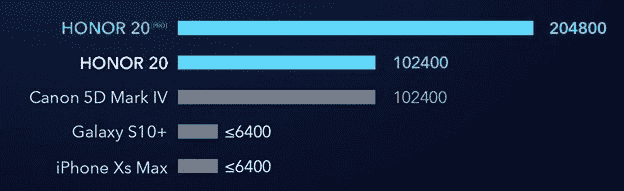

# Honor 20 Pro 如何实现出色的弱光摄影

> 原文：<https://www.xda-developers.com/how-the-honor-20-pro-achieves-excellent-low-light-photography/>

即使有了今天令人惊叹的移动相机，智能手机摄影也在不断发展。有人可能会说，日光照片的质量似乎已经停滞不前，但随着硬件和软件的发展超过了去年的百万像素竞赛，我们看到在新的关键领域不断改善。当然，它通常是推动计算摄影极限的昂贵旗舰产品的先锋，其中“夜间模式”超低光照片是一个新的关键话题。凭借 Honor 20 Pro 出色的硬件和软件组合，您可以在一个优质但经济实惠的包中获得令人印象深刻的效果。

Honor 20 Pro 因其相机功能获得了好评:XDA 的相机专家 Daniel Marchena 发现，这款手机具有[“相机向下调整为艺术”](https://www.xda-developers.com/honor-20-pro-review/)，拍摄出令人惊叹的照片，具有惊人的细节，最重要的是，给人一种自然的感觉。其他相机评论者，[如 DxOmark](https://www.xda-developers.com/honor-teases-dxomark-score-honor-20/) ，称赞了这款手机出色的曝光度，在他们的评论发表时，获得了该类别的[联合最高分。](https://dxomark.com/honor-20-pro-camera-review/)

这并不令人惊讶，因为该设备配备了[极其完整的四摄像头设置](https://www.xda-developers.com/best-results-honor-20-pro-cameras/)，提供了索尼 IMX586 48 MP 主摄像头镜头以及人工智能软件和硬件，允许用户即使在昏暗的环境下也能拍摄出清晰的照片。低光性能也受益于光学图像稳定(OIS)和人工图像稳定(AIS)，但这款手机还提供 AIS 超级夜间模式，可以通过将相机模式设置为“夜间”来激活这种模式非常适合夜晚的城市天际线或光线昏暗的后街，但这并不是手机超低光摄影功能的终点。我们发现，即使在自动模式下，这款手机在弱光下也有很好的曝光效果。那么，Honor 是如何获得曝光率如此之高的照片的，它与竞争对手相比又如何呢？

数码相机的曝光由 f/stop、快门速度和 ISO 设置控制。Honor 20 Pro 在这两方面都没有缺点，在强大的主摄像头上配备了大光圈 f/1.4 镜头——前面提到的索尼 48MP 1/2”Quad-Bayer 相机传感器。除此之外，Honor 20 Pro 还具有 Honor 所说的“自动超高 ISO”功能。在这方面，20 Pro 远远超过了移动领域的一些顶级竞争对手。

 <picture></picture> 

A comparison of the ISO number of digital and mobile cameras

在数码摄影中，ISO 数表示相机对光线的敏感程度，这取决于相机传感器的信号增益。更高的值表示更高的灵敏度，从而更好地捕捉弱光。在 Honor 20 Pro 上，当使用多功能和强大的 Pro 模式时，您可以手动调整 ISO，但他们对常规拍摄的自动 ISO 调整仍然能够实现极高的 ISO 数，从而拍摄出巨大的低光拍摄。Honor 20 Pro 的 204800 的 ISO 让 Galaxy S10+相形见绌，无法超越 6400。这一升级超越了 Honor 20 的 102400 ISO，甚至使 Pro 的 ISO 值领先于佳能 5D Mark IV 等单反相机。

当你在自动模式下拍摄时，20 Pro 会自动调整 ISO，所以在实践中，你不需要考虑 ISO 值以及如何将它调整到特定的场景。自动超高 ISO 算法会在 1 勒克斯以下的亮度下自动启动，在这一点上，大多数细节无法通过肉眼感知。正如现代弱光手机摄影所期望的那样，这种模式可以带出隐藏的细节和色彩。虽然调高 ISO 通常会带来额外的噪音，但 20 Pro 也可以将噪音保持在可接受的范围内，DxOMark 指出，Honor 20 Pro 在低光场景中的噪音控制提供的一些结果“可以与最佳表演者的结果相媲美”。

**[荣誉 20 强 XDA 论坛](https://forum.xda-developers.com/honor-20-pro)**

强大的硬件和智能软件的结合使 Honor 20 Pro 与 Galaxy S10+等竞争对手并驾齐驱，在许多情况下甚至领先于竞争对手。如果你想了解更多关于 Honor 20 Pro 的信息，请查看我们的 [Honor 20 Pro 评测](https://www.xda-developers.com/honor-20-pro-review/)，我们的[近期性能分析](https://www.xda-developers.com/ux-speed-ui-smoothness-comparison-honor-20-pro-oneplus-7-galaxy-s10-plus/)，以及我们的[电池寿命报告](https://www.xda-developers.com/honor-20-pro-typical-day-battery-test/)。要了解更多关于手机摄像头的信息，请访问我们的[摄像头测试](https://www.xda-developers.com/honor-20-pro-testing-video-stabilization-night-mode-photography/)、[对比](https://www.xda-developers.com/honor-20-pro-galaxy-s10-oneplus-7-pro-low-light-camera-comparison/)和我们关于如何[充分利用手机摄像头的帖子](https://www.xda-developers.com/best-results-honor-20-pro-cameras/)。

###### 我们感谢 HONOR 赞助了这篇文章。我们的赞助商帮助我们支付与运行 XDA 相关的许多费用，包括服务器成本、全职开发人员、新闻撰稿人等等。虽然您可能会在门户内容旁边看到赞助内容(这些内容将始终被标记为赞助内容),但门户团队对这些帖子不承担任何责任。赞助内容、广告和 XDA 仓库完全由一个独立的团队管理。XDA 绝不会通过接受金钱来赞扬一家公司，或以任何方式改变我们的观点或看法，从而损害其新闻诚信。我们的意见不能被收买。