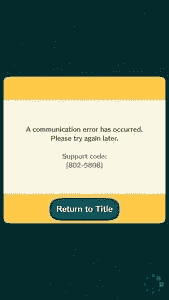

# 如何绕过动物穿越口袋营地的安全网禁令

> 原文：<https://www.xda-developers.com/how-to-bypass-animal-crossing-pocket-camps-safetynet-bans/>

动物穿越口袋营是任天堂最新推出的面向 Android 和 iOS 设备的移动产品。你变成了露营地中唯一的人类之一，在那里你遇到了其他有知觉的动物，帮助他们完成任务并和他们交朋友。这个游戏开始变得热门，就像口袋妖怪 Go 一样，但也像口袋妖怪 Go 一样，这个游戏受到安全网的保护。这意味着解锁或根设备，除非他们运行最新版本的 Magisk，将无法玩游戏。更重要的是，任天堂实际上**封禁了**触发安全网的账户，给你留下了错误代码 802-5808，表示永远封禁安全网。这意味着如果谷歌在 Magisk 更新之前更新 SafetyNet 的根识别方法，那么如果你启动动物穿越，你的数据可能会永远丢失。**但它真的一去不复返了吗？**

 <picture></picture> 

Error code 802-5808, a SafetyNet ban in Animal Crossing Pocket Camp

我一直在玩这个游戏，就像成千上万的其他根用户一样，我已经启动了安全网，我的游戏已经被清除了两次。链接到一个任天堂账户可以解决大部分相关问题，但是我第一次玩的时候没有链接到一个任天堂账户，所以我永久的丢失了我的数据。然而，我发现了一种简单的方法来解除我的帐户，并在窥探应用程序的数据文件时恢复我的数据，我已经通过启动 SafetyNet 并尝试恢复我的数据进行了测试，我做到了。祝您身体健康

## 绕过动物穿越口袋营地安全网禁令

你需要安装一个根文件浏览器来完成这个任务。我将使用 Solid Explorer，但是如果你愿意，你可以使用 XDA 实验室的免费 MiXplorer。

[appbox xda com.mixplorer]

一旦你准备好了，按照下面的步骤。如果你已经将你的任天堂帐户链接到你的动物穿越口袋营，那么你可以跳到第 2 步。

### 第一步

首先，你需要把你的任天堂账号和动物穿越口袋营连接起来，如果你还没有的话。这是因为下一步将从你的设备中删除你的帐户，如果它没有链接到你的任天堂帐户，那么你将无法取回你的数据。打开动物穿越应用程序，点击底部的按钮链接你的任天堂帐户，创建一个帐户，当你完成后，应用程序应该会再次启动，并显示以下消息。

现在，尝试启动游戏，您应该会收到开始时显示的错误。接下来，强制停止应用程序并继续下一步。您的数据仍然存储在任天堂的服务器上，并且已经链接到您的任天堂帐户。

### 第二步

打开您的 root 启用的文件浏览器应用程序，并导航到**/data/data/com . Nintendo . zaca/shared _ prefs**。

在这个文件夹中，您可以看到许多 XML 文件，但我们将重点放在 **deviceAccount.xml** 文件上。该文件包含了您连接和登录动物穿越口袋营地帐户所需的所有数据。当您开始游戏时，会随机生成一个用户名和密码供您登录，并与会话 ID 一起存储在该文件中。**先备份这个文件，然后删除它**。这是以防万一出了什么差错。

### 第三步

接下来，启动游戏，你会看到一个更新游戏的提示。接受它，一旦完成，你必须**登录你的任天堂账户**。现在导航到左上角的主菜单，向下滚动**选择数据恢复**。就是这样！

* * *

## 结论

实际上，你的所有设备登录信息都存储在 deviceAccount.xml 文件中，当你的设备被标记为触发 SafetyNet 时，这将是永久性的，直到你删除游戏并重新开始。我们可以很容易地绕过这一点，将我们的游戏链接到我们的任天堂帐户，然后删除这个文件。这在理论上也应该允许在一个设备上有多个账户，只要任天堂账户**没有被**使用。让我们知道它是否适合你！