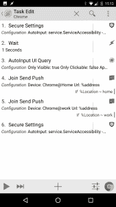
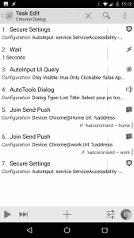
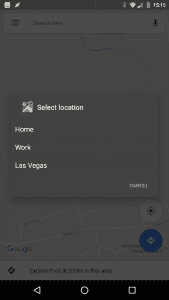

# 如何使用 Tasker 创建自定义指纹操作

> 原文：<https://www.xda-developers.com/how-to-create-custom-fingerprint-actions-with-tasker/>

如果你的智能手机或平板电脑有指纹识别器，它的用途很可能是有限的。除了谷歌 Pixel 或华为智能手机系列中的一些额外好处，Android 上的大多数指纹识别器只能解锁你的设备。幸运的是，借助 Tasker 的强大功能和一些插件，我们能够显著扩展指纹扫描仪的功能。之前，我做过一个关于如何[分配自定义指纹动作](https://www.xda-developers.com/create-a-context-aware-fingerprint-reader-in-tasker/)并使其依赖于上下文的教程。当时，我只演示了如何将当前标签转换到您的 PC 上。在本教程中，我将提供一些额外的例子来说明如何利用上下文感知的指纹识别器。

但是如果你的手机没有指纹识别器呢？即使你的手机上没有，也不要担心，因为我们可以通过屏幕上的按钮来调整脚本。我甚至会演示如何用一个完全透明的屏幕按钮来复制这个设置！XDA 资深会员 [Flextrick](http://forum.xda-developers.com/member.php?u=4642185) 更新了指纹扫描工具，更好地集成了 Tasker，所以这里是我最喜欢的自定义指纹操作。在每一节的最后，我将为那些想要自己复制该设置(并在此过程中学习)的人提供 Tasker 摘要，但是如果您想简单地下载本文中提到的所有脚本，我在最后提供了一个下载链接。

* * *

## *施放当前 Chrome 窗口(已更新)*

在上一篇文章中，我演示了如何使用 Join 将当前打开的 Chrome 网页投射到您的 PC 上。自从我发表了那篇文章后，我想出了一些我认为会改进其功能的变化。虽然单独的配置文件做完全相同的事情，但我已经更新了任务，根据连接的 WiFi 或从对话框中选择的输入将页面投射到选定的 PC。我还添加了一个开关来启用然后禁用**自动输入**辅助功能服务，因为这些[辅助功能服务会降低你手机的速度](https://www.xda-developers.com/working-as-intended-an-exploration-into-androids-accessibility-lag/)。为此，我添加了一个**安全设置**可访问性切换动作作为任务中的第一个和最后一个动作。如果你在 Android 7.0+上努力让**安全设置**插件工作，看看我这里的[解决方案](http://www.notenoughtech.com/tasker/secure-settings-nougat/)或者检查这里[的**运行 shell** 选项](http://www.notenoughtech.com/tasker/tasker-run-shell-commands/)。

### WiFi 连接上下文

 <picture></picture> 

WiFi context

除非您可以从另一个配置文件获取位置值，否则您将需要创建两个附加配置文件。一个将变量**%位置**设置为*家*，另一个设置为*工作*。创建配置文件，连接 WiFi，填写您的家庭 SSID，并链接任务，该任务将变量 **%Location** 设置为 *home* 。为你的工作 WiFi 做同样的事情。

现在我们已经准备好了这个部分，我们可以通过简单地向 **Join Send Push** 动作添加一个 IF 条件来更新我们的原始任务。根据我们的 **%Location** 变量，将会发布对正确设备的推送，这是我们根据如上所述的 WiFi 连接配置文件设置的。

### 铬型材

```
Profile: Connected Home状态:Wifi 已连接[SSID:FASTBERRY/slow frog MAC:* IP:*]进入:连接的家庭A1:变量集[名称:% Location To:home Do Maths:Off Append:Off]简介:关联工作状态:Wifi 已连接[ SSID:ITC-STAFF MAC:* IP:* ]输入:连接工作A1:变量集[名称:% Location To:work Do Maths:Off Append:Off]简介:电脑上的 Chrome应用:铬合金事件:变量值[ %FingerScanned eq 1 ]回车:ChromeA1:安全设置[配置:自动输入:服务。启用 ServiceAccessibility 的超时(秒):0 ]A2:等待[毫秒:0 秒:1 分钟:0 小时:0 天:0 ]A3:自动输入 UI 查询[配置:仅可见:真仅可点击:falseApp 包:com.android.chrome检查屏幕状态:假正文:((？< = http:\/\/| https:\/\/| https:\/\/www。|http:\/\/www。|www。))?。*对变量:地址超时(秒):20 ]A4:加入发送推送[配置:设备:Chrome@HomeURL:%地址超时(秒):60 ]如果[ %Location ~ home ]A5:加入发送推送[配置:设备:Chrome@workURL:%地址超时(秒):60 ]如果[ %Location ~ work ]A6:安全设置[配置:自动输入:服务。ServiceAccessibility -禁用超时(秒):0 ]
```

### 对话上下文

 <picture></picture> 

Dialog

如果你想在一个网络中拥有多台电脑，也许对话会是一个更好的选择。我将使用**自动工具**来生成一个对话框，其中将包含您可以将当前 Chrome 网页转换到的 PC 的名称。一旦点击-网站将只发送到那台电脑。如果您打算只使用对话框，您不需要从上面重新创建概要文件。你所需要做的就是将**自动工具**对话框动作添加到你的任务中。用您的家庭设备填充名称，并为每个选项分配命令。这些命令将存储在变量 **%atcommand** 中。一旦按下，变量将被设置，我们可以触发正确的**加入推**动作。每个**加入推动**动作将有一个匹配的 IF 条件( **%atcommand** ~ home 或 work 等)。

### Chrome 对话框配置文件

```
Profile: Chrome On PC应用:铬合金事件:变量值[ %FingerScanned eq 1 ]进入:Chrome 对话框A1:安全设置[配置:自动输入:服务。启用 ServiceAccessibility 的超时(秒):0 ]A2:等待[毫秒:0 秒:1 分钟:0 小时:0 天:0 ]A3:自动输入 UI 查询[配置:仅可见:真仅可点击:假App 包:com.android.chrome检查屏幕状态:假正文:((？< = http:\/\/| https:\/\/| https:\/\/www。|http:\/\/www。|www。))?。*对变量:地址超时(秒):20 ]A4:自动工具对话框[配置:对话框类型:列表标题:选择您的电脑icon:Android . resource://net . dinglisch . Android . taskerm/HD _ hardware _ dock列表类型:0短信:家庭，工作文本大小:20图像宽度:100命令:家庭、工作暗淡背景:真上边距:16下边距:16底部按钮上边距:16底部按钮下边距:16选择时关闭:真分隔符:，命令变量:atcommand可取消:真打开屏幕:真实超时(秒):60 ]A5:加入发送推送[配置:设备:Chrome@HomeURL:%地址超时(秒):60 ] If [ %atcommand ~ home ]A6:加入发送推送【配置:设备:Chrome@workURL:%地址超时(秒):60 ]如果[ %atcommand ~ work ]A7:安全设置[配置:自动输入:服务。ServiceAccessibility -禁用超时(秒):0 ]
```

* * *

## *WhatsApp -在 PC 上继续对话*

这是我们在实验室里做的一个新的。在手机上进行 Whatsapp 对话对于快速回复信息非常有用，但有时你更愿意跳到电脑上打出更长的回复。因此，我创建了一个非常简单但非常有用的个人资料，它可以让 [WhatsApp 的在线界面](https://web.whatsapp.com/)在你的电脑上运行，这样你就可以继续你的对话。如果您有多台 PC，请随意将其链接到 WiFIi 连接的上下文或创建一个对话框，就像我们在前面的示例中所做的那样。

### WhatsApp 个人资料

```
Profile: WhatsApp On PC事件:变量值[ %FingerScanned eq 1 ]应用程序:WhatsApp输入:WhatsappA1:加入发送推送[配置:设备:Chrome@HomeURL:https://web.whatsapp.com/超时(秒):60 ]如果[ %Location ~ home ]A2:加入发送推送[配置:设备:Chrome@workURL:https://web.whatsapp.com/超时(秒):60 ]如果[ %Location ~ work ]
```

* * *

## *脸书-在电脑上打开脸书*

类似地，如果你厌倦了在移动设备上滚动订阅源，我们可以继续在电脑上浏览脸书。和以前一样，我们将通过加入推送将我们的 PC 指向脸书桌面网站的 [URL。当然，您可以通过添加 WiFi 连接上下文或多个设备的对话框来随意修改它。](https://www.facebook.com)

### 脸书简介

```
Profile: Facebook On PC事件:变量值[ %FingerScanned eq 1 ]申请:脸书输入:脸书A1:加入发送推送[配置:设备:Chrome@HomeURL:https://www.facebook.com/超时(秒):60 ]如果[ %Location ~ home ]A2:加入发送推送[配置:设备:Chrome@workURL:https://www.facebook.com/超时(秒):60 ]如果[ %Location ~ work ]
```

* * *

## *地图——导航回家，或前往您最喜爱的地点*

一键“带我回家”按钮可以节省一些时间和挫折，特别是当你很匆忙的时候。虽然你可以创建一个启动器快捷方式来启动谷歌地图导航，但有些用户不喜欢在主屏幕上添加额外的图标。当 Google Maps 打开时，我们可以传递一个请求 Google 带我们回家的意图(需要设置 Google Maps 中的“家”位置或变量中的硬编码地址)。如果你想有几个喜欢的选择，如“工作”或“拉斯维加斯”，我们也可以链接一个对话框。

### 导航回家

只要快速按下按钮，就会发送一个意图动作。这将打开谷歌地图，并将“家”设置为目的地。简单！

### 地图配置文件

```
Profile: Maps Go Home事件:变量值[ %FingerScanned eq 1 ]应用:地图输入:地图A1:发送意图[Action:Android . Intent . Action . view Cat:None Mime 类型:Data:Google . navigation:q = home Extra:Extra:Extra:Package:Class:Target:Activity]
```

### 最喜欢的地点

用**自动工具**创建一个对话框，并填写一个位置列表。你可以用家或工作的地方，城市，或特定的地址。用逗号分隔列出它们。按下该选项时，自动工具对话框将填充变量 **%attext** 。这个选项将被传递给 intent，在**数据**字段:*Google . navigation:q =**% at text***。目的:*Android . intent . action . view*带你去目的地。

### 地图收藏配置文件

```
Profile: Maps Go Home 事件:变量值[ %FingerScanned eq 1 ]应用:地图进入:地图对话框A1:自动工具对话框[配置:对话框类型:列表标题:选择位置icon:app-icon:com . Google . Android . apps . maps列表类型:0短信:家，工作，拉斯维加斯文本大小:20图像宽度:100暗淡背景:真上边距:16下边距:16底部按钮上边距:16底部按钮下边距:16选择时关闭:真分隔符:，命令变量:atcommand可取消:真打开屏幕:真实超时(秒):60 ]A2:发送意图[Action:Android . Intent . Action . view Cat:None Mime 类型:Data:Google . navigation:q = % attext Extra:Extra:Extra:Package:Class:Target:Activity]
```

* * *

## *Hangouts -快速回复模板*

我知道我似乎很喜欢**自动工具对话框**的动作，但那是因为它提供了一个非常有用的功能，可以应用于各种 Tasker 脚本。在这种情况下，我们将使用一个对话框用快速回复模板快速填充剪贴板。一旦做出选择，你可以粘贴你的文本信息或在几秒钟内回复。不需要打字。

我们将使用一个数组来存储我们的消息模板。要创建一个数组，使用**变量集**并以逗号分隔列出您的选项。然后你将执行一个由逗号分隔的**变量**，然后你将能够在一个自动工具对话框中列出数组！确保它是一个全局数组(名称中包含大写字母),因为局部数组将会消失。自动工具对话框将在文本字段中使用 **%Templates()** 数组，并用选项填充您的列表。您现在需要做的就是使用**设置剪贴板**动作来存储 **%attext** 的值。

为了帮助您，我在描述中为您保留了数组操作。一旦创建了一系列模板响应，您就可以从任务中删除 A1 和 A2 操作。如果您希望将来修改您的模板响应数组，只需转到 Tasker 中的“Variables”选项卡并查找 **%Templates** 变量。

### Hangouts 配置文件

```
Profile: Hangout Template 

事件:变量值[ %FingerScanned eq 1 ]

应用:悬挂物

输入:Hangout (16)

A1: [X]变量集[ Name:%Templates To:option 1，option 2，option 3 Do Maths:Off Append:Off ]

A2: [X]变量 Split [ Name:%Templates Splitter:，Delete Base:Off ]

A3:自动工具对话框[配置:对话框类型:列表

标题:选择您的模板

icon:Android . resource://net . ding lisch . Android . task erm/HD _ content _ edit

列表类型:0

文本:%Templates()

文本大小:20

图像宽度:100

暗淡背景:真

上边距:16

下边距:16

底部按钮上边距:16

底部按钮下边距:16

选择时关闭:真

分隔符:，

命令变量:atcommand

可取消:真

打开屏幕:真实超时(秒):60 ]

A4:设置剪贴板[ Text:%attext Add:Off ]

A5: Flash [文本:剪贴板设置为:%attext Long:On ]

```

* * *

## *相机延时快门*

我总是觉得用相机自拍很不舒服。扫描你的手指拍照也许不是最好的解决办法，但是你可以设置一个定时器，让你的手到位，拍出更好的照片。

为了给我们自己一个警告，Android 语音引擎将通过动作**说**为我们倒计时。之后-使用动作**按钮-相机**用主相机拍照。没有必要玩计时器或伸手去按按钮。

### 相机配置文件

```
Profile: Camera Seflie Main事件:变量值[ %FingerScanned eq 1 ]应用:照相机输入:相机A1:说[文本:在 3，2，1...engine:Voice:com . Google . Android . TTS:eng-GBR Stream:2 Pitch:6 Speed:6 Respect Audio Focus:On Network:On 立即继续任务:Off ]A2:等待[毫秒:0 秒:1 分钟:0 小时:0 天:0 ]A3:按钮[按钮:照相机]
```

* * *

## *YouTube -将视频传送到电脑*

拥有一台智能电视让我意识到将 YouTube 视频传输到电脑上是不必要的困难。除非您的电脑在电视模式下打开了 YouTube 页面，否则 cast 选项不可用。幸运的是，我们可以使用指纹扫描仪启用该选项。这是另一个简单但有用的概要文件。我们所要做的就是通过加入推送在我们的电脑上打开 [YouTube 电视页面](https://www.youtube.com/tv)，然后你就可以将你当前的视频传送到你的电脑上了！这么简单！

### YouTube 个人资料

```
Profile: Youtube PC (21)事件:变量值[ %FingerScanned eq 1 ]应用:YouTube输入:Youtube (20)A1:加入发送推送[配置:设备:Chrome@HomeURL:https://www.youtube.com/tv 超时(秒):60 ]
```

* * *

## *指纹传感器替代品*

如果你没有传感器，同样的行为可以通过叠加来再现，通过制作一个不可见的场景，其行为方式与扫描你的手指完全相同。将它放在一个固定的位置，这样您就知道在哪里点击(或长时间点击)并执行以下操作:

```
Scanned Finger

A1:变量集[名称:% finger scanned To:1 Do Maths:Off Append:Off]

A2:等待[毫秒:0 秒:2 分钟:0 小时:0 天:0 ]

A3:变量集[名称:% finger scanned To:0 Do Maths:Off Append:Off]

你可以让按钮可见，但我发现它有点分散注意力，尤其是在观看视频时。通过创建显示和销毁场景的配置文件，选择所有支持使用该按钮的应用程序。

### 假按钮

```
Profile: Fake Button应用:铬，相机，Hangouts...回车:假按钮A1:创建场景[名称:假手指]A2:显示场景[名称:假手指显示为:覆盖，阻挡水平位置:200 垂直位置:100 动画:系统显示退出按钮:on 立即继续任务:On ]退出:假按钮-A1:破坏现场[姓名:假手指]
```

您可以通过下面的下载链接下载整个项目。下载完项目 XML 文件后，您可以打开 Tasker，然后长按左下角的 Home 图标来导入它。这将打开 Tasker 项目菜单，允许您导入位于内部存储器上的项目。

 [**下载上下文感知指纹识别器项目**](https://www.androidfilehost.com/?fid=529152257862686778) 

我很想看看你还能想出什么其他的用途。让我知道，我会更新这个职位。

```