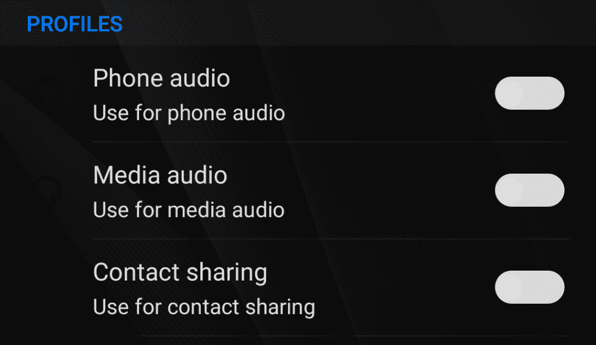

# 如何在任何安卓手机上禁用蓝牙自动播放

> 原文：<https://www.xda-developers.com/how-to-disable-bluetooth-automatic-playback-on-any-android-phone/>

你是否曾经将手机连接到你最喜欢的蓝牙扬声器或车载套件，发现像 Google Play Music、Pandora 或 Soundcloud 这样的应用程序自动开始播放？

这对于那些更喜欢选择他们自己偏好的应用来进行媒体回放的用户来说是非常烦人的。不幸的是，除非您的特定蓝牙设备允许您禁用自动播放，否则您几乎无法阻止播放命令发送到您的设备。

如果你在网上搜索这个问题的解决方案，你可能会看到几页建议用一种相当粗糙的方法来解决这个问题。它包括进入每个特定蓝牙设备的蓝牙配置文件设置页面，并禁用媒体音频配置文件。我称之为“粗糙”的解决方案，因为虽然它确实阻止了自动播放，但在您可以再次使用蓝牙设备进行媒体播放之前，您必须手动返回并重新启用此配置文件。

 <picture></picture> 

Bluetooth Profiles

然而，有一个更好的方法可以用来解决这个问题。如果你读过我以前的任何教程，那么你可能已经猜到这涉及到 Tasker 的使用。不过，这一次，您不需要使用任何其他应用程序/插件，而且该解决方案实现起来相当简单，即使对于 Tasker 初学者来说也是如此。事情是这样的。

* * *

## 了解 Android 上的蓝牙自动播放

当你连接一个发送自动播放命令的蓝牙设备时，本质上发生的是，这个命令被视为 Android 中切换播放/暂停的[按键事件](https://developer.android.com/guide/topics/media-apps/mediabuttons.html)。带有 [MediaButtonReceiver](https://developer.android.com/reference/android/support/v4/media/session/MediaButtonReceiver.html) 广播接收器的应用程序可以对这个媒体按钮事件做出反应。

但是，如果你有多个应用程序可以对这个意图做出反应，Android 如何知道实际开始播放哪个应用程序呢？其工作原理是，Android 跟踪最后一个请求接收媒体按钮事件的应用程序。任何新的媒体应用程序都可以通过调用 AudioManager 中的 [setMediaButtonReceiver](https://developer.android.com/reference/android/media/session/MediaSession.html#setMediaButtonReceiver(android.app.PendingIntent)) 来监听媒体按钮按键事件，该应用程序将处理媒体按钮按键事件，直到另一个应用程序请求控制。通过输入以下 ADB 命令，您实际上可以看到哪个应用程序当前设置为响应这些关键事件:

`adb shell settings get secure media_button_receiver`

在我的设备上，该命令产生了以下输出:

`com.google.android.music/com.google.android.music.playback.MediaButtonIntentReceiver`

这是 Google Play Music 设置的广播接收器，用于响应媒体按钮按键事件。因此，如果我插入我的蓝牙设备，我的手机将自动开始在 Google Play 音乐中播放。

我们可以利用这个事实，让 Tasker 来响应媒体按钮按键事件。这样，Tasker 将吸收切换播放/暂停命令，防止任何其他应用程序对其做出反应，从而开始播放。现在，这是怎么做的。

* * *

## 使用 Tasker 禁用蓝牙自动播放

如前所述，这个项目需要[名任务负责人](https://play.google.com/store/apps/details?id=net.dinglisch.android.taskerm)。不过，这次你不需要任何额外的插件了。我不确定如何在其他自动化应用程序上复制这一点，因为我不熟悉它们的功能集，但您可以自由尝试。

首先，打开 Tasker，点击 **+** 图标创建一个新的个人资料。选择如下所示的**状态上下文**，并选择 **Net - > BT Connected。**在这里，按下姓名或地址栏下的**放大镜**图标，选择您想要阻止自动播放的所有蓝牙设备。

接下来，我们需要创建我们的任务。没有必要命名它，因为这里只有一个动作，它不会在另一个概要文件中使用。进入任务创建屏幕后，按下屏幕底部中间的 **+** 按钮创建一个动作。进入**媒体- >媒体按钮事件**，在下拉菜单中选择**抓取**。根据我的经验，我不需要选择“使用新的 API”，但是如果最终这个项目不工作，你可以返回并启用这个复选框。

一旦你完成，Tasker 现在应该自动设置自己为 Android 中的媒体按钮接收器，连接到你选择的蓝牙设备。这样，发送的播放/暂停动作将不会被任何媒体应用程序接收，而是被 Tasker 接收。

不过，不要担心，因为这并不意味着 Tasker 将无限期地继续抓取媒体按钮按键事件。如前所述，任何应用程序都可以请求这样做，因此当您手动开始在您选择的所需媒体播放器上播放时，它将收回对侦听媒体按钮按键事件的控制。

* * *

## 结论

显然，我不能在每台设备上测试这一点，但我已经通过启用/禁用该配置文件以及反复连接/断开我的蓝牙设备进行了无数次测试。它的效果和我预期的一样，但是你必须自己试一试。

这一次，我不会为您提供一个配置文件来导入，因为这个配置文件非常容易设置，而且还需要您手动更改配置文件来选择您自己的蓝牙设备。但是，请务必让我知道这个描述是否适合你，或者你是否有任何改进的建议！