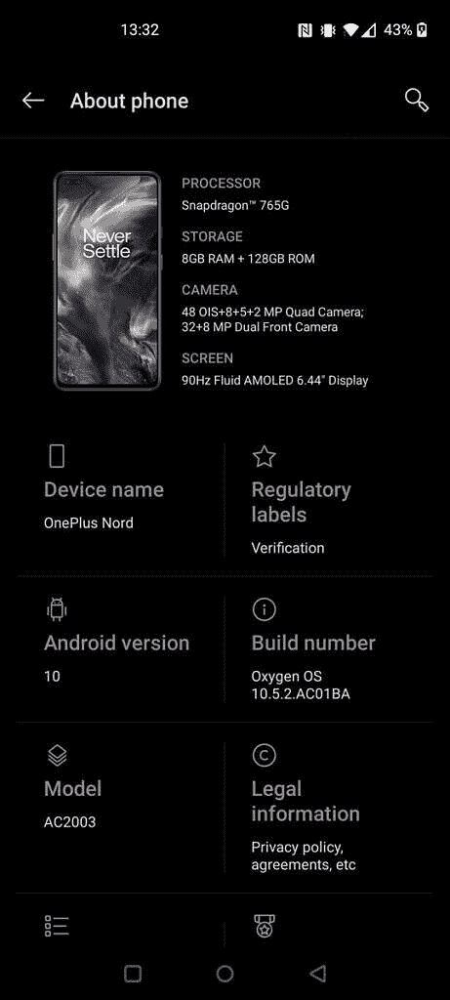
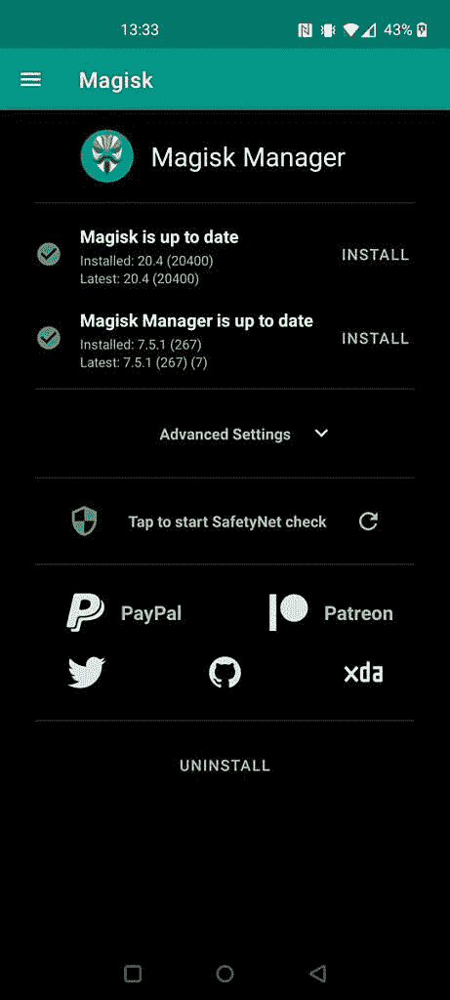

# 如何解锁引导加载程序和根一加诺德与 Magisk

> 原文：<https://www.xda-developers.com/how-to-root-unlock-bootloader-oneplus-nord-magisk/>

# 如何用 Magisk 在一加北部扎根

如果你已经得到了新的一加北，这里有一些步骤，你可以按照轻松解锁引导加载程序和根北与 Magisk。

一加诺德刚刚开始进入早期用户的门廊，而且已经有一种方法让它扎根。XDA 资深会员*[Some _ Random _ Username](https://forum.xda-developers.com/member.php?u=8234677)*整理了一份指南，利用 XDA 资深公认开发者*[topjohnwu’](https://forum.xda-developers.com/member.php?u=4470081)*的 Magisk 对设备进行 root。显然，在 Nord 的产品周期的早期，没有 TWRP 或 flashable Magisk zip，所以要找到它需要一些步骤。你需要准备好你的电脑，熟悉 ADB 和你电脑的命令行界面。

**[一加诺德点评:性价比超高](https://www.xda-developers.com/oneplus-nord-review/)**

**[为什么一加诺德如此熟悉却又如此独特:与产品负责人刘爽](https://www.xda-developers.com/oneplus-nord-unique-interaction-with-shawn-liu-head-product-oneplus-nord/)** 的对话

### 准备您的一加诺德

*   使用[这个线程](https://forum.xda-developers.com/oneplus-nord/how-to/oneplus-nord-repo-oxygen-os-builds-t4138085)将 OxygenOS 更新到最新版本(目前是 10.5.2 ),因为 Nord 附带的版本没有公开的可刷新 zip 文件(因此没有可提取的 boot.img)。
    *   根据您的语言环境下载印度版本或欧盟版本。
    *   进入设置>系统>系统更新，并使用“本地更新”选项。

 <picture></picture> 

Image credit: Reddit user [/u/jisifus](https://www.reddit.com/user/Jisifus)

*   激活开发者选项，选择“允许 OEM 解锁”和“允许 USB 调试”。
*   在你的电脑上安装最新的安卓开发者平台工具，并将你的一加诺德连接到你的电脑上。
*   打开 PC 上的命令终端窗口。

### 支持你的一加诺德

1.  解锁您的引导程序:
    1.  使用 adb 重启你的一加诺德进入快速启动模式(在你的命令窗口中导航到你的平台工具文件夹并输入“ADB 重启引导程序”)。
    2.  在您的命令窗口中键入“fastboot OEM unlock”(警告:解锁引导程序将擦除您的所有用户数据)。
    3.  重启手机，完成 OxygenOS 设置过程。
2.  为您的变体下载并修补启动映像:
    1.  从 [topjohnwu 的回购](https://github.com/topjohnwu/Magisk/releases/download/manager-v7.5.1/MagiskManager-v7.5.1.apk)下载 Magisk Manager。
    2.  下载解压后的 boot.img 作为您的构建版本( [EU](https://drive.google.com/file/d/18aPqErEMbRqmN4BpdvHE4OKgizDcEbou/view?usp=sharing) ) ( [India](https://drive.google.com/file/d/1ZIEYWH2PYkKyojq_S_i_onBstejHKDTJ/view?usp=sharing) )
    3.  安装 Magisk Manager 并选择“选择并修补文件”选项来修补您在上一步中下载的 boot.img 文件。
    4.  一旦 Magisk Manager 完成修补您下载的 boot.img 文件，修补后的文件将出现在您手机的下载文件夹中。
3.  用您下载的并使用 Magisk Manager 修补的启动映像替换您手机的活动启动映像。
    1.  将打了补丁的 boot.img(应该命名为 magisk_patched.img)复制到您的计算机上
    2.  返回到你的电脑的命令窗口，键入“adb 重新启动引导加载程序”，让你的手机返回到快速启动模式。
    3.  键入“fastboot getvar current-slot”并按 Enter 键。
        *   如果输出是，请键入“fast boot flash boot _ a magisk _ patched . img ”,然后按 Enter 键。
        *   如果输出为 b，则键入“fast boot flash boot _ b magisk _ patched . img”并按 Enter 键。
4.  重启 OxygenOS 并打开 Magisk 管理器——它现在应该表明你的手机已经启动了。

 <picture></picture> 

Image credit: Reddit user [/u/jisifus](https://www.reddit.com/user/Jisifus)

如需了解更多详情，您可以查看 XDA 论坛中的以下帖子:

**[指南:如何扎根一加诺德](https://forum.xda-developers.com/oneplus-nord/how-to/guide-how-to-root-oneplus-nord-t4139411) [回购氧气 OS 打造一加诺德](https://forum.xda-developers.com/oneplus-nord/how-to/oneplus-nord-repo-oxygen-os-builds-t4138085)**