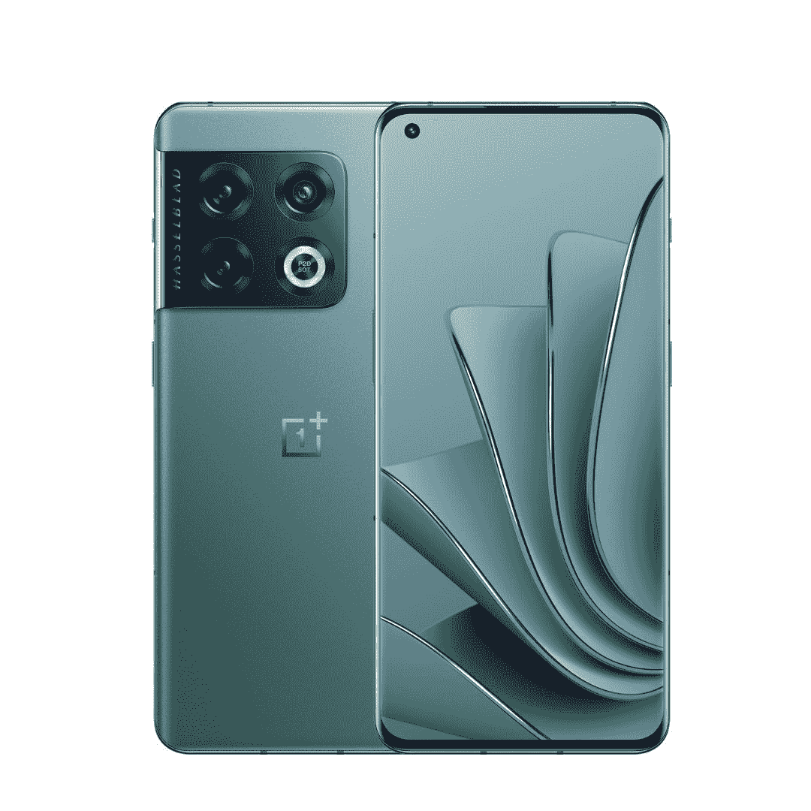

# 如何设置一加 10 专业版

> 原文：<https://www.xda-developers.com/how-to-set-up-oneplus-10-pro/>

# 如何设置一加 10 专业版

一加 10 Pro 肯定会成为适合很多普通用户的旗舰产品。如果你需要帮助设置它，请点击这里！

一加 10 Pro 是来自一加的最新旗舰，这一年中它一定会受到很多关注。虽然这款手机可能不是其前身一加 9 Pro 的重大升级，但它本身就是一款不错的旗舰产品，由于其较低的价格和[更划算的交易](https://www.xda-developers.com/best-oneplus-10-pro-deals/)，这款手机是有意义的。如果你已经买了一台一加 10 专业版，并且在设置过程中需要一些帮助，以下是如何设置一加 10 专业版以便在你所在的地区使用。

## 首次启动后设置一加 10 专业版

在你打开新的一加 10 Pro 的盒子后，按住电源按钮大约 3 秒钟。这将启动手机，并让你进入 OxygenOS 的启动屏幕，第一次启动时可能是 OxygenOS 12:

*   在这个屏幕上选择您的语言。这通常是根据您购买手机的地区设置的，但是如果设置不正确，您可以更改它。
*   您也可以在视觉设置按钮下访问一些辅助功能设置。
*   完成后，点击开始按钮。

*   在您开始使用手机之前，您需要接受一加的 EULA 和隐私政策。如果您点击不同意，您将无法继续。所以向上读，同意相同的。

*   您现在需要将您的设备连接到互联网。
*   如果您还没有插入 nano-SIM 卡，手机会提示您插入。请注意，手机不支持 eSIMs。您可以在没有 SIM 卡的情况下使用手机，因此如果您想这样做，请单击跳过。我们建议使用有一定数据余量的 SIM 卡，因为首次设置不允许您关闭 SIM 卡上的数据。您可以在以后添加 SIM 卡。
*   然后你将登陆 WiFi 连接屏幕。选择您想要连接的 WiFi。你也可以跳过这一步:设备将依靠你的 SIM 卡获取数据；或者，如果您没有插入 SIM 卡，那么您将设置您的设备离线，跳过一些重要的帐户恢复步骤。我们建议使用两者中数据限制更大的一个(通常是 WiFi)。

*   手机将检查更新。如果您在手机生命周期的后期购买手机，一些重要的更新可能会在这个阶段应用。

*   接下来是恢复过程。谷歌提供了几个恢复选项，包括在其 GMS 套件中，一加 10 Pro 在中国以外的地区打包。
*   很有可能您有一个旧设备(Android 或 iPhone ),您正在从该设备升级。您可以通过电缆或无线方式连接设备。
*   对于旧的 Android 手机，你需要在该设备上打开谷歌应用程序，并在搜索框中输入“设置我的设备”。验证新一加 10 专业版上的电话名称，然后继续。
*   对于 iPhones，谷歌会提示你打开 Safari 并前往 android.com/switch,，那里有进一步的说明。在撰写本文时，这些说明包括将 Google Drive 安装到 iOS 上，通过应用程序备份你的内容，关闭 iMessage，然后在新的 Android 设备(在这种情况下是一加 10 Pro)上登录你的 Google 帐户，继续下一步。

*   如果你已经从旧手机恢复，你可能会在这个帐户登录屏幕结束。谷歌可能会让你验证自己的两步验证过程。
*   然后，您需要查看 Google 服务条款、Google Play 服务条款和 Google 隐私政策。您需要这些才能在这台 Android 设备上访问谷歌 Play 商店和您的 Google 帐户。
*   您可以选择禁用一些其他设置。我们建议保持 Google Drive 打开，而使用和诊断数据设置不会以任何方式影响您的用户体验。

*   此时，您可以开始使用手机的大多数功能。如果您需要紧急使用您的设备，您可以离开并获得提醒，以便稍后继续一些可选的设置。

*   继续，你可以选择在设备上设置更简单的谷歌助手触发。你可以选择为它设置语音检测和语音匹配，甚至让 Assistant 工作而无需解锁你的设备。所有这些都是可选的。

*   移过去，您可以添加更改一些进一步的设置。如果需要，您可以添加更多 Google 帐户，更改壁纸，并查看您可以安装的其他应用程序。这些附加应用程序是一加跨地区推荐的。默认情况下，它们被标记为安装在设备上，但如果你不使用这些应用程序，你可以跳过。

*   接下来，系统会提示您是否要参与共创实验室计划。接受此操作将允许一加向您发送推送通知，并从您的设备接收错误报告。
*   在支持的地区，系统还会提示您是否要加入红色有线电视俱乐部。对于印度的用户来说，好处通常包括额外的一年保修，因此这种会员资格值得探索。

*   接下来，我们继续在设备上设置安全性。我们建议使用光学指纹扫描仪解锁您的设备，并配合数字或字母数字密码进行备份。手机会指导你设置所有这些。注册指纹的过程应该不会花太长时间，因为一加 10 Pro 有一个非常好的指纹传感器，而且它的位置也足够高(不像一加 9 Pro)。

*   OxygenOS 将提示您在 Roboto 和一加 Sans 之间选择字体，并让您在字体和其他显示元素的几种大小设置之间进行选择。
*   您也可以在下一个屏幕上选择您的导航风格。您可以选择基于边缘的手势或使用屏幕上的导航按钮。虽然手势不能修改，但一加确实为屏幕按钮提供了两种定位布局。

*   基本上就是这样！您已经成功设置了一加 10 专业版！
*   你的设备将继续在后台下载和恢复一些应用，并应用任何待定的软件更新。但无论如何，你可以开始使用你的设备。

祝贺你的新设备！为了更进一步，您可以查看一加 10 职业版的一些[最佳案例，您也可以访问我们的](https://www.xda-developers.com/best-oneplus-10-pro-cases/)[一加 10 职业版 XDA 论坛](https://forum.xda-developers.com/f/oneplus-10-pro.12503/)来查看社区正在做什么。您还可以查看一些[推荐的调整，这些调整将使您的一加 10 Pro 体验更好](https://www.xda-developers.com/oneplus-10-pro-recommended-settings/)。享受您的新旗舰！

 <picture></picture> 

OnePlus 10 Pro

##### 一加 10 专业版

一加 10 Pro 是一加最新最棒的旗舰智能手机，将一些性能最好的硬件打包在一个包中。它有一个伟大的芯片组，良好的摄像头，和超级快速充电都在一个独特的设计。