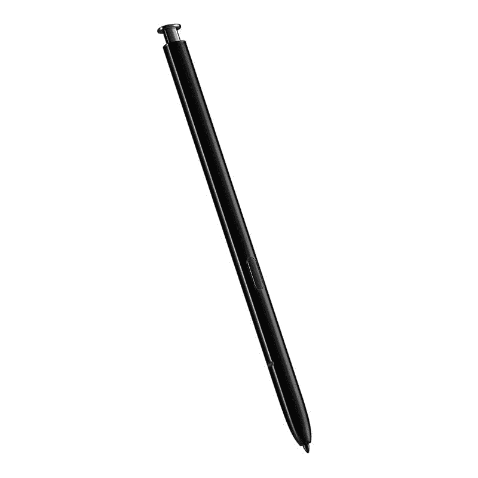

# 如何使用随附的 S Pen 在 Galaxy S22 Ultra 上快速记笔记

> 原文：<https://www.xda-developers.com/how-to-take-notes-samsung-galaxy-s22-ultra-s-pen/>

随着今年早些时候 Galaxy S22 系列的发布，三星终于停止了其广受欢迎的 Galaxy Note 系列。这是因为该公司在新的 [Galaxy S22 Ultra](https://www.xda-developers.com/samsung-galaxy-s22-ultra-review/) 中包含了 Galaxy Note 系列中所有独特的软件和硬件功能。这款顶级旗舰产品是 Galaxy Note 20 Ultra 的精神继承者，它采用了类似的设计，内置 S Pen，以及你希望在旗舰 Galaxy Note 设备上看到的所有软件功能。这些功能可让您使用附带的 S Pen 轻松记下笔记。

如果你刚刚买了一台全新的 Galaxy S22 Ultra，并且想学习如何使用 S Pen 快速记笔记，那么你来对地方了。在这篇文章中，我们将看看三种方法来帮助你在 Galaxy S22 Ultra 上快速做笔记。我们还将尝试几个流行的笔记应用程序，如 Google Keep、Microsoft OneNote 和 Evernote，以了解 Galaxy S22 Ultra 和 S Pen combo 在第三方应用程序中的表现。

## 使用内置的 S Pen 和 Samsung Notes 在 Galaxy S22 Ultra 上记笔记

默认情况下，您在 Galaxy S22 Ultra 上记录的所有笔记都存储在 Samsung Notes 应用程序中。该应用程序提供了大量有用的功能，并与 Galaxy 生态系统紧密集成，使其成为大多数 Galaxy 智能手机用户的首选。除了各种各样的笔记功能，Samsung Notes 还可以让您充分利用 Galaxy S22 Ultra 的内置 S Pen，随时随地记笔记。请继续阅读，了解如何使用 S Pen 在 Samsung Notes 应用程序中快速记笔记。

 <picture></picture> 

Samsung Galaxy S22 Ultra replacement S Pen

##### 三星 Galaxy S22 Ultra S 笔

如果您丢失或损坏了 Galaxy S22 Ultra 附带的 S Pen，您可以购买它作为更换部件。

### 屏蔽备忘录

在 Galaxy S22 Ultra 上记笔记的第一个也是最简单的方法是使用屏幕关闭备忘录功能。顾名思义，这项功能可以让你在不解锁设备或打开显示屏的情况下快速记笔记。以下是启用该功能的方法:

*   导航至 Galaxy S22 Ultra 设备设置中的*高级功能*部分。

*   点击 *S Pen* 选项打开 S Pen 设置。

*   点击*屏幕关闭备忘录*选项旁边的开关，启用该功能。

现在，您已经启用了屏幕关闭备忘录功能，您需要做的就是在屏幕关闭的情况下拔出 S Pen，您应该能够快速记下笔记。

正如你在所附的截图中看到的，memo UI 的屏幕非常简单。它的左上角有两个选项，可以让你改变笔的颜色和粗细，还有橡皮擦按钮。在右上角，你可以看到一个将当前备忘录固定在常亮显示屏上的按钮和一个*保存*按钮。

屏幕关闭备忘录功能无疑是 Galaxy S22 Ultra 上最有用的 S Pen 功能之一。现在你已经知道如何使用它了，我敢肯定，当你想快速记下一些东西时，你会比其他所有的笔记功能更喜欢它。

### 快速创建笔记

虽然屏幕关闭备忘录功能非常方便，但它没有快速创建笔记功能提供那么多定制选项。因此，如果您想要访问额外的自定义选项，如钢笔样式和不透明度，或工具，如荧光笔或选取框，您应该启用快速创建笔记功能。你可以这样做:

*   导航至 Galaxy S22 Ultra 设备设置中的*高级功能*部分。

*   点击 *S Pen* 选项打开 S Pen 设置。

*   点击*快速创建注释*选项旁边的开关，启用该功能。

完成后，解锁您的 Galaxy S22 Ultra 并拔出 S Pen。然后，按住手写笔按钮，用手写笔点击屏幕两次，创建新的便笺。

正如你在所附的截图中看到的，快速创建笔记功能的浮动窗口提供了更多的设置。底部一行包括一个从 S 笔快速切换到屏幕键盘的选项，一个带有五种书写工具和其他定制选项的笔选择器，一个带有几个定制选项的荧光笔工具，一个橡皮擦，一个选取框选择工具，以及撤销/重做按钮

快速创建笔记功能还在右上角提供了一个阅读模式按钮。阅读模式按钮位于一个三点上下文菜单按钮旁边，该按钮带有其他附加选项，可帮助您向笔记中插入图像、文档、语音笔记、绘图等内容，还有页面排序器、页面模板选项、页面设置、全屏视图按钮、帮助您轻松排序笔记的标签、另存为选项和手指绘图开关。上下文菜单还包括收藏夹按钮、共享按钮和删除按钮。

### 空中行动

除了屏幕关闭备忘录和快速创建笔记，Galaxy S22 Ultra 还提供了另一个选项，可以帮助您在三星笔记应用程序 Air actions 中快速记下笔记。按照以下步骤在您的 Galaxy S22 Ultra 上启用 Air 操作:

*   导航至 Galaxy S22 Ultra 设备设置中的*高级功能*部分。

*   点击 *S Pen* 选项打开 S Pen 设置。

*   点击*空气动作*选项，然后点击下页的切换按钮启用该功能。

完成后，解锁设备后，只要您拔出 S Pen，Air actions 菜单就会弹出。该菜单默认包含一个*创建* *笔记*选项，你可以点击它打开一个新的三星笔记浮动窗口。

这是与快速创建备忘录功能相同的窗口，它包括所有其他定制选项，这些选项是屏幕关闭备忘录功能所没有的。

请注意，如果您点击菜单外的任何位置，Air actions 菜单将会关闭。但是您可以使用 Air actions 浮动操作按钮(FAB)将它拉回来。FAB 将出现在显示屏的右边缘，并一直保持在那里，直到您将 S Pen 放回其插槽中。

如果你不喜欢它的默认位置，你可以点击并按住它来移动它，并将其贴在显示屏左右边缘的任何位置。您也可以手动关闭它，方法是将它拖到显示屏顶部的 Remove 提示符上。

## 使用内置的 S Pen 和第三方应用程序在 Galaxy S22 Ultra 上记笔记

现在，您已经知道了使用 S Pen 和 Samsung Notes 应用程序在 Galaxy S22 Ultra 上快速记笔记的所有便捷方法，让我们看看如何在一些流行的第三方笔记应用程序上记笔记。

值得一提的是，以下应用程序都无法像默认的三星笔记应用程序那样与 S Pen 无缝配合，并且您可以快速为这些应用程序打开新的笔记窗口的唯一方法是在 Air actions 菜单中添加快捷方式。为此，您可以遵循以下步骤:

*   解锁您的 Galaxy S22 Ultra 并拔出 S Pen 以打开 Air actions 菜单。
*   点击菜单底部的*添加*按钮，将快捷方式添加到您喜欢的笔记应用程序。

*   在接下来的屏幕上，向下滚动到*所有* *应用*部分，并点击您想要添加到 Air actions 菜单的笔记应用的图标。(注意:在 Air 操作菜单中最多只能添加 10 个快捷键。如果列表已满，您可以通过点击右栏中应用程序图标右上角显示的减号来删除一些默认快捷方式)

*   点击后退按钮或从显示屏的任一边向内滑动，退出 Air actions 快捷方式页面。

现在，您应该会在 Air actions 菜单中看到您喜欢的笔记应用程序的快捷方式。然而，即使有了快捷方式，使用 S Pen 和 Air 操作在第三方应用程序上记笔记也不像三星 notes 应用程序那样无缝。快捷方式只需打开以下应用程序，你必须再次点击以创建一个新的笔记，然后才能开始写作。

### Microsoft OneNote

尽管微软 OneNote 没有提供与三星默认 Notes 应用相同的体验，但它确实提供了一个你在 Google Keep 和 Evernote 上无法获得的便捷功能。该应用程序支持 Air actions，允许您使用 S Pen 执行一些快速操作。您可以使用 OneNote 中的 S Pen 创建新笔记、创建新的图片笔记、在当前笔记中插入图像、向上滚动、向下滚动、在页面之间切换以及放大或缩小。

但是，此功能在默认情况下是不启用的，因此您需要跳转到 Air actions 设置来设置它。你可以这样做:

*   导航至 Galaxy S22 Ultra 设备设置中的*高级功能*部分。

*   点击 *S Pen* 选项打开 S Pen 设置。

*   点击*空气动作*选项，向下滚动到*应用程序动作*部分。

*   单击 OneNote 应用程序图标，为该应用程序启用应用程序操作，一切就绪。

现在，您应该能够在 OneNote 应用程序中使用上述 air 操作。

与 Google Keep 和 Evernote 相比，使用 OneNote 的另一个好处是，当你用 S 笔创建新笔记时，应用程序会自动选择笔输入。使用 Google Keep 和 Evernote，你必须在新笔记中启用绘图/草图选项，才能开始用 S Pen 书写。这使得这个过程有点慢。

### Google Keep

如前所述，Google Keep 不提供任何快捷方式来帮助您使用 S Pen 快速记笔记。您必须打开应用程序(从应用程序抽屉或从 Air 操作菜单)并创建一个新的备忘录。

要使用 S 笔书写，您必须点击左下角的附件按钮，并选择*绘图*选项，开始使用 S 笔书写。

或者，您可以使用三星键盘应用程序上的*手写*选项，使用 S 笔在文本字段中书写。

和前面的方法一样，这个选项对于快速记笔记并不理想，所以你可以使用默认的屏幕关闭备忘录或者快速创建笔记功能。

### Evernote

和 Keep 一样，Evernote 也不会在你创建新笔记的时候选择 S Pen 作为默认的输入法。你必须从底部工具栏选择*草图*选项，才能用 S Pen 书写，或者你可以使用三星键盘的*手写*选项在文本字段内书写。

然而，Evernote 确实提供了比 Keep 更广泛的功能。因此，如果你对这两者感到困惑，我们建议你使用 Evernote 而不是 Keep。

现在，您已经知道了使用内置 S Pen 在 Galaxy S22 Ultra 上快速记笔记的所有方法，您打算使用哪种方法？虽然我是谷歌 Keep 用户，但每当我想快速记下一些东西时，我更喜欢使用 Galaxy S22 Ultra 上的屏幕关闭备忘录和快速创建笔记功能。由于这些功能会自动将我所有的笔记保存在 Samsung Notes 应用程序中，我现在会根据我使用的主要手机在 Google Keep 和 Samsung Notes 之间切换。

请务必查看我们在[上的帖子，Galaxy S22 Ultra](https://www.xda-developers.com/samsung-galaxy-s22-ultra-s-pen-features/) 上提供的所有 S Pen 功能不仅仅是用活动手写笔做笔记。