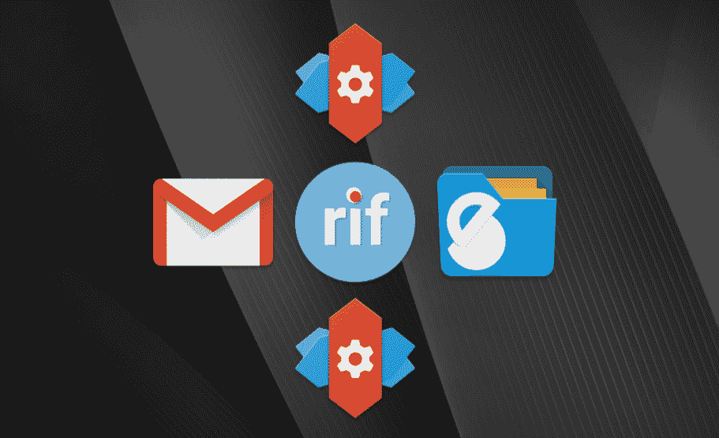

# 如何在任何启动器上使用 EMUI 的 App Twin 功能

> 原文：<https://www.xda-developers.com/how-to-use-emuis-app-twin-feature-on-any-launcher/>

几天前，我分享了一个教程，概述了如何将 EMUI 的 App Twin 功能与[任何安装在你设备上的应用程序或游戏](https://www.xda-developers.com/how-to-clone-any-application-with-emuis-app-twin-feature-no-root/)一起使用。

如果你有一台华为或 Honor 设备，安装了 Android 7.0 牛轧糖和 EMUI 5(如华为 Mate 9 系列、华为 P9/P9 Lite、Honor 6X 或 Honor 8)，那么你可能会发现该教程很有用。虽然这的确是一个巧妙的解决办法，解决了华为/Honor 设置的一个不必要的限制，但在这个功能上还有另一个我觉得很傻的限制。

即使该教程中概述的说明绕过了阻碍 App Twin 功能的最大障碍，你仍然必须处理 App Twin **只能与股票 EMUI 启动器**一起工作的事实。我对我的教程上的这个大星号不满意，我想看看是否有办法解决这个问题。幸好有。

我发现克隆的应用程序不是沙盒应用程序，事实上可以对针对原始应用程序活动的常规 Android 意图做出反应。例如，当我试图分享一个从 Chromium 到 Reddit is Fun 的链接时，我遇到了“完成动作使用”对话框，要求我在原始应用程序和克隆应用程序之间进行选择。

这意味着克隆的应用程序可以通过发送针对应用程序主要活动的意图来启动。毕竟铬能做到，我们为什么不能？

事实上，使用这样的东西来做这件事相当简单，允许我们从我们选择的任何第三方启动器启动克隆的应用程序**。**使用一个意图/快捷方式生成器，如来自 Play Store 的[意图](https://play.google.com/store/apps/details?id=krow.dev.scheme)或[开始意图](https://play.google.com/store/apps/details?id=com.parthpanchamia.startintent)，我们可以创建快捷方式来打开“完成动作使用”选择器。

虽然这些应用程序是免费的，但是它们要求您知道主要活动/组件的名称，您可以从 logcat 或通过查看 AndroidManifest 来收集这些信息。因此，由于很难找到合适的目标活动，我将向您展示如何使用。

 <picture></picture> 

App Twin in Nova Launcher

注意:如果你没有使用 App Twin 功能，这个教程是没有意义的。本教程将适用于任何使用该功能的克隆应用程序，但默认情况下，EMUI 只允许您克隆 Whatsapp/脸书或 QQ/微信。如果你想克隆其他应用程序来在第三方启动器中使用它们，那么你需要[按照我之前的教程](https://www.xda-developers.com/how-to-clone-any-application-with-emuis-app-twin-feature-no-root/)来做。

* * *

## 在任何启动器上使用 App Twin 功能

这将如何工作很简单。我们将在 Tasker 中创建一系列任务，每个任务只包含一个动作:启动应用程序孪生列表中每个应用程序的主活动。当活动启动时，它将打开一个对话框，要求您打开原始应用程序或您克隆的应用程序的主活动。我们将在主屏幕上放置一个快捷方式来运行每个任务，比如在 Nova Launcher 中，这样我们就可以从 EMUI launcher 中解除 App Twin 特性的绑定。

打开 Tasker，点击顶部的“任务”标签。点击右下角的 **+** 图标，创建一个新任务。以您克隆的应用程序命名任务。一旦进入任务编辑屏幕，点击屏幕底部中间的 **+** 图标，添加一个新动作。进入**应用- >启动应用**，找到你克隆的应用。**长按应用名称上的**，调出活动列表。在列表中找到看起来像**主活动**的东西，并选择它。

注意，这个列表中并不总是有一个“主活动”。从技术上讲，启动应用程序主屏幕的活动可以被命名为任何东西。例如，启动 Gmail 的主要活动叫做“邮件活动”如果你不知道是哪一个，不要担心，因为你可以通过简单的试错找到它。选择一项活动后，只需返回到任务编辑屏幕，然后按左下角的 play 按钮来测试任务。如果您看到一个“完成操作使用”对话框弹出，那么您已经得到了正确的活动。

最后，为了让 Tasker 能够将该任务作为快捷方式/小部件添加到您的主屏幕上，我们必须为该任务分配一个图标。在任务创建界面中，再次点击右下角的图标(看起来像一个由 9 个方块组成的网格)。你会看到一个“图像选择”对话框弹出。如果你有想要使用的自定义图标，你可以选择“本地媒体”，否则我建议点击**应用程序图标**，这样你就可以使用应用程序的默认图标。

这次任务应该就这样了。对您想要添加到第三方启动器的所有其他克隆应用程序重复此过程。

一旦你这样做了，把这个任务添加到你的主屏幕就非常简单了。只需调出你的启动器的小部件创建菜单(通常是长按空白区域),在 Tasker 小部件列表下寻找**任务快捷方式**。点击它，然后选择您之前创建的任务。您必须为每个您想要的克隆应用程序重复此操作。

就是这样！现在你可以在你选择的任何启动器上使用你选择的任何应用程序来享受 EMUI 的应用程序孪生功能。华为/Honor 限制该功能排他性的两种尝试现在都变得毫无意义。让我们只希望这不会在未来的更新中得到修补！

* * *

**如果你在 EMUI 5 上拥有一台华为/Honor 设备。x，试试这个，让我们知道它是否适合你！**