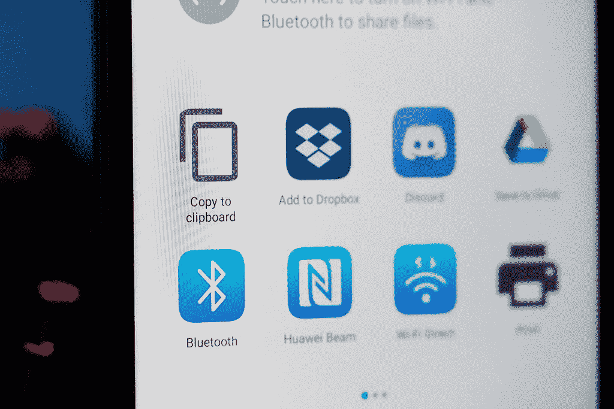

# 如何使用 Android 剪贴板

> 原文：<https://www.xda-developers.com/how-to-use-the-android-clipboard/>

Android 操作系统让你能够访问剪贴板功能，让你选择文本并粘贴到其他地方。这是一个基本的剪贴板功能，当你按住想要复制的文本时，它就会被激活。以下是如何在 Android 上使用剪贴板功能。

**复制文本:**

1.  按住您想要复制的文本
2.  调整滑块以指定您想要选择的文本
3.  按“分享”

**粘贴文本:**

1.  在文本栏中按住
2.  选择“粘贴”

 <picture></picture> 

Android Share's "Copy to Clipboard" Option.

剪贴板也在共享功能中实现。当您选择“共享”时，您可以将您正在共享的内容的 URL 拷贝到剪贴板。现在你可以把它粘贴到任何你需要的地方。

Google Play 商店为提供更强大的剪贴板的应用程序提供了许多选择。如果默认的剪贴板不能为你剪切它，检查一些第三方应用程序。