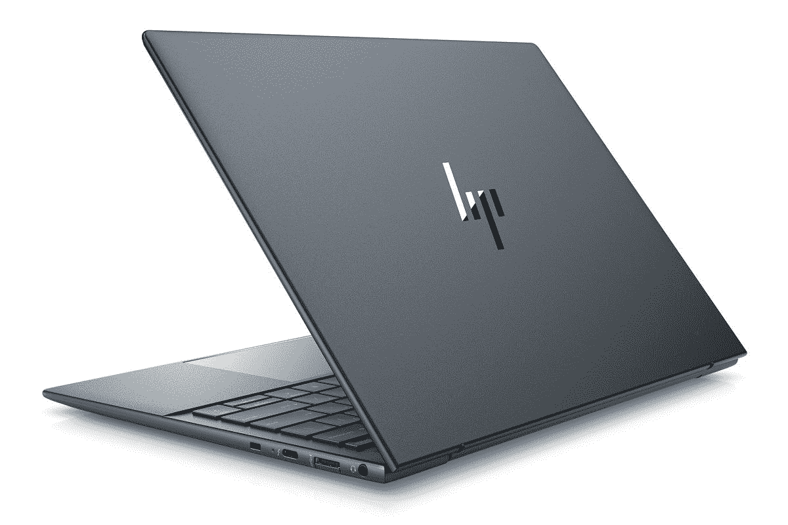

# 惠普精英版蜻蜓 G3 有 5G 吗？4G LTE 呢？

> 原文：<https://www.xda-developers.com/hp-elite-dragonfly-g3-have-5g/>

惠普在蜻蜓的精英阵容已经迅速成为一些你能买到的[最好的商用笔记本电脑](https://www.xda-developers.com/best-business-laptops/)的大本营。随着即将推出的 [Elite 蜻蜓 G3](https://www.xda-developers.com/hp-elite-dragonfly-g3/) ，惠普带来了许多新东西，包括 3:2 显示屏、更快的英特尔处理器和新的轻量级翻盖设计。许多商用笔记本电脑也提供蜂窝连接选项，随着 5G 成为新标准，您可能想知道惠普精英蜻蜓 G3 是否支持它。

好消息是确实如此，但你必须愿意为此付出代价。与大多数笔记本电脑一样，5G 支持是可选的，这肯定是一个昂贵的升级。Elite 蜻蜓 G3 还为您提供了以 Cat16 速度获得 4G LTE 支持的选项，这仍然是相当快且更实惠的。

## 惠普精英蜻蜓需要 5G 吗？

蜂窝连接意味着您的笔记本电脑可以使用与您的手机相同类型的网络来连接互联网。这是商务笔记本电脑的一个常见功能，因为商务用户经常希望无论身在何处都能保持联系。有了蜂窝支持，你就不需要依赖公共 Wi-Fi 了，公共 Wi-Fi 可能很慢，不安全，或者根本不存在。

5G 是最新一代的蜂窝网络，它具有更高的速度和更多的带宽，可以同时容纳更多的用户。然而，谈到 5G 时讨论的大多数好处，如数千兆位的速度，实际上只有毫米波 5G 才能实现，毫米波 5G 的范围比低于 6GHz 的 5G 小得多。大多数笔记本电脑都支持 mmWave 5G，所以你不会获得那些超快的速度。

不过，惠普没有明确表示精英版蜻蜓 G3 是否支持毫米波 5G。然而，它仍然会更快，随着 5G 网络变得更加广泛和更加优化，这一点将更加真实。5G 支持也能给你买些长寿。例如，十年后，4G 网络可能会关闭，你将无法再使用它们，但 5G 将得到更长时间的支持。

另一方面，使用 4G LTE 通常更便宜，在速度方面，你不会损失太多。LTE 网络已经存在了大约十年，因此现在更加稳定可靠。如果你计划几年后升级你的笔记本电脑，你可以现在选择 4G 配置，以后再买 5G 笔记本电脑，这样可以节省一些钱。我们不知道惠普对精英版蜻蜓 G3 的 5G 比 LTE 多收费多少，但如果你看看精英版蜻蜓 Max，升级费用超过 200 美元。

当然，如果你根本没有手机调制解调器，你可以省更多的钱，但是那样的话，你就不得不依靠 Wi-Fi 来连接互联网了。如果您需要在旅途中保持连接，或者您可能更喜欢使用移动 Wi-Fi 热点，无论是您的手机还是专用设备，这完全取决于您。

* * *

精英蜻蜓 G3 的伟大之处在于你可以根据自己的喜好进行配置。除了蜂窝支持之外，您还可以更改处理器、RAM、存储等等。你可以使用下面的链接购买，但如果你还不相信，你可以看看今天可以购买的[最佳 5G 笔记本电脑](https://www.xda-developers.com/best-5g-laptops/)。如果你认为你不需要它，看看惠普的[其他伟大的笔记本电脑。](https://www.xda-developers.com/best-hp-laptops/)

 <picture></picture> 

HP Elite Dragonfly G3

##### 惠普精英蜻蜓 G3

惠普 Elite 蜻蜓 G3 是惠普最高端的商用笔记本电脑，配备第 12 代英特尔处理器、3:2 显示屏和可选的 LTE 或 5G 蜂窝支持。