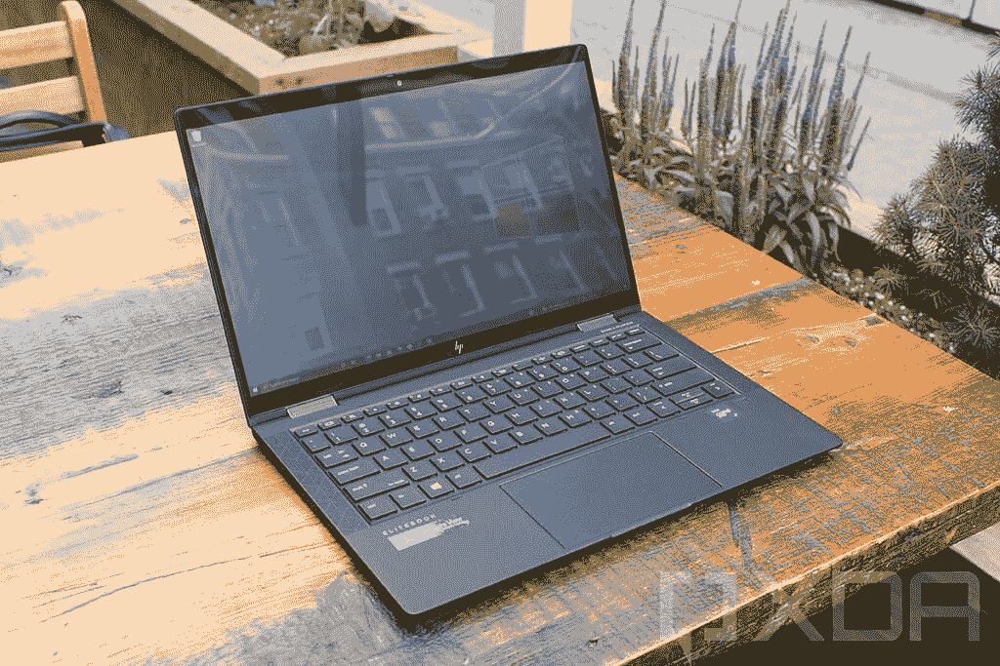

# 惠普精英版蜻蜓 G3 有多重？

> 原文：<https://www.xda-developers.com/hp-elite-dragonfly-g3-weight/>

惠普精英版蜻蜓 G3 很可能是 2022 年[最佳商务笔记本电脑](https://www.xda-developers.com/best-business-laptops/)之一，尤其是如果你想要感觉高端的东西。它由第 12 代英特尔处理器驱动，另外它有一个新的 3:2 显示屏，一个更好的网络摄像头，以及翻盖设计，而不是可折叠的。以前的惠普精英蜻蜓型号非常轻便，那么蜻蜓 G3 的重量是多少呢？

令人欣慰的是，它仍然非常轻，起始重量为 0.99 千克或 2.2 磅。这使它成为你可以买到的最轻的笔记本电脑之一，并且它不会做出太多牺牲。它仍然拥有您想要的商用笔记本电脑的所有端口、出色的显示屏和强大的英特尔处理器。它的厚度也是 16.4 毫米，这并不令人印象深刻，但它很坚固。请记住，这是起始重量，它可能会根据您的配置而增加。

它如此轻的原因是它由镁合金制成，很像以前的精英蜻蜓车型。镁是一种有趣的金属，因为它可以提供与铝相同的耐用性，同时更薄，这使得笔记本电脑更轻。这种材料近年来在高端笔记本电脑中变得更加常见，但大多数仍然使用铝。此外，惠普使用加工镁，而不是成型镁，这有助于它感觉就像是由铝制成的一样优质。

## 它与以前的惠普精英蜻蜓型号相比如何？

在重量方面比较惠普 Elite 蜻蜓 G3 和它的前辈是很有趣的，因为它们是非常不同的笔记本电脑。以前的型号是敞篷车，加上它们有 16:9 的显示屏。

惠普精英版蜻蜓 G2 更像是它的前身，重 2.18 磅，实际上比精英版蜻蜓 G3 轻一点。但 Elite 蜻蜓 G2 也是一款更小的笔记本电脑，因为它采用了 16:9 的显示屏。它的尺寸为 304.29 x 197.61 毫米，而第三代车型的尺寸为 297.4 x 220.4 毫米。此外，Elite 蜻蜓 G3 对网络摄像头进行了大幅升级，从 720p 传感器升级到 500 p 摄像头，增加了厚度，同时增加了重量。另一方面，由于它不再是敞篷车，精英蜻蜓 G3 更容易变得更轻。

 <picture></picture> 

HP Elite Dragonfly Max

或者，你也可以将它与精英蜻蜓 Max 相比较。这款笔记本电脑的尺寸与 Elite 蜻蜓 G2 完全相同，但起始重量仅为 2.49 磅。它包括一个 500 万像素的摄像头，类似于 Elite 蜻蜓 G3 上的摄像头，加上基本配置包括一个英特尔酷睿 i7 型号和 16GB 的内存，这有助于解释重量的差异。最有可能的是，如果你在 HP Elite 蜻蜓 G3 上使用相同的配置，你会看到类似的重量。

这三款笔记本电脑在端口方面都是一样的:两个 Thunderbolt 4 端口，一个 USB Type-A，HDMI 和一个耳机插孔。没有一款车型在这方面做出牺牲，做到和它们一样轻。

* * *

惠普精英蜻蜓 G3 是一款昂贵的笔记本电脑，但如果你感兴趣，你可以在下面购买。如果你想看看其他选择，你可以看看你现在能买到的最好的惠普笔记本电脑。或者，如果你想要更便携的东西，不妨看看我们的[最佳轻便笔记本电脑](https://www.xda-developers.com/best-lightweight-laptops/)列表。

 <picture></picture> 

HP Elite Dragonfly G3

##### 惠普精英蜻蜓 G3

惠普 Elite 蜻蜓 G3 是惠普最高端的商用笔记本电脑，采用第 12 代英特尔处理器、3:2 显示屏和重量仅为 2.2 磅(不到 1 千克)的轻质设计。