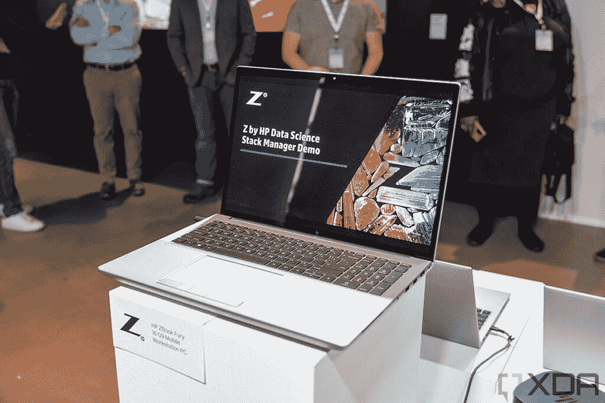
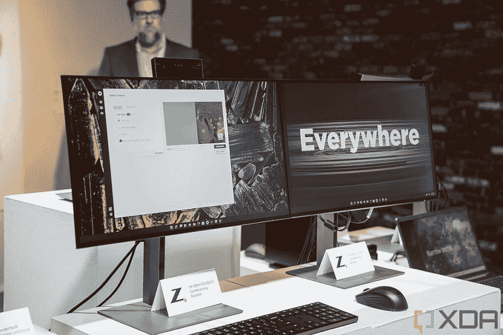
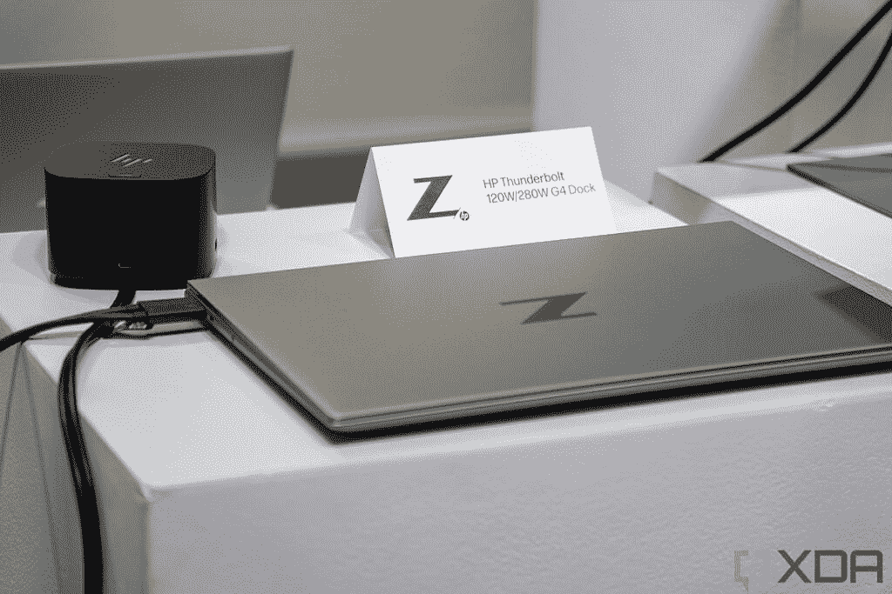

# 惠普通过新的 ZBook 移动工作站关注创作者

> 原文：<https://www.xda-developers.com/hp-focuses-on-creators-with-new-zbook-mobile-workstations/>

今天，惠普宣布其 Z 系列的所有新产品，包括一些 ZBooks，一些显示器，甚至惠普 Thunderbolt Dock G4。具体来说，这两款新笔记本电脑是 ZBook Studio G9 和 ZBook Fury G9。

惠普公司高级计算和解决方案总经理兼全球负责人 Jim Nottingham 表示:“创意专业人士希望获得个性化的硬件和软件体验，让他们能够自由追求自己的激情和创造，而不会受到技术或地理位置的限制。今天惠普发布的 Z 将尖端技术与组合生态系统的多功能性相结合，让每一个创意都成为现实。”

## 惠普 ZBook Studio G9 和 ZBook Fury G9

惠普的 ZBook 移动工作站旨在能够处理最复杂的工作负载。ZBook Studio 和 ZBook Fury G9 都配备了英特尔新的第 12 代处理器。ZBook Studio 根据您的需求，最高可配有酷睿 i9 博锐 CPU 和英伟达 RTX A5500 或 GeForce RTX 3080 Ti。

 <picture></picture> 

HP ZBook Fury G9

ZBook Fury G9 更厉害。它拥有英特尔新的 55W HX 系列处理器，以及英伟达 RTX A5500 GPU 或 AMD 镭龙 Pro GPUs。凭借这些新处理器，惠普有望获得台式机级的性能，因为它们更接近于英特尔的标准 S 系列 CPU。

ZBook Fury 和 ZBook Studio 都将于 6 月上市，定价将在稍后公布。

## 显示器和新的坞站

惠普今天将发布两款新显示器，Z24m G3 QHD 会议显示器和 Z24q G3 QHD 显示器。

 <picture></picture> 

HP Z24 monitors

如果你正在寻找一款 QHD 分辨率的 23.8 英寸显示器，惠普可以满足你的需求，尤其是因为它有 90Hz 的刷新率。它们是针对 sRGB 和 P3 进行工厂校准的，并且它们具有 VESA DisplayHDR 400。两者之间的最大区别是 Z24m G2 QHD 会议显示器有一个可倾斜的 500 万像素网络摄像头。

惠普 Z24m G3 QHD 会议显示器将于 7 月上市，价格将于稍后公布。Z24q 将于 5 月上市，起价 374 美元。

 <picture></picture> 

HP Thunderbolt Dock G4

惠普的新 Thunderbolt Dock G4 增加了一系列端口，如双显示端口、HDMI、几个 USB Type-A 等。真正有趣的是，它有 120 瓦和 280 瓦两种型号，所以如果你需要，它可以更快地为你的笔记本电脑充电。Thunderbolt Dock G4 将于 5 月上市，120W 型号的价格为 329 美元，280W 型号的价格为 439 美元。