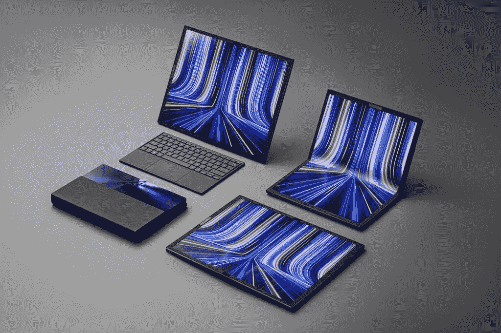

# 据报道，惠普正在开发一款 17 英寸的可折叠笔记本电脑

> 原文：<https://www.xda-developers.com/hp-working-17-inch-foldable-laptop/>

根据一份新的报告，惠普正准备在今年晚些时候或明年初推出其首款可折叠笔记本电脑。该公司将使用 LG Display 生产的 17 英寸 4K 有机发光二极管面板，由 SK IE Technology 提供透明的聚酰亚胺薄膜。

惠普并不是第一个加入这一潮流的公司，因为华硕最近宣布了 [ZenBook 17 Fold 有机发光二极管](https://www.xda-developers.com/asus-unveils-zenbook-17-fold-oled-foldable-pc/)，这几乎是相同的概念。它还有一个 17 英寸的显示屏，可以折叠成两个 12.5 英寸的两半。

然而，这款所谓的惠普设备和华硕的版本之间有一些值得注意的差异。根据 Elec 的报告，惠普可折叠笔记本电脑将采用 3840 x 2160 分辨率的 4K 显示屏，长宽比为 16:9。折叠后，显示屏的对角线约为 11 英寸，分辨率为 2160 x 1920，长宽比约为 4:3.59，看起来更像方形。作为参考，华硕笔记本电脑展开时的长宽比为 4:3，折叠后的长宽比为 3:2。它也没有那么清晰，全屏分辨率为 2560 x 1920。

 <picture></picture> 

ASUS ZenBook 17 Fold OLED in different postures

可折叠手机在过去几年中获得了更多的牵引力，这在很大程度上要归功于三星的 Galaxy Z 系列，但可折叠笔记本电脑几乎闻所未闻。几年前发布了一款联想 ThinkPad X1 Fold ,但它被令人失望的性能和过高的价格所拖累。

可折叠笔记本电脑真正流行起来可能还需要一段时间。根据该报告，LG Display 将从今年第三季度开始向惠普提供约 1 万台可折叠有机发光二极管显示器。这可能是因为惠普并不打算大量销售这种笔记本电脑，但这往往是许多新外形的早期尝试的结果。根据该设备的受欢迎程度，我们可能会在不久的将来看到更多这样的设备。

* * *

来源:[选举委员会](http://www.thelec.net/news/articleView.html?idxno=3991)