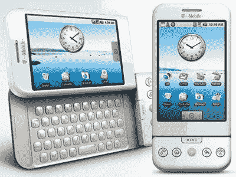

# 如果没有 HTC，Android 就不会有今天

> 原文：<https://www.xda-developers.com/htc-android-smartphone-history/>

本周，随着 HTC Desire 20 Pro 和 U20 5G 的发布，HTC 再次成为头条新闻。如果你在网上读到这些设备，你可能会看到很多评论，比如“HTC 还没死？”或者“HTC 还做手机？”除了 VR 之外，该公司近年来在智能手机领域没有太多作为，所以许多人对其不屑一顾也就不足为奇了。这很不幸，因为 HTC 曾经是智能手机领域的巨头。事实上，该公司与 Android 的早期成功有很大关系。

确实 HTC 最近在智能手机上做的不多。除了 Exodus 品牌下的几款利基[“区块链”手机，这家台湾公司推出的最后一款真正为消费者制造的智能手机是 2018 年底](https://www.xda-developers.com/htc-5g-hub-second-gen-blockchain-phone/)的 [Desire 12s。当然，从那以后有一些设备以 HTC 的名字](https://www.xda-developers.com/htc-desire-12s-qualcomm-snapdragon-435/)在[推出，但是它们只是使用 HTC 品牌](https://www.xda-developers.com/htc-wildfire-r70-announced-specifications-india/)的智能手机，而不是实际上由 HTC 制造的。即使是新发布的智能手机也是非常基本的中型产品，尽管该公司希望通过搭乘 5G 列车[扭转局面，并在最近的 U20 5G 中达到高潮。可悲的是，大多数人不会关心这些设备，但 HTC 以前不是这样。](https://www.xda-developers.com/htc-still-making-phones-will-launch-5g-smartphone-this-year/)

 <picture></picture> 

The first Android phone

如果你是一个 Android 的死忠，你可能知道该公司的历史可以追溯到平台的开始。2008 年，该公司发布了第一款商用安卓手机，HTC Dream/T-Mobile G1。在相当长的一段时间里，HTC 负责市场上最好的 Android 手机。Hero、DROID Incredible、EVO 4G 和 Desire 等手机推动 Android 操作系统成为苹果 iPhone 上 iOS 的有力竞争对手。谁能忘记 2010 年中期广为流传的臭名昭著的“ [iPhone 4 vs HTC Evo](https://www.youtube.com/watch?v=FL7yD-0pqZg) ”视频呢？HTC 与谷歌关系密切，以开发高质量的智能手机和软件而闻名，甚至合作开发了[首款 Nexus 设备](https://forum.xda-developers.com/nexus-one)。伟大的软件才是真正让他们与众不同的地方——我相信很多人仍然会深情地回忆起 Sense UI。

我与 HTC 的个人历史可以追溯到 2009 年的 DROID 厄里斯。当时，威瑞森有两款安卓设备:超受欢迎的摩托罗拉 droid 和 HTC DROID 厄里斯。我清楚地记得我选择了厄里斯，因为它有该公司的“感觉用户界面”皮肤。那时候，普通的 Android 很难看，Sense UI 是一个巨大的进步。HTC 制造了伟大的硬件，但是它的软件是它对 Android 最大的贡献。

在早期，Android 皮肤非常重要，因为股票 Android 在功能和设计方面非常缺乏。直到 2011 年推出 Android 4.0 冰淇淋三明治，Android 才开始看起来真正有吸引力。然而，这不仅仅是谷歌的问题。三星早期的安卓手机以“TouchWiz”为特色，这是苹果一系列[设计诉讼的主题。摩托罗拉的“Motoblur”软件很不错，但是有一些非常奇怪的想法。原始设备制造商正在努力寻找他们的移动身份，但 HTC 锁定了他们的身份，并坚持了下来。](https://en.wikipedia.org/wiki/Apple_Inc._v._Samsung_Electronics_Co.)

问题是他们坚持太久了。谷歌慢慢改进了股票 Android 的设计，Sense UI 开始觉得过时了。随着其他皮肤开始看起来更现代，skeuomorphic 设计变得很差。我记得当 Sense UI 开始感觉过时时，我在 HTC 手机上安装了定制的股票 rom。还记得 [Evervolv](https://forum.xda-developers.com/showthread.php?t=2172323) 吗？该公司最终对 Sense UI 进行了修改，并采用了一种更简单、更接近库存的方法，但为时已晚。与此同时，在硬件方面，三星正全力以赴，占领市场。

我不确定 HTC 能做些什么来保持相关性。我所知道的是，在 Android 早期，它是谷歌非常重要的合作伙伴。许多人对 Android 的第一次体验是通过一台 HTC 设备。该公司向世界展示了苹果不是唯一一家可以制造漂亮手机的公司，我相信 HTC 的 Sense UI 推动了谷歌对 Android 进行视觉改进。

HTC Desire 20 Pro 和 U20 5G 将为该公司注入新的活力，这种可能性一直存在。该公司很清楚，Android 生态系统比 2008 年时更加拥挤，竞争更加激烈。看到 OG 半途而废总是令人难过，但 HTC 对 Android 的贡献不应被忘记。尊重你的长辈。