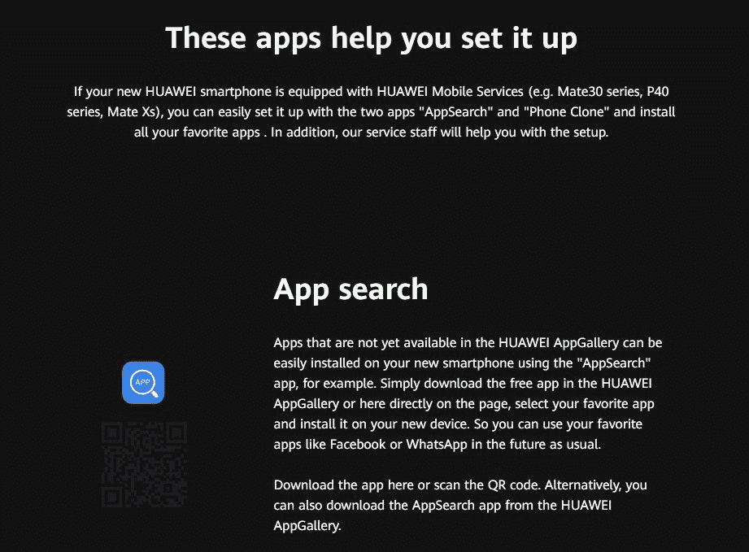

# 华为 AppSearch 帮助用户在没有 Play Store 的情况下下载应用

> 原文：<https://www.xda-developers.com/huawei-appsearch-download-popular-apps-without-google-play-store/>

由于美国商务部去年将华为列入实体名单，华为无法与谷歌签署新的移动应用分发协议(MADAs)，这使得华为无法分发带有谷歌移动服务(GMS)的新移动设备。这意味着，所有新的华为智能手机和平板电脑，至少不是现有已认证设备的更名型号，都不能搭载谷歌应用程序。这对华为来说是个问题，因为绝大多数安卓应用都是通过谷歌 Play 商店分发的，所以华为不得不在自己的 AppGallery 应用商店中增加应用目录。然而，仍有许多流行的 Android 应用程序在 AppGallery 上不可用，这迫使用户安装亚马逊或 Aptoide 等其他应用程序商店，或从 APKMirror 等托管网站下载 APK 文件。

为了让用户更容易下载流行的应用程序，而不必从不同的网站下载额外的应用商店或侧载 apk，华为正在开发一款名为“AppSearch”的应用程序。该应用目前正在德国进行测试，APK 可在华为 AppGallery 的[德国网站上公开访问。(该网站的名称“zukunftsversprechen”大致翻译为“未来的承诺”，华为在美国贸易禁令后用它来宣传其对设备的承诺。)AppSearch](https://www.zukunftsversprechen.de/) 的[登陆页面称，该应用旨在帮助用户在配备了](https://www.zukunftsversprechen.de/#appsuche)[华为移动服务](https://www.xda-developers.com/huawei-hms-core-android-alternative-google-play-services-gms/)的华为智能手机上安装他们喜欢的应用。华为将脸书和 WhatsApp 列为可以通过在 AppSearch 中搜索下载的应用程序示例，描述中将“Mate30 系列、P40 系列和 Mate Xs”列为该应用程序打算在其上使用的设备示例。

 <picture></picture> 

Description of the Huawei AppSearch app translated from German to English using Google Translate.

XDA 撰稿人 Max Weinbach 在他的华为 Mate 30 Pro 上侧装了该应用程序，分享以下截图。正如你所看到的，AppSearch(德语:“AppSuche”)为用户提供了一种简单的方法，可以在一个地方找到 WhatsApp、脸书、Instagram、Twitter、Telegram 等热门应用。这款应用可以让你按照受欢迎程度、字母顺序或类别对列表进行排序。你可以点击一个应用程序来查看描述和下载位置。请注意，AppSearch 实际上并不提供任何应用程序的直接下载。事实上，该应用程序中的免责声明称，“[AppSearch]通过整合多个下载源来协助用户找到热门应用程序。通过[AppSearch]可以访问的所有内容都是由第三方提供的。内容由提供内容的实体全权负责。”

检查 APK，我们发现华为已经创建了一个可以向用户展示的应用程序的庞大列表。“流行”应用的列表取决于地区。应用程序中列出了以下地区:

*   奥地利
*   加拿大
*   中国
*   塞浦路斯
*   捷克共和国
*   法国
*   德国
*   爱尔兰
*   拉脱维亚
*   荷兰
*   瑞典
*   联合王国
*   美国

我们发现 AppSearch 引导用户从以下来源下载应用:

*   亚马逊应用商店
*   apk 镜子
*   阿克蒙克
*   APKPure
*   华为应用程序库
*   应用程序的官方网站(如果有)

以下是 AppSearch 支持的类别:

*   汽车和车辆
*   书籍和参考书
*   商业
*   沟通
*   约会
*   教育
*   娱乐
*   金融
*   食物和饮料
*   健康与健身
*   生活方式
*   地图和导航
*   音乐和音频
*   新闻和杂志
*   摄影
*   生产力
*   购物
*   社会的
*   运动
*   工具
*   旅游和当地
*   视频播放器和编辑器
*   天气

最后，这里有一个未列出的 YouTube 视频，华为将其嵌入到 AppSearch 页面中。该视频展示了该应用程序的基本功能。

* * *

H/t @ [Rodent950](https://twitter.com/RODENT950/status/1240620155132153858)