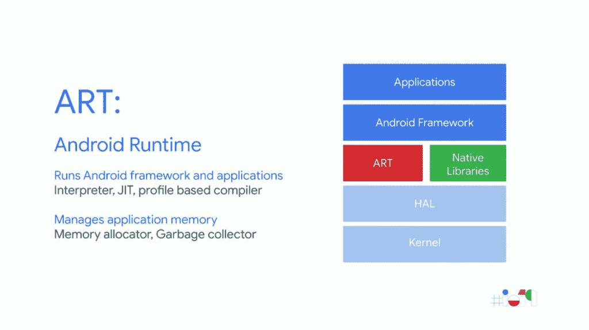
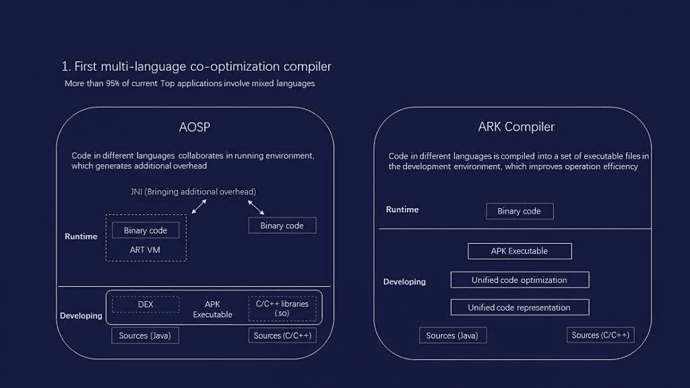

# 华为的 Ark 编译器如何提高 Android 应用性能

> 原文：<https://www.xda-developers.com/huawei-ark-compiler-android-app-performance/>

最近围绕华为的许多谈话都围绕着该公司不幸的政治形势，因为美国行政命令限制许多公司与华为开展业务。这样一个关键决定的影响太大了，不能不引起注意。但在这个行政命令不存在的另一个现实中，华为可能会因其最近发布的 Ark Compiler 而受到关注，这是一项最新的创新，据称可以弥合 Android 和 iOS 之间的应用性能差距。

在深入了解什么是 Ark 编译器之前，我们需要后退一步，了解什么是编译器，以及它在 Android 系统中的用途。

## Android 上编译器和解释器的简史

编译器是将代码从一种语言翻译成另一种语言的计算机程序，通常是本机机器语言。这既可以由计算机直接执行，也可以通过另一个程序(解释程序)执行。这种翻译是必要的，因为我们用人类可读的编程语言(如 Java 和 Kotlin)编写代码，而计算机只理解本机机器语言(1 和 0 形式的二进制代码)。因此，编译器充当了人类编写的指令和机器理解并执行这些指令的能力之间的桥梁。这种转换和随后的解释发生的速度和效率决定了编译器的效率，从而在编译器的效率与代码的性能和效率之间引入了直接的关联，并延伸到应用程序。

### Dalvik VM

在 Android 的早期，操作系统使用了所谓的 Dalvik VM(解释器)和 JIT(实时)编译器。这个来自 XDA 电视台的 Android 基础 101 系列的老视频涉及了 Dalvik VM 和 JIT 设置，这两者都满足了早期 Android 系统的需求，这些系统的内存限制非常大。Dalvik VM 获取 Java 字节码，并在需要执行代码时将其转换成机器码(因此是实时的)。这是必要的，因为当时手机的存储空间是一个真正的限制，所以这种方法允许应用程序在系统中使用较小的文件。

在运行时编译和解释应用程序的缺点是应用程序的整体性能较低，因为编译会在用户使用应用程序的同时进行。

Dalvik 的垃圾收集机制也有局限性。Dalvik 集体跟踪每个内存分配。一旦 Dalvik 确定程序不再使用某块内存，它就将该内存释放回堆，而无需程序员的任何干预。这个过程被称为垃圾收集(GC ),它的目标是找到程序中不再被访问的内存对象，然后回收这些对象使用的资源以释放内存。系统在集体的基础上决定何时需要 GC，所以应用程序开发者不能选择 GC 事件何时发生[即使在 ART 中]。因此，如果 GC 事件发生在前台应用程序的任何密集处理活动的中间，系统将暂停进程的执行并开始 GC，从而增加处理时间并给用户带来明显的“欺骗”。

这些和其他的限制促使谷歌去探索更快性能的替代方法。

### Android 运行时

在 Android 4.4 KitKat 中，谷歌引入了带有 AOT(提前)编译器的预览版 [ART (Android Runtime)](https://source.android.com/devices/tech/dalvik) ，而在 Android 5.0 Lollipop 中，谷歌放弃了 Dalvik，转而支持 ART 作为唯一可用的解释器。阿特和 AOT 在安装应用程序的时候就把代码转换成机器语言，而不是等到应用程序正在使用的时候才进行转换。因此，这种方法加快了应用程序的启动时间，但也带来了一些缺点，如安装时间变慢和磁盘空间使用增加。为了平衡这一切，谷歌[在 Android 7.0 牛轧糖上采用了【that、JIT 和带有 ART 的简档引导编译的组合，以确保没有任何单一因素受到剧烈影响。](https://source.android.com/devices/tech/dalvik/configure#how_art_works)

 <picture></picture> 

Android's ART Implementation

艺术也致力于减少垃圾收集的侵扰。GC 过程经过优化，总体速度更快，暂停次数更少(单次短暂暂停与 Dalvik 的两次暂停相比)，碎片更少，内存使用更少。Google 在 Google I/O 2014 上的演示更详细地解释了 Dalvik 的 GC 和 ART 在这方面的改进的局限性。

即使这些年来发生了这些变化，Google 方法的基本前提仍然是在执行过程中解释代码，同时改变编译(翻译)元素的时间。垃圾收集也仍然是应用程序开发人员的一个痛点，因为它固有的中断性和集体性。可以说，由于持续存在开销，安卓的应用性能因此受到影响。

## 华为方舟编译器

华为一直致力于开发一种更高效的解决方案，并因此聘请了数百名该领域的专家。这一努力的结果是 Ark 编译器，华为声称这是有史以来第一个允许直接翻译成机器语言的静态编译器，完全不需要解释器。Ark Compiler 的开发目标也是最大化 Java 和 C 的运行效率，所以理论上应该可以看到这些语言的最佳效果。

 <picture></picture> 

Graphic by Huawei. Text translated by XDA user MyKeyVans.

华为展示了 Ark 编译器的一些关键特性，如下所示:

*   诸如 AOT 和 JIT 之类的编译技术可以将一些程序转换成机器码并直接在 CPU 上运行，但是这些技术不能完全摆脱解释器和附带的限制。Ark 编译器利用静态编译，让它从动态解释器中解放出来，开启了跨越式提升应用性能的可能性。
*   静态编译有一个潜在的缺点，就是太死板，而且不能像动态编译器那样在执行过程中进行调整。华为声称，方舟编译器的静态编译通过将编程语言中的动态特性无缝翻译成机器代码，解决了这个“*”。*
*   现有的编译过程发生在移动设备上安装应用包期间或之后。Ark 编译器是为软件开发期间的部署而设计的，我们认为这有助于消除安装和执行期间的时间开销。我们假设，应用程序开发人员将能够在应用程序开发过程中直接将不同的语言编译成本机代码，由此产生的 APK 可能不需要与解释器或虚拟机交互来运行。举例来说，这将在理论上减少与 JNI 相关的管理费用。
*   Ark 编译器还改变了垃圾收集的集体性质。它允许 GC 事件为不同的 Java 线程分别发生。这种划分的方法声称在前台应用程序上提供更少的 jank。

这些变化的结果是，Ark Compiler 可以**看似将 Android 系统操作流畅度提升高达 24%，响应速度提升高达 44%，第三方应用的流畅度提升高达 60%** ，声称将 Android 应用性能提升到与 iOS 相同的水平。

Ark 编译器目前是针对 ARM 芯片架构编译优化的。华为希望在未来，协作硬件和软件设计将致力于最大限度地发挥麒麟芯片的能力。

Ark 编译器支持标准 Java 用法，允许直接编译第三方应用程序，而不需要应用程序开发人员进行任何代码修改。Ark Compiler 还允许“调整代码结构”,以进一步提高性能和内存。华为选择让 Ark Compiler 成为一个开源系统，这将允许第三方开发人员采用并适应他们的需求，进一步推动应用程序开发人员和手机制造商对该技术的采用。

虽然华为没有提到 Ark 编译器的任何缺点，但人们至少可以预计大型应用程序的大小，但这应该不会在具有充足存储空间的当代设备上造成任何问题。我们还预计，Ark Compiler 不会适用于所有的 CPU 架构，因为谷歌的兼容性困境并不是华为头疼的问题。Ark 编译器被设计成在开发期间使用，而不是在安装期间使用；这表明华为可能已经修改了应用程序在 Android 设备上的部署和安装方式，也可能已经开发了自己的 APK 设计。如果这是正确的，这可能会在生态系统中造成一个主要的兼容性问题，而且这将成为标准的 Android 功能还需要很长一段时间。

不在用户的设备上编译也提出了一个关于优化的大问题。ART 目前在每个微架构的基础上进行优化，这意味着对于骁龙设备和 Exynos 设备来说，甚至对于骁龙 845 和骁龙 625 来说，最终的二进制文件都是不同的。这种方法对于完全控制 SoC 的制造商来说是有意义的，比如苹果和华为。然而，随着 Android 世界的其余部分使用许多不同的 SOC，强制跨设备使用通用优化将再次成为 Ark 编译器标准化的障碍。因此，不要指望 Ark 编译器会很快出现在你最喜欢的定制 ROM 上。

为了澄清，Ark 编译器是为 Android 开发的，华为没有提到任何关于其所谓的自制操作系统及其与 Ark 编译器的兼容性，所以我们在这方面不做任何假设。

华为计划举行两次大型会议，专门讨论开发者和更大的生态系统。这是华为设备中国开发者大会和绿色联盟中国开发者大会。这两个活动都将解决与华为 Ark 编译器相关的具体开源问题，以努力使这项技术的好处尽可能广泛地普及。

* * *

*特别感谢 XDA 资深公认贡献者 [Dees_Troy](https://forum.xda-developers.com/member.php?u=912474) 和公认开发者 [arter97](https://forum.xda-developers.com/member.php?u=4898097) 的协助和投入。*

注意:华为/Honor 已经停止为其设备提供官方 bootloader 解锁代码。因此，他们设备的引导加载程序无法解锁，这意味着用户无法 root 或安装自定义 rom。