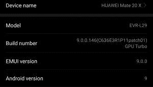

# EMUI 9 稳定-找到您的华为/Honor 设备的 Android Pie 更新！

> 原文：<https://www.xda-developers.com/huawei-honor-emui-9-stable-update-list/>

自从谷歌 Pixel 智能手机的 Android 9 Pie 正式发布以来，我们一直在跟踪所有主要 Android 设备制造商的更新进度。除了谷歌，小米、HMD Global、索尼、摩托罗拉、一加和夏普等设备制造商也为他们的几款设备发布了 Android Pie 更新。在前两大 Android 设备制造商中，三星仅发布了旗舰 Galaxy S9 和 Galaxy Note 9 设备的 Android Pie beta 更新，而华为及其子品牌 Honor 发布了 8 款设备的稳定更新和 14 款设备的 beta 更新(并且*推出了* 5 款最新 Android 版本的设备)。无论你对该公司在引导加载程序解锁上的立场有什么想法，都很难否认他们没有为他们庞大的设备组合提供足够的软件支持。

在如此多的国家销售如此大量的 Android 设备，华为/Honor 必须支持许多软件版本，以覆盖其设备销售的所有地区。不幸的是，这意味着一些地区将在其他地区之前获得更新。以最近 [EMUI 9 全球发布](https://www.xda-developers.com/emui-9-0-get-global-release-for-honor-10-honor-play-and-honor-view-10/)为例。我们被告知，该更新将在亚太国家的一些设备上推出，但我们也知道该更新也将在一些欧洲国家推出。

| 

可用频道

 | 

电话

 | 

模型

 | 

适合 Android 9.0 更新的版本

 |
| --- | --- | --- | --- |
| 亚太 | 杀了 10 个人 | 碱性磷酸酶-L29 | 碱性磷酸酶-L29 |
| 亚太 | 杀了 10 个亲 | 星际迷航舰级列表 | BLA-L29 突击步枪 |
| 亚太 | P20 手枪 | 艾米丽-L29C | EML-29 战斗机 |
| 亚太 | P20 专业版 | CLT-L29C 突击步枪 | CLT-L29 8.1.0.158(C636) |
| 亚太 | 荣誉 10 | 哥伦比亚-L29D | 列 L29 8.1.0.153(C636) |
| 亚太 | 荣誉游戏 | 康奈尔大学 L29 | 133 英寸 636 gt |
| 亚太 | 荣誉观 10 | 伯克利-L09 | BKL-L09 突击步枪 |

如果你拥有一台华为或 Honor 设备，它将获得基于 Android Pie 的 EMUI 9 更新，并且住在尚未获得更新的地区，我们将描述几个你必须手动获得更新的选项。首先，这里列出了你可以更新到的所有可能的 EMUI 9 稳定固件版本，以及它们属于哪些设备。

## 荣耀

以下是 EMUI 9 stable (Android 9 Pie)目前在 Honor 设备上的可用性总结:

*   荣誉 10:中东、欧洲、亚洲、俄罗斯
*   荣誉游戏:欧洲
*   荣誉观 20:欧洲、亚洲、俄罗斯

以下是适用于 Honor 设备的稳定 Android Pie 固件的完整列表:

*   荣誉 10
    *   COL-L29 突击步枪
        *   9.0.0.159
        *   9.0.0.159
        *   159(c636 和 2R1P12)
        *   9.0.0.160
*   荣誉游戏
*   荣誉观 10
    *   BKL-L09 突击步枪
        *   9.0.0.159
        *   9.0.0.159
        *   160(C10 和 2R1P12)

[**荣誉 10 论坛**](https://forum.xda-developers.com/honor-10/) [**荣誉游玩论坛**](https://forum.xda-developers.com/honor-play/) [**荣誉查看 10 论坛**](https://forum.xda-developers.com/honor-view-10)

## 华为

以下是华为设备 EMUI 9 stable (Android 9 Pie)目前的可用性总结:

*   华为 Mate 10:中国、中东、拉美、墨西哥
*   华为 Mate 10 Pro:中国、欧洲、亚洲、中东、保时捷设计
*   华为 P20 Pro:墨西哥、拉丁美洲、意大利、英国、中东、亚洲、欧洲、俄罗斯
*   华为 P20:中国、墨西哥、中东、亚洲、欧洲、拉丁美洲
*   保时捷设计华为 Mate RS:中国，全球

以下是适用于华为设备的稳定 Android Pie 固件的完整列表:

*   华为 Mate 10
    *   阿尔-阿尔 00
        *   9.0.0.110
        *   9.0.0.125
        *   9.0.0.156
    *   ALP-L09 战斗机
    *   碱性磷酸酶-L29
        *   9.0.0.159
        *   9.0.0.159
        *   159(c636 和 2R1P12)
*   华为 Mate 10 Pro
    *   -00 点钟方向
        *   9.0.0.110
        *   9.0.0.125
        *   9.0.0.156
    *   09 年欧洲足球锦标赛
        *   9.0.0.159
        *   161(c 432 和 4R1P11)
    *   BLA-L29 突击步枪
        *   9.0.0.119
        *   9.0.0.159
        *   159(c636 和 2r 1 P3)
        *   页:1
        *   第 161 次(C432)
        *   161(c 432 和 4R1P11)
*   华为 P20
    *   艾勒 00
        *   9.0.0.110
        *   9.0.0.125
        *   9.0.0.156
    *   EML-09 突击步枪
        *   9.0.0.159
        *   9.0.0.159
        *   160(C432)
    *   EML-29 战斗机
        *   9.0.0.159
        *   9.0.0.159
        *   160(C432)
        *   161(c605 和 2R1P12)
    *   EML-TL00 突击步枪
        *   9.0.0.110
        *   9.0.0.125
        *   9.0.0.156
*   华为 P20 Pro
    *   CLT-AL00 突击步枪
    *   CLT-AL01 战斗机
    *   CLT-L04 突击步枪
    *   CLT-L09 突击步枪
        *   9.0.0.161
        *   9.0.0.168
        *   9.0.0.168
    *   CLT-L29 突击步枪
        *   9.0.0.159
        *   159(c636 和 2R1P12)
        *   161(C10 和 2R1P9)
        *   第 163 次(C432)
        *   168(c636 和 2R1P12)
*   保时捷设计华为 Mate RS
    *   新 AL00
        *   125(c 786 和 81R1P13)
        *   156(c 786 和 84R1P13)
    *   新 L29

[华为 Mate 10 论坛](https://forum.xda-developers.com/mate-10)[华为 P20 论坛](https://forum.xda-developers.com/huawei-p20) [**华为 P20 Pro 论坛**](https://forum.xda-developers.com/huawei-p20-pro)

## 怎么更新？

首先，如果你住在符合条件的地区，并且拥有合适的设备，你可能已经有一个稳定的 EMUI 9 更新在等着你了。这里有一个来自华为的视频，向你展示如何获得更新。

你也可以使用免费的[固件查找器](https://pro-teammt.ru/firmware-database/?firmware_model)服务来手动查找要下载的固件，但你必须确保你正在刷新正确的固件。不幸的是，您不能闪存区域外的固件或尚未批准用于您的设备的固件。然而，我们在 [FunkyHuawei.club](https://funkyhuawei.club/) 的朋友提供了一个(付费)工具，可以简化更新过程，让你将你的设备更名到另一个地区，并刷新未经批准的固件版本。例如，如果你更新到 Mate 20 Pro 上的 EMUI 版本 9.0.0.171 或 Mate 20 X 上的 9.0.0.172，OEM 解锁开关[再次变为可用](https://twitter.com/FunkyHuawei/status/1075498881595650059)，因此[可以解锁引导加载程序](https://www.xda-developers.com/huawei-honor-unlock-bootloader-fee/)。我的华为 Mate 20 X(由 [FunkyShop.club](https://funkyshop.club) 提供评论)目前在 EMUI 版本 9.0.0.146 上，没有向 9.0.0.172 提供更新，所以我要么需要等待，要么使用这些第三方服务之一立即更新。如果你对使用 Firmware Finder 或 FunkyHuawei.club 感兴趣，你只需要知道你自己的设备的型号名称和它运行的软件的内部版本号。

[**固件查找器**](https://pro-teammt.ru/firmware-database/?firmware_model)[**FunkyHuawei**](https://funkyhuawei.club/)

若要查找设备的软件信息，请前往“设置”>“系统”>“关于手机”。型号名称告诉您您有什么设备，而内部版本号告诉您它运行的是什么软件版本。例如，型号名称 EVR-L29 是国际双卡华为 Mate 20 X。许多用户会被内部版本号弄糊涂，但格式实际上相当简单。以下是如何解释一个 build 号为 9.0.0.146(C636E3R1P11patch01)。前三个数字(9.0.0)告诉你安卓版本(安卓 9 派)。接下来的三个数字(146)告诉您更新级别。C (C636)后面的三个数字告诉你地区(亚洲)。最后，区域代码后面的任何字母和数字只是告诉您关于您正在运行的确切版本的更多信息——这对于我们的目的来说并不是必须知道的。

 <picture></picture> 

Software information for my Huawei Mate 20 X.

*免责声明:FunkyHuawei 帮我整理了上面的可用稳定 EMUI 9 固件版本列表。FunkyHuawei 为我们提供了未发布设备的信息，但我们没有从他们服务的任何销售中受益。*