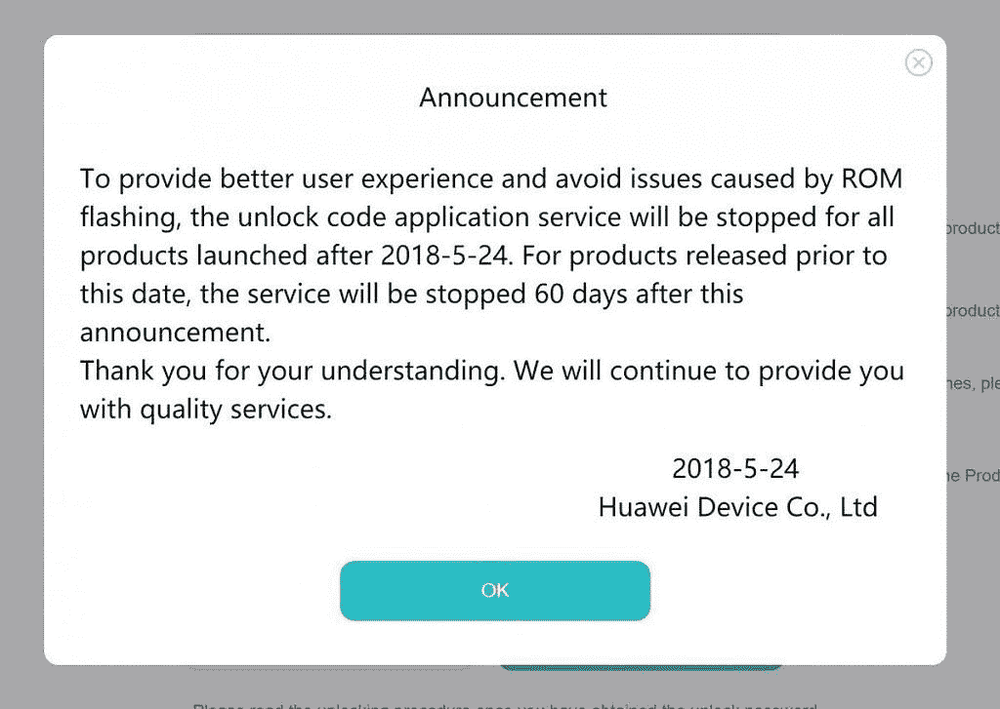

# 今天是为华为/Honor 设备申请引导程序解锁代码的最后一天

> 原文：<https://www.xda-developers.com/huawei-honor-request-bootloader-unlock-code/>

过去一年，中国科技巨头华为及其子品牌 Honor 在 Android 爱好者群体中慢慢赢得了更多尊重。随着及时的软件更新、[支持定制开发的承诺、](https://www.xda-developers.com/honor-open-source-program-honor-view-10/)以及所有设备广泛采用 Project Treble [他们已经将](https://www.xda-developers.com/list-android-devices-project-treble-support/)更新为 Android Oreo，不难看出为什么华为和 Honor 智能手机开始在我们的论坛上变得越来越受欢迎。不幸的是，公司突然改变了主意。两个月前，该公司宣布他们将[停止提供 bootloader 解锁代码](https://www.xda-developers.com/huawei-stop-providing-bootloader-unlock-codes/)。如果您想解锁您的华为或 Honor 设备的引导加载程序，今天是请求代码的最后一天。

虽然在华为或 Honor 设备上解锁引导程序不像在谷歌或一加设备上那么简单，但这并不是一个困难的过程。在华为和 Honor 设备上，如果您希望能够解锁引导加载程序，您需要获取引导加载程序解锁代码。请求代码的页面要求您填写设备的详细信息，并使用您的华为帐户登录，但这是一个非常简单的表格。获得 bootloader 解锁代码通常也是即时的，不像小米设备那样需要等待 360 个小时。

解锁 bootloader 可以获得 Magisk 或 SuperSU 的 root 访问权限，安装 TWRP 之类的定制恢复来进行备份，[linea geos、复活 Remix 或 CarbonROM 之类的闪存定制 rom](https://www.xda-developers.com/openkirin-emui-8-huawei-honor/)，闪存定制内核，或 ARISE 和 Xposed Framework 之类的闪存修改。我们已经展示了闪存 AOSP ROM 如何能够在 Honor 9 Lite [等预算荣誉设备上带来](https://www.xda-developers.com/huawei-p20-camera-port-honor-9-lite-kirin-659/)[巨大的性能提升](https://www.xda-developers.com/honor-9-lite-project-treble-aosp-review/)，而不牺牲相机质量，这要归功于华为 P20 相机端口等模块。如果没有一个可解锁的引导装载程序，这一切都是不可能的，这就是为什么解锁代码不再可获得对社区来说是一个巨大的打击。

我们已经联系了 Honor 和华为的联系人，没有听到任何关于该公司未来将提供 bootloader 解锁代码的消息。该公司终止该程序的原因是它提供了“更好的用户体验，并避免了 ROM 闪存引起的问题。”我们不同意这个理由，因为公司已经让你千方百计解锁引导程序。此外，它完全是选择加入的，因此如果出现问题，遇到问题的用户只能怪自己。华为和 Honor 停止为本地升级提供固件当然也于事无补，因为他们的电子恢复工具在中国境外访问时经常无法恢复设备。

如果您想解锁您的华为或 Honor 设备上的引导加载程序，您需要立即注册一个解锁代码。你不必现在就解锁引导程序，但是如果你现在不获取代码，你以后就永远不会有这个选择了。所以现在就去拿代码，把它保存在某个地方，以防你决定冒险一试。如果你决定解锁引导程序，一定要去 XDA 论坛看看你的设备的最新发展。

[**请求华为或 Honor 设备上的 bootloader 解锁代码**](https://www.emui.com/en/unlock_index)