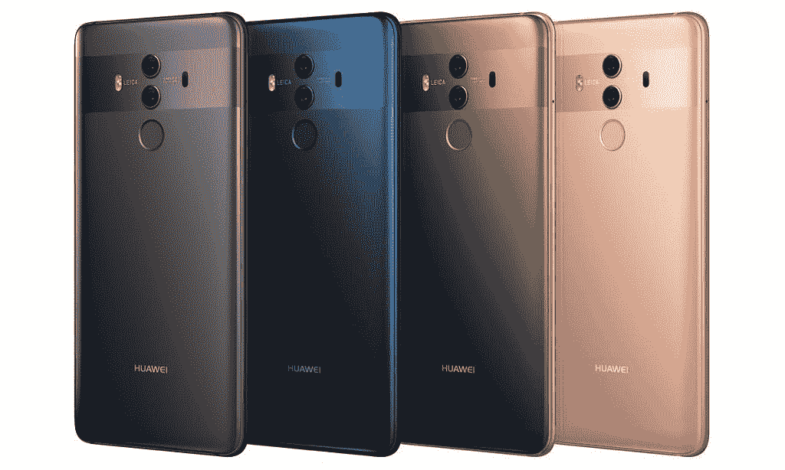

# 华为 Mate 10 和 Mate 10 Pro 是官方的-规格和细节

> 原文：<https://www.xda-developers.com/huawei-mate-10-pro-porsche-official/>

几个月来，华为一直在酝酿推出两款新的旗舰智能手机，今天该公司正式发布了这两款手机。我们听到了很多关于华为在此次活动中推出三款设备的传言，分别是[华为 Mate 10](http://forum.xda-developers.com/mate-10) ，华为 Mate 10 Pro 以及最后的华为 Mate 10 Lite。有一些关于该公司像去年一样再次制造[保时捷版](https://www.xda-developers.com/huawei-mate-10-porsche-design-confirmed-wallpapers/)的杂谈，他们今天也谈到了这一点。

今年，华为和其他智能手机原始设备制造商对人工智能有很多关注。2017 年的趋势主要是缩小我们设备的边框，但人工智能也有增长的趋势。包括高通和华为在内的芯片供应商已经开始将专用硬件集成到他们的 SOC 中，专门用于人工智能，在未来几年内，我们将看到各种智能手机制造商利用这种硬件。

华为在今年早些时候强调了其最新麒麟 970 SoC 的人工智能能力，这也是该公司在华为 Mate 10 和 Mate 10 Pro 发布会上提到的内容。华为表示，他们使用的麒麟神经处理单元(NPU)能够处理 1.92 TFLOPs 的 FP16，据说是苹果新神经引擎的两倍，在今天的活动中，他们展示了 Mate 10 处理计算机视觉任务的速度比 Galaxy Note 8 快 20 倍。这种类型的性能将完全取决于应用程序本身，但现在我们还没有看到真正利用这种专用硬件的东西。华为正在集中其人工智能能力，以确保快速的性能和改善其相机体验，这款手机的[能够识别主题](https://www.xda-developers.com/huawei-mate-10-makeup-object-recognition-camera/)，并调整图像质量，为每个场景创造最佳拍摄效果。

 <picture></picture> 

Mate 10 Pro

随着 Mate 10 和 Mate 10 Pro 的推出，该公司坚持他们的信念，即他们需要专注于智能手机市场的高端和优质领域。因此，在创造这两款新设备时，他们说团队在设计和性能方面做得最多。与 iPhone 8 Plus 相比，Mate 10 和 Mate 10 Pro 在紧凑的设计中内置了更大的屏幕。这是今天发布的两款新智能手机的规格...

|  | 

华为 Mate 10

 | 

华为 Mate 10 Pro

 | 

华为 Mate 10 保时捷版

 |
| --- | --- | --- | --- |
| 显示 | 5.9 英寸 2560×1440 RGBW HDR 液晶面板 | 6 英寸 2160×1080 有机发光二极管面板 | 6 英寸 2160×1080 有机发光二极管面板 |
| 社会学 | Kirin 970 SoC 马里 G72 GPU | Kirin 970 SoC 马里 G72 GPU | Kirin 970 SoC 马里 G72 GPU |
| 随机存取存储 | 4GB | 4GB/6GB | 6GB |
| 内存储器 | 64GB | 128GB | 256GB |
| MicroSD 卡插槽 | 是 | 不 | 不 |
| 后置摄像头 | 12MP RGB + 20MP 单色摄像头，均为 f/1.6 | 12MP RGB + 20MP 单色摄像头，均为 f/1.6 | 12MP RGB + 20MP 单色摄像头，均为 f/1.6 |
| 前置摄像头 | 800 万像素前置摄像头，f/2.0 光圈 | 800 万像素前置摄像头，f/2.0 光圈 | 800 万像素前置摄像头，f/2.0 光圈 |
| 3.5 毫米耳机插孔 | 是 | **否** | **否** |
| 连通性 | 双 SIM 卡(主 4G，次 2G/3G/4G)，双 4G 双 VoLTE | 双 SIM 卡(主 4G，次 2G/3G/4G)，双 4G 双 VoLTE | 双 SIM 卡(主 4G，次 2G/3G/4G)，双 4G 双 VoLTE |
| 证书 | IP53 | IP67 | IP67 |
| 指纹扫描仪 | 是(正面) | 是 | 是 |
| 颜色；色彩；色调 | 香槟金、黑色、玫瑰金、摩卡棕 | 钛灰色、摩卡棕色、午夜蓝、玫瑰金 | 钻石黑 |
| 价格 | €699 | €799 | €1,395 |
| 有效性 | 2017 年 11 月 | 2017 年 11 月 | 2017 年 11 月 |

因此，正如你所看到的，华为正在做大量的工作，以便在设计和性能方面展现出最好的一面。他们非常注重将 Mate 10 和 Mate 10 Pro 与当今市场上的其他智能手机进行比较。这是用麒麟 970 中的 NPU 和苹果提供的神经引擎完成的。他们花时间将这些新手机的屏幕比例与苹果在 iPhone 8 Plus 中提供的屏幕比例进行了比较，显示了每个维度和改进。他们甚至谈到如何安装 4000 毫安时容量的电池，而 iPhone X 的电池要小得多——华为当然喜欢电池容量。

诚然，普通的 Mate 10 有一个液晶面板，而 Mate 10 Pro 有一个 OLED 面板。然而，他们认为 Mate 10 中的新 RGBW 面板尽最大努力保持低电池使用量，与常规 RGB 显示器相比，背光功率节省高达 14%，并且该面板的分辨率奇怪地更高。三星拥有他们一直在研究的曲面屏幕技术的 Infinity Display，而华为将他们的 edge to edge 显示技术称为“FullView”。Mate 10 Pro 的 OLED 面板是 FHD+ 2:1，支持 HDR，对比度为 70000:1，颜色饱和度的目标是 NTSC。Mate 10 上的 RGBW 面板略小，为 5.9 英寸，而不是 6 英寸，但在传统的 16:9 宽高比下具有更高的分辨率(2560x1440)，并且可以实现 730 尼特的亮度，以提高室外能见度。

除了为这些手机配备大量硬件，华为还做了大量工作来改进手机中使用的软件。他们将搭载 EMUI 8.0，他们押注于随着时间的推移人工智能优化以及硬件速度的普遍提高而提高的性能。该公司表示，这将使系统响应时间增加 60%，操作流畅度增加 50%，因为它会学习你的习惯和使用模式，并调整各种与性能相关的参数，以确保快速体验。该公司再次试图确保性能不会随着时间的推移而下降:Richard Yu 将这一理念称为“快速启动，保持快速”，并向我们展示了华为 P10 Plus 如何随着时间的推移仅出现 10.6%的性能下降，而 S7 的应用程序响应时间下降了 195%(不过，没有给出更多细节)。这不仅有助于提高性能，也有助于调整设备以延长电池寿命。

新的华为 Mate 10 系列[的电池由 TUV 莱茵](https://www.xda-developers.com/huawei-supercharge-safety-tuv-rheinland/)认证，该公司是[在评估 Note 7 的](https://www.xda-developers.com/samsung-partner-company-says-the-note-8-will-sport-a-2160p-display/)电池故障时帮助三星的公司之一，它们也是第一个包含来自他们的认证快速充电器的公司。华为的超级充电快充技术[，我们发现它在过去](https://www.xda-developers.com/charging-comparison-oneplus-huawei/)非常出色，使 Mate 10 和 Mate 10 Pro 的充电速度比 iPhone 8 Plus 快 50%，并承诺在 30 分钟的充电时间内将电池充满 58%。虽然无线充电对一些人来说有一些好处，但华为认为他们的超级充电技术以四倍的速度给我们的手机充电最终对客户更好。

该软件有一个功能，可以让你将设备用作 PC 的虚拟触摸板和键盘，它们还将支持 Android 的神经网络 API，让开发人员充分利用机器学习应用程序的硬件加速。所有设备都将搭载 Android 8.0 Oreo，它们将成为支持谷歌零触摸条款的第一批设备。得益于全球企业移动管理供应商合作伙伴关系，这使他们能够提供增强的企业安全性和效率。

* * *

华为 Mate 10 将于 2017 年 11 月上市，4GB+64GB 存储的起价为€699 英镑，而 Mate 10 Pro 的 6GB+128GB 版本的起价为€799 英镑。最后，保时捷设计的 Mate 10 将花费€1395 英镑——虽然看起来贵得离谱，但华为确实表示他们之前的保时捷型号已经售罄，所以对这样一款专属手机肯定有需求。一如既往，一旦我们获得这些设备，请继续关注 XDA 门户网站，获取更多报道和深入分析！

**如何看待 Mate 10，Mate 10 Pro，Mate 10 保时捷？请在评论中告诉我们！**

[**查看 XDA 的华为 Mate 10 论坛！**](https://forum.xda-developers.com/mate-10)