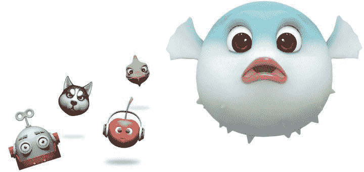

# 华为 Mate 20 Lite 官方:以下是所有细节

> 原文：<https://www.xda-developers.com/huawei-mate-20-lite-specs-pics-pricing-availability/>

Earlier this summer, we published the first [specifications list](https://www.xda-developers.com/huawei-mate-20-specifications-features-rumor/) and [renders](https://www.xda-developers.com/huawei-mate-20-notch-render-specifications/) for the Huawei Mate 20. That device is powered by the [HiSilicon Kirin 980 system-on-chip](https://www.xda-developers.com/hisilicon-kirin-980-honor-magic-2-huawei-mate-20-pro/), a beast of a SoC that was just unveiled by Huawei at IFA. It's certainly not going to be a cheap phone, so what does Huawei have in store for those who are looking for something new, but more affordable? The Huawei Mate 20 Lite is the answer to that question. Its specifications aren't as impressive as the larger Mate 20 and Mate 20 Pro, but that doesn't mean it doesn't have a lot to offer.

## 华为 Mate 20 Lite 设计和规格

华为 Mate 20 Lite 由金属和玻璃制成，采用优质的弧形边缘设计。正面的主要焦点是显示屏凹口，其中包含两个摄像头，一个耳机和其他传感器。底部有个下巴，但不太大。

手机背面还有两个摄像头和一个指纹扫描仪，都垂直排列在中央。主摄像头是 20MP，副摄像头是 2MP。同样，前面是 24MP+2MP 的设置。

回到前面，Mate 20 Lite 的显示屏尺寸与普通版相同。它是 6.3 英寸，分辨率为 2340x1080。该设备由海思麒麟 710 驱动，这是它成为“精简”型号的原因。麒麟 710 [亮相华为 Nova 3i](https://www.xda-developers.com/huawei-nova-3i-kirin-710-launch/) 。然而，Mate 20 Lite 有 4GB 的内存和 64GB 的存储空间，因此无论如何它都不会动力不足。此外，电池容量是令人印象深刻的 3，650 mAh。该设备搭载 Android 8.1 Oreo 和 EMUI 8.2。

| 

Specification

 | 

Huawei Mate 20 Lite

 |
| --- | --- |
| 尺寸和重量 | 158.3 x 75.3 x 7.6 毫米，172 克 |
| Display | 6.3 英寸(2340x1080)凹口液晶屏，19.5:9 |
| CPU/GPU | HiSilicon Kirin 710 with Mali-G51 MP4 GPU |
| 随机存取存储 | 4GB |
| Storage | 64gb micro SD 插槽 |
| 电池 | 3，750 毫安，带华为快充 |
| Rear Camera(s) | 20MP + 2 MP，f/1.8，480fps 视频录制，PDAF |
| 前置摄像头 | 24MP + 2 MP, f/2.0 |
| Software | 安卓 8.1 奥利奥配 EMUI 8.2 |
| 声音的 | 3.5 毫米耳机插孔 |
| 连通性 | 全球定位系统，GLONASS，LTE 猫。12、NFC |
| 端口/按钮 | USB 类型-C |
| 安全性 | 指纹扫描仪(后部)，面部解锁 |
| 价格 | £379 |
| 颜色；色彩；色调 | 金色、黑色、蓝色 |

华为 Mate 20 Lite 的后置摄像头将配备 HDR Pro 技术，这应该有助于改善照片的颜色。由于“人工智能”是这些天的主要流行语，这款相机具有人工智能场景识别功能。前置摄像头采用了华为自己版本的苹果 Animojis，名为“Q 莫吉”

 <picture></picture> 

Huawei's Q Moji

*图片 via:[Helpix](http://helpix.ru/news/201808/201013-pojavilis_oficialnye_dannye_po_huawei_maimang_7_huawei_mate_20_lite/)*

## 华为 Mate 20 Lite 配件

华为为 Mate 20 Lite 提供了一些好看的外壳。第一个是一个简单的“保护性”外壳，用于加固角落并提供一些最低限度的保护。它只有黑色的。第二个案例看起来有点奇怪。它被称为“智能视图翻转”，它只覆盖了显示屏的一半。另一半用于显示时间、日期、天气和通知。这款保护套有黑色和蓝色可选。最后一个盒子是一个简单的皮夹盒，有一个卡槽。

## 华为 Mate 20 Lite 定价和供货情况

华为 Mate 20 将定价 379 无 SIM 卡。该设备将于 9 月 5 日开始在 Vodaphone 和 Carphone Warehouse 上市。EE 也将在 10 月份获得该设备。最终也可以从 Tesco 和 Argos 购买。这款手机有三种颜色:黑色、蓝色和金色。