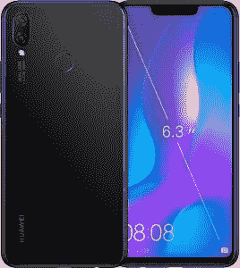

# 华为在印度发布华为 Nova 3 和 Nova 3i

> 原文：<https://www.xda-developers.com/huawei-nova-3-huawei-nova-3i-india-launch/>

今天在德里的一次活动中，华为在印度发布了华为 Nova 3 和华为 Nova 3i。这些手机是 Nova 系列中第一批正式进入印度的手机。华为 Nova 3 拥有高端规格，包括海思麒麟 970 片上系统(这是 Nova 系列的第一款)，而华为 Nova 3i [是第一款采用新海思麒麟 710 SoC](https://www.xda-developers.com/huawei-nova-3i-kirin-710-launch/) 的华为手机。

华为 Nova 3 和华为 Nova 3i 的规格如下:

## 华为 Nova 3 和华为 Nova 3i -规格一览

 <picture></picture> 

Huawei Nova 3i

| 

规范

 | 

华为 Nova 3

 | 

华为 Nova 3i

 |
| --- | --- | --- |
| 规模 | 157 x 73.7 x 7.3 毫米，166 克 | 157.6 x 75.2 x 7.6mm 毫米，169 克 |
| 软件 | 安卓 8.1 奥利奥配 EMUI 8.2 | 安卓 8.1 奥利奥配 EMUI 8.2 |
| 社会学 | 八核海思麒麟 970 (4x 2.36GHz Arm Cortex-A73 核心+ 4x 1.8GHz Arm Cortex-A53 核心)；Mali-g72mp 12 GPU @ 746 MHz；神经处理单元；i7 协处理器 | 八核麒麟 710(4x 2.2 GHz Arm Cortex-A73+4x 1.7 GHz Arm Cortex-A53 核心)；Mali-G51MP4 GPU |
| RAM 和存储 | 6GB 内存，128GB 存储空间；microSD 卡插槽 | 4GB 内存，128GB 存储空间；microSD 卡插槽 |
| 电池 | 3,750mAh 快速充电 | 3,340mAh10W 充电 |
| 显示 | 6.3 英寸全高清+ (2280x1080) IPS 液晶屏，宽高比为 19:9 | 6.3 英寸全高清+ (2280x1080) IPS 液晶屏，宽高比为 19:9 |
| 连通性 | Wi-Fi 802.11ac，蓝牙 4.2 | Wi-Fi 802.11ac，蓝牙 4.2 |
| 港口 | USB Type-C 端口，双 nano SIM 插槽(nano SIM + nano SIM/microSD)，**3.5 毫米耳机插孔** | microUSB 端口，双 nano SIM 插槽(nano SIM + nano SIM/microSD)， **3.5mm 耳机插孔** |
| 法官 | GSM:850/900/1800/1900 MHz HspA:850/900/2100 MHz FDD-LTE:频段 1/3/5/8TDD-LTE:频段 38/39/40/41 | GSM:850/900/1800/1900 MHz HspA:850/900/2100 MHz FDD-LTE:频段 1/2/3/5/7/8TDD-LTE:频段 38/39/40/41 |
| 后置摄像头 | 1600 万像素 RGB 摄像头，f/1.8 光圈，相位检测自动对焦(PDAF)2400 万像素单色摄像头，f/1.8 光圈，PDAF | 1600 万像素，带 f/2.2 光圈 200 万像素深度感应摄像头 |
| 前置摄像头 | 24MP + 2MP 深度感应摄像头 | 24MP + 2MP 深度感应摄像头 |

### 软件

在 Nova 3 和 Nova 3i 上，华为推出了人工智能购物功能，让用户通过图像或相机购买产品。他们可以用两个手指长按图像在亚马逊上购物，他们可以扫描物体在电商平台上购物。

华为 Nova 3 还支持红外(IR)面部解锁，可以在弱光下工作。两款手机都支持华为的 [GPU Turbo](https://www.xda-developers.com/honor-play-gpu-turbo-honor-9i/) 技术，游戏性能更佳。

华为还表示，该公司在中国以外最大的 R&D 中心位于印度。该公司还声称拥有 21 个独家服务中心和 250 多个授权服务中心。华为手机现在将配备印度特有的功能，如定制日历、[乘车模式](https://www.xda-developers.com/honor-view-10-update-electronic-image-stabilization-call-recording/)等。

### 定价和可用性

华为 Nova 3 和 Nova 3i 将有黑色和虹膜紫色两种颜色。Nova 3 的单个 6GB RAM/128GB 存储版本在印度的₹34,999 售价为 510 美元。另一方面，华为 Nova 3i 的单 4GB RAM/128GB 存储版本价格为₹20,990(305 美元)。

这款手机现在可以在亚马逊印度网站上预订。推出的优惠包括₹2,000“交换折扣”、Jio 的₹1,200 返现，以及 100GB“附加数据”华为 Nova 3 将于 8 月 23 日上市，距离现在还有近一个月。另一方面，Nova 3i 将于 8 月 7 日开始销售。消费者预订设备将获得₹1,000 返现。

在竞争方面，华为 Nova 3i 在定价方面与该公司自己的 P20 Lite 竞争，但具有明显更好的 SoC。另一方面，Nova 3 与 Honor 10、OnePlus 6 和华硕 ZenFone 5Z 竞争。后两个竞争对手由高通骁龙 845 驱动，这意味着他们在性能上有优势。

Nova 3 的规格与 Honor 10 的规格基本相似，只是屏幕尺寸(6.3 英寸对 5.84 英寸)、前置摄像头(24MP + 2MP 深度传感器对 24MP 单摄像头)、面部解锁(Nova 3 有红外面部解锁功能，用于在弱光下解锁)和电池容量(3，750mAh 对 3，400mAh)。荣誉 10 也比华为 Nova 3 便宜(₹34,999 对₹32,999).

**注意:华为已经[停止为其设备提供官方引导程序解锁码](https://www.xda-developers.com/huawei-honor-request-bootloader-unlock-code/)。因此，华为 Nova 3 和 Nova 3i 的 bootloaders 无法解锁，这意味着用户无法闪存 Magisk/TWRP/Project Treble Generic System Images/基于 AOSP 的定制 rom。**

* * *

[**在亚马逊**](https://www.amazon.in/b?node=15417218031&pf_rd_p=c6969851-2cc1-438b-afd7-5e507b9813e9&pf_rd_r=JM9835WQJJC9F03S62CZ) 上预订 Nova 3 和 Nova 3i