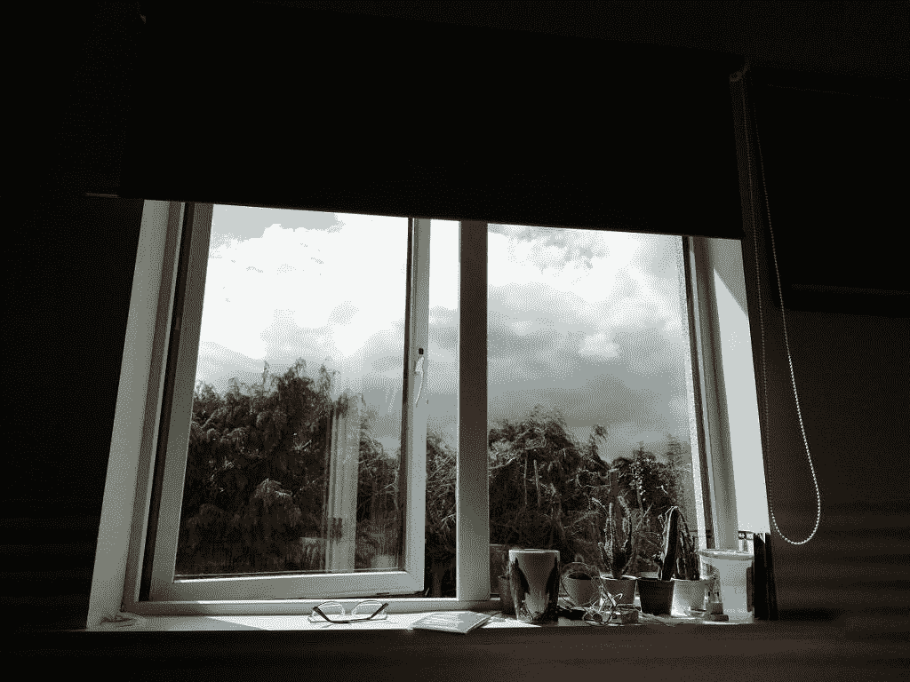

# 华为 P20 相机应用为 Honor 9 Lite 和其他麒麟 659 手机移植

> 原文：<https://www.xda-developers.com/huawei-p20-camera-port-honor-9-lite-kirin-659/>

从 7 月 22 日开始，华为和 Honor devices】将在下周被完全锁定，但现在解锁你的引导程序还为时不晚。一旦你解锁了你的引导程序，你就有可能[在项目 Treble-](https://www.xda-developers.com/flash-generic-system-image-project-treble-device/) [支持的设备](https://www.xda-developers.com/list-android-devices-project-treble-support/)上安装定制的 rom，比如 LineageOS 或者复活混音。我们回顾了几个月前运行纯 AOSP ROM 的 Honor 9 Lite [，性能提升在 AOSP 和 EMUI 之间日夜不停。然而，这些 AOSP rom 的最大问题是相机性能，这是华为 P20 相机应用程序的端口旨在解决的问题。](https://www.xda-developers.com/honor-9-lite-project-treble-aosp-review/)

如果没有从 EMUI 移植的相机，你经常会得到带有绿线或伪像的劣质照片。如果不使用合适的相机库，照片就无法正确处理。由于这些问题，这基本上意味着如果你想用手机拍照，你必须留在 EMUI 上。这就是为什么 XDA 成员[Dark-Dark](https://forum.xda-developers.com/member.php?u=9044321)将优秀的华为 P20 相机应用移植到海思麒麟 659 设备上(在 Honor 9 Lite 上测试)。我决定试开一下，看看效果如何。

该端口可以通过 Magisk 模块安装。您可以从本文中的链接[下载 Magisk 的最新版本。在我们向您展示这个相机端口带来的改进之前，请查看下面这张使用 AOSP 相机应用程序拍摄的照片。](https://www.xda-developers.com/magisk-v16-6-samsung-galaxy-s9-project-treble-gsi-root-loss/)

 <picture></picture> 

Picture taken using stock AOSP camera app on the Honor 9 Lite

## 华为 P20 摄像头移植到麒麟 659 设备，如 Honor 9 Lite

我对新的相机应用程序进行了测试，结果比 AOSP 相机应用程序好得多。即使只有控制 ISO 和快门速度的能力也有很大的不同。下面显示的所有照片都来自 AOSP 的 GSI，带有移植的华为 P20 相机应用程序。注意 WordPress 压缩了我上传的图片，所以质量比下面显示的还要好。尽管如此，您仍然可以对改进的动态范围颜色有一个大致的了解。以前，这种相机几乎不能被认为是可用的。

镜头比我们之前看到的好多了，对吧？相机不再在画面中产生怪异的伪像，有些镜头效果相当不错。顺便说一下，所有这些照片都是傻瓜相机拍的。如果你想完全控制你的相机，有很多选择。这包括 ISO、曝光、白平衡等等。

## 华为 P20 摄像头端口特性

华为 P20 相机端口有大量的功能，尽管有一些错误，它确实经常崩溃。话虽如此，它仍在不断发展和改进。您可以查看下面的功能列表。请注意，慢动作也适用于股票 EMUI。

*   孔
*   肖像
*   照片
*   录像
*   专业模式
*   夜间摄影
*   光绘
*   直接热轧制
*   全景画
*   时间推移
*   良好的足部
*   文档扫描
*   过滤器
*   水印
*   二维码扫描仪

很明显，不要指望这里会有奇迹发生。请记住，Honor 9 Lite 是一款经济型智能手机，所以这款相机不会令人兴奋。话虽如此，在合适的光线下，它也能拍出一些不错的照片。我们还需要记住，大多数采用海思麒麟 659 片上系统的智能手机也将是廉价设备。华为 P20 摄像头端口只是为那些不想牺牲摄像头质量来提高 AOSP ROM 性能的定制 ROM 用户提供的。查看下面的论坛帖子，下载并安装 Magisk 模块。

* * *

[**为麒麟 659 设备下载华为 P20 摄像头端口**](https://forum.xda-developers.com/apps/magisk/module-huawei-p20-camera-kirin659-t3798436)