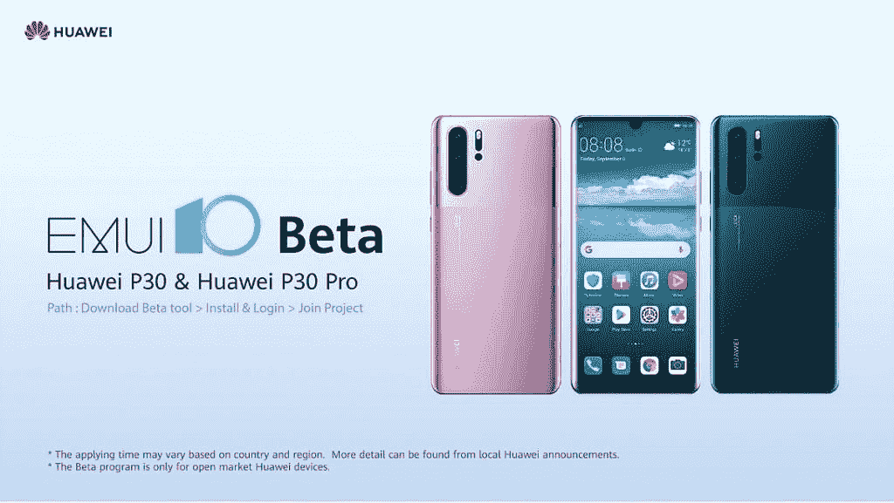

# 华为 P30 月 8 日开始获取 EMUI 10 beta (Android Q)

> 原文：<https://www.xda-developers.com/huawei-p30-emui-10-android-q-release/>

**更新(9/10/19 @美国东部时间下午 2:05):**华为已经在华为 P30 和 P30 Pro 上开放了 EMUI 10 的测试版注册。

中国最大的科技公司华为本周将在东莞举行年度开发者大会。在发布会上，华为正式宣布了其基于 Android 的软件 EMUI 的最新版本。EMUI 10.0 基于 Android 10 Q，Android 10 Q 本身还处于测试阶段。尽管如此，华为准备向世界展示其华为和 Honor 品牌智能手机的 Android Q 更新将是什么样子。

本周早些时候，谷歌为其 Pixel 智能手机推出了第六个也是最后一个 Android Q beta 版。由于谷歌向某些合作伙伴提供了 Android 10 源代码的早期访问，一些智能手机品牌，如[小米](https://www.xda-developers.com/android-q-miui-xiaomi-mi-9/)和[一加](https://www.xda-developers.com/oneplus-7-pro-oneplus-6-oneplus-6t-android-q-dp4/)已经开始定制具有自己风格的下一个 Android 版本。在这方面，华为没有什么不同，除了该公司唯一的 Android 10 测试版基本上是 EMUI 9，并在 Android Q 框架下进行了更改。本周，我们终于要看到华为在谷歌的 Android Q 上做出了什么改变。

在主题活动中，华为只谈到了即将到来的 EMUI 10 的全系统黑暗模式，但 Android Q 肯定会有很多额外的变化，华为无法在今天的公告中体现出来。在华为开发者大会上，华为确实证实了 **Android Q beta 版将于 9 月 8 日**面向华为 P30 系列发布，但这很可能只针对中国机型。尽管如此，我们现在已经为华为下一个 Android 版本的第一个测试版确定了发布日期，这意味着稳定版应该不会太远。

我们在本周的华为开发者大会上尽可能多地了解新的[鸿蒙系统](https://www.xda-developers.com/harmony-os-huawei-announce/)和 EMUI 10，所以请关注 XDA 首页以获取更多信息。

## EMUI 10 版本

正如[华为](https://www.xda-developers.com/huawei-android-q-update-p30-pro/)和 [Honor](https://www.xda-developers.com/honor-20-android-q-update-emui-10/) 之前宣布的，最新的基于 Android 10 Q 的 EMUI 版本将可用于以下设备:

*   [荣誉 8X](https://forum.xda-developers.com/honor-8x)
*   荣誉 10
*   荣誉 20
*   Honor 20i/20 Lite
*   Honor 20 Pro
*   华为 P30 Pro
*   华为 P30
*   华为 Mate 20
*   华为 Mate 20 Pro
*   保时捷设计华为 Mate 20 RS
*   华为 P30 lite
*   华为 P smart 2019
*   华为 P smart+ 2019
*   华为 P smart Z
*   华为 Mate 20 X
*   华为 Mate 20 X (5G)
*   华为 P20 Pro
*   华为 P20
*   华为 Mate 10 Pro
*   保时捷设计华为 Mate 10
*   华为 Mate 10
*   华为 Mate 20 Lite

华为 Mate 30 系列将搭载新的 EMUI 10 和 Android 10，华为今天在 HDC 的主题演讲中证实了这一点。

美国东部时间 8/9/19 @ 6:30 AM 更新:这篇文章的早期版本错误地暗示了稳定的 EMUI 10 版本将于 9 月 8 日为 P30 系列推出。事实上，它只是公测版。文章已被修改；我们对任何困惑表示歉意。

* * *

## 更新:测试版注册

基于 Android 10 的 EMUI 10 是华为的下一个重大软件更新。他们现在已经开放了华为 P30 和华为 P30 Pro 的测试版注册。这是一个公开的测试版，如果你安装了它，并想回到以前的稳定版本，你需要清除所有的数据。华为公布了安装测试版所需的所有 P30/P30 Pro 特定型号和内部版本号的完整列表。如果您符合条件，您可以安装测试版应用程序来加入该项目。查看下面的帖子，了解所有细节。

**Known issues:**

*   无法安装使用特定浏览器应用程序下载的应用程序。
*   在画中画模式下，屏幕偶尔会变黑。
*   当网络连接时，无法使用华为视频播放本地视频。
*   由于与 Android Q 的兼容性问题，一些金融应用程序可能会意外退出。
*   一些应用程序可能会有显示问题，因为它们没有与谷歌黑暗模式兼容。
*   一些第三方应用程序可能无法正常运行，因为它们没有与 Android Q 兼容。

**Source: [Huawei](https://consumer.huawei.com/en/community/details/%5bEMUI%2010%20Beta%20Opens%5d%20Get%20Ahead%20of%20the%20Line!/topicId_26877/showBread_1/fbclid_IwAR0mNOs1vh1_XJrCd2YKugkYXN67TyXegPHW9w5L14iCr-eUZwRTkXLXY-I/)**