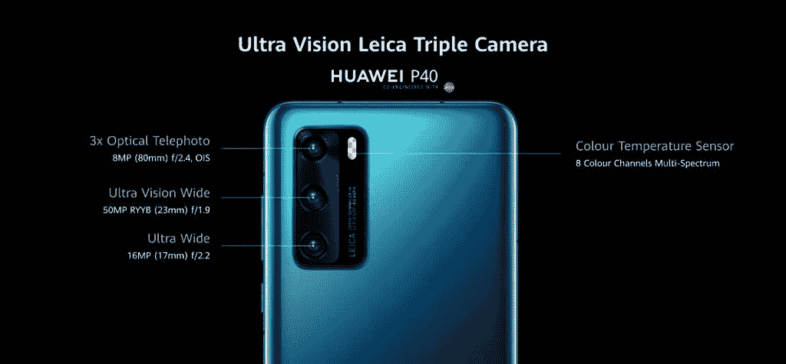
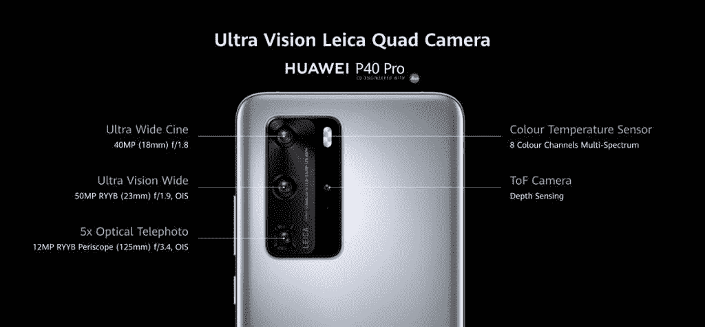
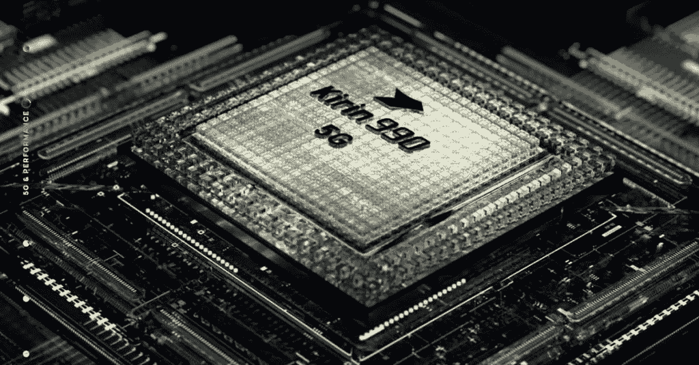
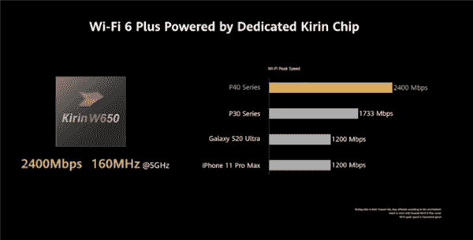

# 仔细了解华为 P40 系列的新技术

> 原文：<https://www.xda-developers.com/huawei-p40-series-tech/>

***华为 P40 & P40 Pro 全球速卖通首发会于 4 月 20 日至 21 日开始，价格惊人。您有机会赢得免费的华为 P40 和 P40 Lite！[点击此处了解详情](https://huaweitech.aliexpress.com/store/5234030)。***

华为 P40 系列是来自这家中国公司的最新系列手机。这些手机配备了许多新技术，我们将在本文中进一步探讨。

## 设计升级

华为新款 P40 手机的设计灵感来自于自然界中常见的颜色。华为 P40 和 P40 Pro 采用了深海蓝、冰白色、黑色、腮红金、银霜等纯色。

P40 Pro 配备了四曲线溢出显示屏，灵感来自于流动的水。使用 90Hz 显示屏，您可以享受整个无边框屏幕的沉浸式视图。

## 摄像机升级

 <picture></picture> 

Huawei P40 Camera

 <picture></picture> 

Huawei P40 Pro Camera

P40 和 P40 Pro 上的摄像头在明亮的日光和夜间环境下表现出色，无论拍摄对象是近距离还是远距离。使用相机不费吹灰之力，你几乎总能拍出完美的照片。

华为 P40 系列拥有业界领先的 1/1.28 英寸传感器，像素尺寸为 2.44μm。借助 RYYB 彩色滤光片阵列，传感器能够在弱光拍摄场景中发出更多光线。高分辨率 50MP 主摄像头为您的照片带来更多细节。放大照片中的任何一个小部分，你会得到另一张纹理和色彩丰富的好照片。超级变焦允许您从很远的距离拍摄清晰的照片，其变焦能力为 50 倍。

 <picture></picture> 

Super ZOOM Sample Shot

 <picture></picture> 

50MP Camera Shot

Ultra Vision 主摄像头和采用 AI AWB 算法的多光谱色温传感器，意味着华为 P40 系列将随时准备好在任何时间或任何场景为任何人拍摄高质量的人像照片。

 <picture></picture> 

Huawei P40 Series Camera Sample

 <picture></picture> 

Huawei P40 Series Camera Sample

有了 32MP 自拍相机，你甚至不需要尝试就能拥有最佳状态。前置摄像头会小心翼翼地保留您的特征，并智能地调整您脸上的光线和颜色，使每张自拍看起来都很好，很自然。

 <picture></picture> 

Huawei P40 Selfie Camera Sample

 <picture></picture> 

Huawei P40 Selfie Camera Sample

## AI 升级

华为对 P40 系列的摄影方面升级了很多 AI 广告。黄金快照功能允许您从拍摄的背景中移除不想要的人，移除反射，并从连拍中选择最佳帧。

 <picture></picture> 

Huawei Golden Snap Sample - Best Moment

 <picture></picture> 

Huawei Golden Snap Sample - Remove Passerby

 <picture></picture> 

Huawei Golden Snap Sample - Remove Reflection

新的麒麟 990 5G 芯片组提供了终极性能，大大改善了体验。

 <picture></picture> 

Kirin 990 5G Chipset

使用动态窄带宽技术，支持 Wi-Fi 6 Plus 的手机可以穿透更多的墙壁和地板。它支持 160MHz 带宽，能够实现高达 2.4 Gbps 的最佳速度。

 <picture></picture> 

Wi-Fi 6 Plus Chip

为这项新技术提供动力的是带超级充电功能的大型电池。华为 P40 配有 3800mAh 电池，22.5W SuperCharge，而 P40 Pro 配有更大的 4200mAh 电池，40W Supercharge。

[点击此处](https://huaweitech.aliexpress.com/store/5234030/search?SearchText=P40)以高达 100 美元的折扣购买新的华为 P40 系列。

*   P40 全球速卖通首映价格: **$549.99**
*   P40 Lite 全球速卖通首发价格: **$229.99**
*   P40 Pro 全球速卖通全球首发价格: **$999.99**
*   [点击此处](https://huaweitech.aliexpress.com/store/selected-sale-items/5234030.html?es=BtcnEDZknUMdPtic647VyvpuCvvQMsq%2F)获得额外 10 美元的折扣
*   使用促销代码" **P40PRO100** "获得额外 100 美元的折扣

**一系列活动在速卖通等着你:**

1.  猜价格赢取 10 台免费华为 P40 LITE
2.  玩翻转“N”游戏，赢取免费的华为 P40 LITE
3.  华为 P40 系列前 100 个订单免费获得华为 Band 4

敬请关注 4 月 20 日至 21 日在华为商城专卖店举行的华为 P40 和 P40 Pro 全球速卖通首发。

[点击此处了解更多信息](https://huaweitech.aliexpress.com/store/5234030)。

###### 我们感谢华为赞助这篇文章。我们的赞助商帮助我们支付与运行 XDA 相关的许多费用，包括服务器成本、全职开发人员、新闻撰稿人等等。虽然您可能会在门户内容旁边看到赞助内容(这些内容将始终被标记为赞助内容),但门户团队对这些帖子不承担任何责任。赞助内容、广告和 XDA 仓库完全由一个独立的团队管理。XDA 绝不会通过接受金钱来赞扬一家公司，或以任何方式改变我们的观点或看法，从而损害其新闻诚信。我们的意见不能被收买。