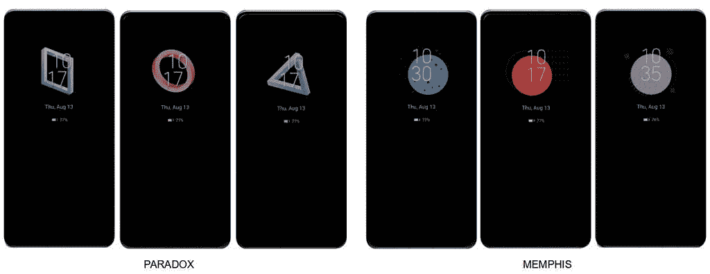
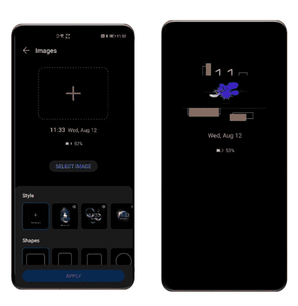
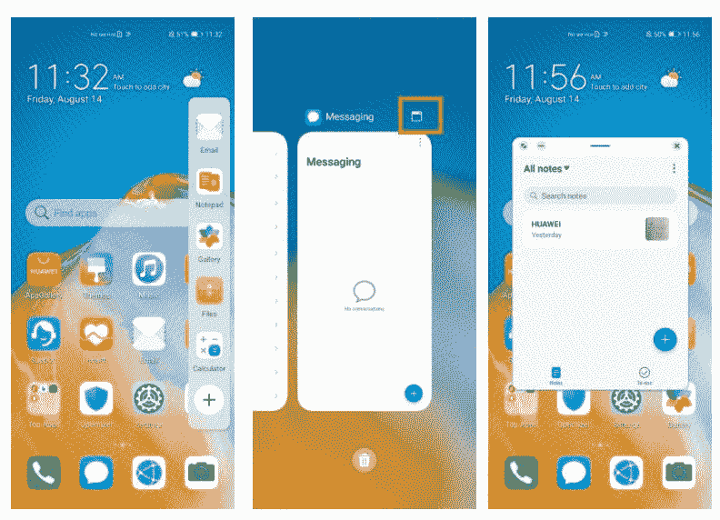
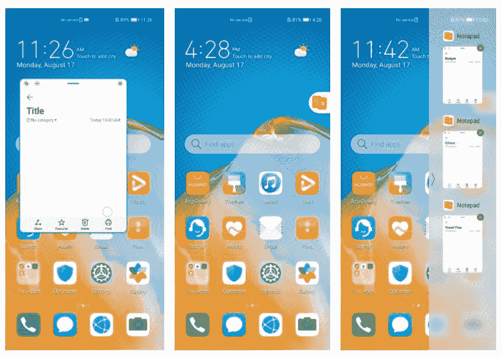

# 华为发布最新安卓软件:EMUI 11

> 原文：<https://www.xda-developers.com/huawei-unveils-its-latest-android-software-emui-11/>

中国智能手机巨头华为今天在中国东莞召开了一年一度的华为开发者大会。在会议期间，该公司推出了 EMUI 11——该公司定制 Android 皮肤的最新版本。虽然最新的软件版本不是基于[谷歌最新的 Android 11 版本](https://www.xda-developers.com/android-11-stable-google-pixel-oneplus-xiaomi-realme-oppo/)，但 EMUI 11 更新包含了一系列新功能和改进，预计将在未来几个月内应用于华为设备。以下是 EMUI 11 中所有新功能的简要介绍:

## EMUI 11 UX 变更

EMUI 11 包括几个新功能，旨在改善华为设备上的用户体验。UX 的改进包括对永远在线显示(AOD)功能的更改，该功能现在允许用户访问许多自定义选项。

 <picture></picture> 

AOD themes

随着新软件的发布，用户将获得 AOD 功能的各种定制选项、新主题、AOD 上的可定制动画元素，以及在 AOD 上显示任何图像、直播视频、GIF 的能力。

 <picture></picture> 

AOD customizations

随着 AOD 的改进，EMUI 11 包括股票画廊应用程序的更新设计。更新后的图库应用程序中的照片选项卡现在支持新的挤压手势，用户可以轻松地在月视图和日视图之间切换。

另一方面,“相册”标签有了新的 4:3 布局和新的设置来对照片进行排序。EMUI 11 中的动画引擎也在华为人因研究的基础上得到了一些优化。由于这一点，过渡动画现在可以模仿连续“一次性”镜头的视觉效果，这有望减少用户浏览 UI 时的分心。

 <picture></picture> 

Resizeable floating windows

EMUI 11 还支持一个名为 Live Icons 的新功能，该功能在整个 UI 中添加了一堆动画图标。这些动画图标可以在通知面板，股票手机应用程序，以及其他默认的华为应用程序如华为记事本和华为音乐中找到。EMUI 11 还引入了新的同步振动功能，将设备振动与铃声音频同步。

 <picture></picture> 

Minimize floating windows

此次更新还包括一项名为智能多窗口的功能，用户可以调整浮动窗口的大小，并在不使用时将其最小化。该功能还允许用户从 dock 的浮动窗口中打开应用程序，所有最小化的窗口都将显示在侧边栏中，以便于访问。在华为 Mate X 和其他可折叠手机/平板电脑上，智能多窗口模式将让用户同时打开多个窗口。

## 新的人工智能和隐私功能

EMUI 11 为华为设备带来了大量新的和更新的人工智能功能。新的人工智能功能包括多屏协作 3.0，用户可以在 PC 上同时控制三个手机应用程序，在连接的 PC 上接受呼叫，并将设备用作文档扫描仪。此次更新还改进了华为的视频通话应用 MeeTime，并增强了该公司的语音助手 Celia。

华为还在 EMUI 11 中加入了一系列新的隐私和安全功能。其中包括状态栏中的新指示器图标，当应用程序使用用户设备的摄像头、麦克风或位置时，它会提醒用户；新功能将阻止后台应用程序访问麦克风和摄像头；以及新的位置、摄像头和麦克风使用权限请求。Gallery 应用程序还获得了隐私和安全方面的改进，包括设备上的人工智能处理支持，从图像中删除 EXIF 数据的选项，以及存储敏感照片的隐藏相册。

此外，此次更新为华为 Notes 应用程序带来了一个新的隐藏备忘录功能和一个安全投射功能，以防止敏感信息在你向电视投射时出现在你的电视上。截至目前，华为尚未公布 EMUI 11 的发布时间表。但由于该公司已经开始测试软件，我们预计其 P40 和 Mate 30 旗舰产品将很快推出测试版。