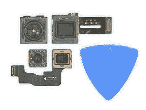

# 从 iFixit 拆卸 Galaxy S20 Ultra 显示 100 倍空间变焦相机

> 原文：<https://www.xda-developers.com/ifixits-galaxy-s20-ultra-teardown-samsung-100x-space-zoom-camera/>

Galaxy S20 Ultra 是三星新 Galaxy S 系列中最昂贵的智能手机，它具有各种顶级硬件功能，三星希望这一价格能够物有所值。这款手机最大的卖点是它的摄像头设置。S20 Ultra 拥有一个巨大的 108MP 主传感器，支持 [3x3 像素宁滨](https://www.xda-developers.com/samsung-galaxy-s20-ultra-108mp-nona-binning-camera/)，一个 48MP ~4x 光学变焦相机，一个 12MP 超广角相机，和一个 0.2MP 飞行时间传感器。 *iFixit* 刚刚公布了这款智能手机的拆解图，以揭示 Galaxy S20 Ultra 100 倍空间变焦相机背后的硬件魔力。

Galaxy S20 Ultra 相机设置的第一个也是最重要的部分是主 108MP 传感器。这是一个巨大的传感器。该传感器的尺寸为 9.5 毫米 x 7.3 毫米。据 *iFixit* 称，该传感器的表面积实际上是 iPhone 11 Pro 的 12MP 主传感器的两倍。为了弥补将 1.08 亿像素装入如此小的区域会导致非常小的像素(这导致了低光照条件下的嘈杂图像)，Galaxy S20 Ultra 使用了一种[“新材料”](https://www.dpreview.com/news/5365192640/this-is-how-the-samsung-isocell-bright-hmx-108mp-mobile-image-sensor-works)，将每个像素分隔开以“[最小化]光学损失和光反射。”三星的“诺娜宁滨”基本上涉及到一组 3x3 的像素，并将它们组合成一个超细节像素。这就是为什么默认情况下，108MP 相机的照片输出分辨率为 12MP。

 <picture></picture> 

iPhone 11 Pro 12MP vs Galaxy S20 Ultra 108MP

约 4x 光学变焦相机是一款更有趣的相机。它使用 48MP 索尼 IMX 586 传感器，但有几种稳定形式。三星使用连接到容纳镜头阵列的盒子的轨道来来回移动阵列以进行对焦。用于将光 90 反射到传感器中的棱镜也是光学稳定的。这意味着从这个镜头拍摄的照片在多个不同的水平上是稳定的。这是三星设置这款相机的一种非常酷的方式，这是我们还没有从任何其他 OEM 看到的系统。

内部硅也同样令人印象深刻。以下是 iFixit 能够在 Galaxy S20 Ultra 中找到的芯片列表。值得注意的一个令人印象深刻的芯片是位于高通骁龙 865 芯片之上的 12GB lpddr 5 RAM。这是第一批广泛提供 LPDDR5 RAM 的器件之一。你甚至可以选择在[获得高达 16GB 的 LPDDR5 RAM](https://www.xda-developers.com/samsung-galaxy-s20-ultra-first-phone-16gb-ram/) 的 S20 Ultra。

*   三星 K3LK4K40BM-BGCN 12 GB LPDDR5 RAM 覆盖高通 865 SoC
*   三星 KLUDG4UHDB-B2D1 128 GB UFS 3.0 闪存存储
*   高通 SDX55M 第二代 5G 调制解调器
*   Skyworks SKY58210-11 射频前端模块
*   Qorvo QM78092 前端模块
*   Maxim MAX77705C 电源管理 IC
*   高通 QPM5677 和 QPM6585 5G 功率放大模块
*   高通 SDR865 RF 收发器
*   村田 KM9D19075 Wi-Fi 和蓝牙模块
*   高通 PM8250 电源管理 IC
*   高通 PMX55 电源管理 IC
*   高通 PM8150C 电源管理 IC
*   高通 QDM4870 前端模块
*   Qualcomm QBT2000 000 5R90777 HK940 07
*   三星 1951 A S6SY79AX 6877DW3

三星 Galaxy S20 Ultra 是一款非常强大(也非常昂贵)的智能手机，但遗憾的是，它不太容易修复。 *iFixit* 只给了它 3 分(满分 10 分)的可修复性评分，这让这款“超”手机感觉少了很多*超*。 *iFixit* 给了这款手机不好的评价，玻璃后盖易碎，更换胶合电池困难，维修显示屏困难。如果你对完全拆卸感兴趣，[看看 *iFixit*](https://www.ifixit.com/Teardown/Samsung+Galaxy+S20+Ultra+Teardown/131607) 上的帖子。

**[银河 S20 论坛](https://forum.xda-developers.com/galaxy-s20)**| |**|[银河 S20+论坛](https://forum.xda-developers.com/galaxy-s20-plus)|**| |**|[银河 S20 超论坛](https://forum.xda-developers.com/galaxy-s20-ultra)**