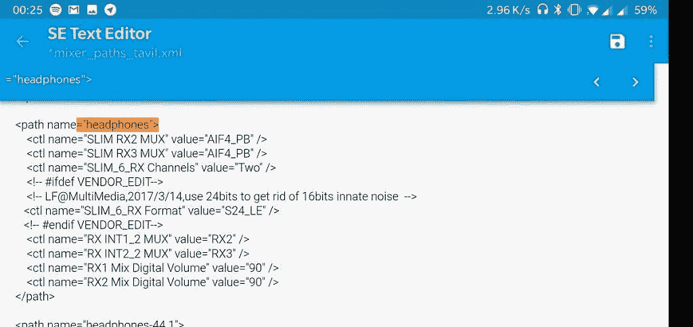

# 如何增加 OnePlus 6 上的耳机插孔音量[Root]

> 原文：<https://www.xda-developers.com/increase-oneplus-6-headphone-jack-volume/>

对 OnePlus 6 最常见的抱怨之一是其低音量耳机插孔。虽然该设备的许多不同方面都很出色，但这款手机的音量输出却没有那么大。质量本身是好的，但你不会完全泵出高分贝的音频。通常用户在其他设备上增加音量的一个技巧是改变适当的 mixer_path 文件中的值，但在 OnePlus 6 上该位置已经改变。如果你想了解如何增加 OnePlus 6 耳机插孔的音量输出，请遵循此教程。你需要一个[根设备](https://www.xda-developers.com/unofficial-twrp-oneplus-6/)(使用 Magisk)和一个根支持的文件浏览器。我们推荐 MiXplorer 或 Solid Explorer。

[appbox xda com.mixplorer]

## 如何增加 OnePlus 6 上的耳机插孔音量

### 第一步-根

你需要首先启动你的设备。在 OnePlus 6 上这是一个有点复杂的过程，所以我们建议遵循 XDA 公认的贡献者 [Funk Wizard](https://forum.xda-developers.com/member.php?u=6143932) 的[这个教程](https://forum.xda-developers.com/oneplus-6/how-to/oneplus-6-unlock-bootloader-flash-twrp-t3792643)。一旦你设置好了，确保你有一个根文件浏览器。

### 步骤 2 -查找 mixer_paths_tavil.xml

一加已经将我们需要的 mixer_paths 文件移动到供应商分区。特定于设备的库和其他二进制文件位于这个分区中。您需要导航到/vendor/etc。接下来，打开 mixer_paths_tavil.xml。

### 步骤 3 -修改 mixer_paths_tavil.xml

该文件包含许多设备的音频特定设置。我们只对调整耳机插孔音量输出感兴趣，所以不要管其他设置。要找到它，我建议搜索“=”耳机“”，不带多余的引号。它在文件的底部。您要修改的值是“RX1 混合数码音量”和“RX2 混合数码音量”。该值默认为 80，所以我将其设置为 90。更改此值后，请重新启动设备。

 <picture></picture> 

**Take care when editing this value, as it can damage your ears. Increase it in small increments. Use common sense.**

## 结论

你在 OnePlus 6 上的耳机孔现在应该大很多了吧！我们到底做了什么？该值通常设置得较低，以保护用户的耳朵，但由于市场上有各种各样的耳机，它对每个用户都没有意义。请注意，较高的值可能会导致音频失真。我注意到这一点时，设置为 100，并把音量提高到最高水平。不过，在值为 90 时，我注意到失真很小，而且我的耳机比原声大得多。我用一加子弹 V2，森海塞尔动量 2.0 和音频技术 M50X 测试了输出。试试这个 mod，让我们知道它是否适合你！

## 更新:如何增加 OnePlus 5 和 OnePlus 5T 上的耳机插孔音量

由于在 OnePlus 5 和 OnePlus 5T 上都有这样做的需求，我们决定用说明更新这篇文章。因此，虽然步骤本身保持不变，但您必须查看三个不同的文件。在最新的公开测试版上，你需要检查/vendor/etc 来找到以下文件，而在 stable 上你应该检查/system/etc。

```
 mixer_paths.xml 
```

```
 mixer_paths_tasha.xml 
```

```
 Finding mixer_paths_tavil.xml 
```

选项应该在其中之一。如果你找到了，请在评论中告诉我们！除了它是一个不同的文件之外，步骤是完全相同的。