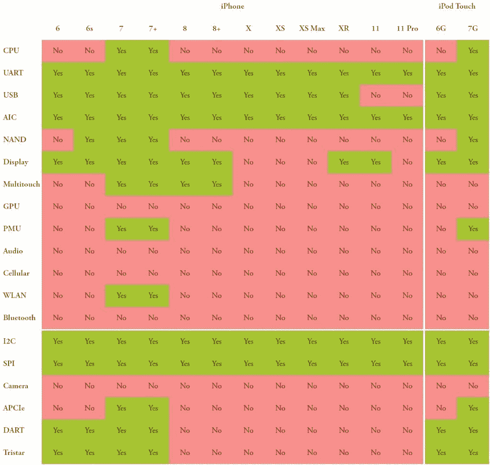

# 使用 Project Sandcastle 在苹果 iPhone 7 上安装 Android 10

> 原文：<https://www.xda-developers.com/install-android-10-apple-iphone-7-plus-project-sandcastle-checkra1n-jailbreak/>

苹果以 iPhone 的形式制造了一些有趣的消费硬件。苹果对 iPhone 和其他设备的硬件和软件进行完全控制，这使得它能够提供无可比拟的体验。这种体验让他们对他们的产品收取高额的加价，一些消费者对这种成本感到满意，因为他们享受到了“*这就是效果*”的奢侈。但苹果的所有这些控制给了它的产品及其底层体验一个“围墙花园”的类比——你只能享受苹果希望你享受的体验，而不能体验其他任何东西，无论是好是坏。因此，即使你为令人兴奋的硬件支付了过高的价格，你也并不真正拥有硬件——你只是拥有在苹果设定的界限内使用它的许可。一些开发者不同意这些界限，他们开始用[项目 Sandcastle](https://projectsandcastle.org/) 来补救这种情况，允许你在你的苹果 iPhone 7 上运行 Android。

《沙堡计划》是 Corellium 公司团队的工作成果，该团队由十多年前,[在最初的 iPhone](http://linuxoniphone.blogspot.com/) 上启动安卓系统的同一批人组成。正如 Project Sandcastle 在其产品理念中指出的:

> 沙盒设定了限制和界限，沙堡提供了一个从你无限的想象力中创造新事物的机会。沙堡项目是关于在你的硬件芯片上建造新的东西。
> 
> iPhone 限制用户在沙盒内操作。但是当你买了 iPhone，你就拥有了 iPhone 的硬件。用于 iPhone 的 Android 让你可以在该硬件上自由运行不同的操作系统。

这一次，Project Sandcastle 可以让你在苹果 iPhone 7、iPhone 7 Plus 和 iPod Touch 上启动 Android 10。该项目广泛使用了 checkra1n 越狱来启动，这与你通过根 Android 来[越狱你的 iPhone 是一样的。该项目正在扩展到 checkra1n 越狱中包含的其他 iPhones，但目前，你只能使用这三种设备。令人欣慰的是，用于制造 checkra1n 越狱和沙堡项目的漏洞极有可能无法修复。因此，理论上，这些方法将对所有易受攻击的 iPhones 永久有效，去掉“*又有什么意义呢？苹果将通过更新*“劝阻努力”来修复它。](https://www.xda-developers.com/jailbreak-apple-iphone-using-checkra1n-rooted-android-phone/)

在你的 iPhone 上安装和使用 Android 有几个主要的注意事项。首先，蓝牙、音频、蜂窝连接和摄像头等主要功能都无法使用。根据我们的理解，Project Sandcastle 也不能提供包含 GMS(谷歌移动服务)的 Android 版本，而且似乎也没有像定制恢复那样单独刷新它的方法——所以你不能访问任何像 Play Store 这样的谷歌应用程序，也不能使用依赖 GMS 功能的应用程序。Android 安装本身也不是永久的，所以当你重启时，你会丢失数据和你的 Android 操作系统。从好的方面来说，当你需要你的手机成为一部手机时，你可以简单地重启进入 iOS(注意，Android 操作系统的空间仍然会被保留)。测试版免责声明仍然适用:这是在测试中，所以不要在硬件上尝试，你不能冒险失去它。

 <picture></picture> 

Working features for Android on iPhone/iPod. Support is currently limited to iPhone 7, 7 Plus and iPod Touch 7th Gen

要下载并安装 Sandcastle 项目下的 Android 版本，[请访问官方网站](https://projectsandcastle.org/status)。安装说明位于下载文件的自述文件中。请记住，您确实需要在您的 iDevice 上安装 checkra1n，并且您需要 Mac 或 Linux 来进一步安装。在很大程度上，脚本负责处理这个过程，所以整个过程对于它试图实现的目标来说并不困难:在 iPhone 上运行真正的 Android。

* * *

**来源:[沙堡项目](https://projectsandcastle.org/)**

**故事 Via: [福布斯](https://www.forbes.com/sites/thomasbrewster/2020/03/04/exclusive-this-hack-runs-android-on-your-iphone/#6666888c50cc)**