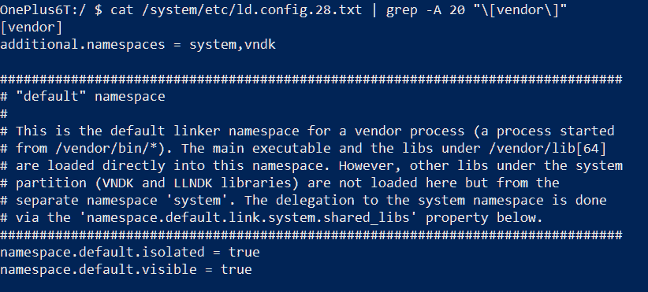

# 如何在你的设备上安装安卓 Q 测试版 GSI 以便测试你的应用

> 原文：<https://www.xda-developers.com/install-android-q-beta-gsi-project-treble/>

随着我们离最终的 Android Q 版本越来越近，开发人员更新应用程序的时间也在缩短。虽然 Android 9 Pie (API 等级 28)还没有到达绝大多数设备，但是 Google Play 的 API 等级要求，你应该[已经很了解](https://www.xda-developers.com/play-store-updated-requirements-api-level-64-bit/)了，会迫使你在 2020 年把 API 等级 29 作为目标。如果你还没有更新你的应用程序来瞄准 Android 9 Pie，[那么](https://www.xda-developers.com/google-play-protect-warning-users-install-apps-targeting-older-android-versions/)如果你计划推出一个新的应用程序，你可以在 8 月前更新，如果你计划更新现有的应用程序，你可以在 11 月前更新。对于那些想要开始开发下一个 Android 版本的人来说，你已经可以在 [Android Studio 模拟器](https://www.xda-developers.com/android-q-beta-2-notification-bubbles/)上测试你的应用程序，或者如果你拥有[任何一部谷歌 Pixel 智能手机](https://www.xda-developers.com/android-q-beta-2-everything-new/)，也可以在物理硬件上测试你的应用程序。然而今年，谷歌为开发者提供了另一种方式来测试他们的应用程序与最新的安卓版本的对比:将一个[安卓 Q 测试版 GSI](https://www.xda-developers.com/android-q-gsi-project-treble/) 闪现到一个兼容 Project Treble 的设备上。

Project Treble 是一项重大举措，旨在提高智能手机制造商推出软件和安全更新的速度。简而言之，Treble 要求设备制造商将使硬件工作的软件与操作系统背后的软件分开。这使得设备制造商可以在现有设备上引导新的 Android 版本，以便他们可以开始在新的 Android 源代码版本上移植现有代码库的艰巨任务。作为 CTS 的补充，VTS 或供应商测试套件是一套测试，设备制造商使用这套测试来验证他们的设备是否符合 Project Treble 的要求。设备制造商要测试的最重要的检查之一是兼容 Treble 的智能手机启动所谓的 GSI 或通用系统映像的能力。GSI 是 AOSP 的未修改版本，旨在让设备制造商看看他们是否正确实现了 Treble。然而，除了原始设备制造商，谷歌[相信【GSIs 可以被开发者用于 Android 应用兼容性测试。](https://www.xda-developers.com/google-test-android-q-project-treble-gsi/)

例如，如果你没有谷歌 Pixel，在最符合谷歌文档的条件下测试你的应用程序行为的唯一方法是你要么购买一个自己的 Pixel 设备，启动 Android Studio 仿真器，要么查看云测试服务。这些都有其优缺点，但如果你有一个现有的高音兼容设备，不想花任何钱或处理模拟器的限制，为什么不把 GSI 放在上面呢？如果你的应用可以在 GSI 上运行，那么它应该可以在几乎所有运行该安卓版本的设备上运行。

这就是谷歌决定发布 Android Q GSIs 背后的思维过程，或者至少我们是这么认为的。Android Q 的源代码要到 8 月份才能发布，所以谷歌官方的 GSI 二进制文件是目前在真实的非像素硬件上测试 Android Q 的唯一方法。以下是你可以开始的方法。

## 要求

在你考虑安装 Android Q beta 之前，你应该检查一下你的设备是否兼容 Project Treble，是否可以接受来自引导程序的闪烁系统映像。

**要求:**

*   你的设备**必须**有一个**可解锁的引导程序**。在美国销售的骁龙三星智能手机、华为品牌的设备、Honor 品牌的设备以及 HMD Global 的诺基亚品牌的设备(除了[诺基亚 8](https://www.xda-developers.com/nokia-8-bootloader-unlock/) )在这里不符合条件。
*   你的电脑上安装了最新的 ADB 和 Fastboot 二进制文件，你可以在这里找到。快速启动的过时版本可能会导致不正确的闪存。
*   您的设备**必须**满足**以下标准之一**才能被视为项目三重兼容:
    *   与 Android 9 Pie 一起推出的设备。如果是这种情况，您可以在本节结束后跳过确认高音兼容性。
    *   该设备推出了 Android 8.0 Oreo 或 Android 8.1 Oreo，但更新到 Android 9 Pie，具有 VNDK 隔离和系统根。我们将在下一节详细介绍如何找到它。

在我们进一步讨论之前，值得一提的是，刷新 GSI 将需要您对 userdata 分区执行完全擦除。这意味着您将丢失设备内部和外部(/数据/媒体)存储上的所有照片、视频、音乐、文档或任何其他内容。因此，强烈建议在进一步操作之前进行设备外备份。

接下来，请记住，这些 GSI 尚未通过 CTS，因此如果您的应用程序使用 SafetyNet 认证 API 来检查 CTS 配置文件匹配的设备完整性，那么这将不起作用。此外，这些构建不是为了日常使用，所以如果一个或多个基本硬件功能不能在 Android Q 中已经记录的错误上工作，不要感到惊讶。谷歌已经列出了 GSI 的几个已知问题，你可以在这里找到。你发现的任何新漏洞都应该在这里[存档](https://issuetracker.google.com/issues/new?component=190602&template=1244680)。

### 确认高音兼容性

运行以下命令:

```
 adb shell getprop ro.treble.enabled 
```

如果响应为**假**，则您的设备与 Project Treble 不兼容，您不应继续。如果回答是**真**，那么你就可以继续前进了。

接下来，通过运行以下命令检查跨版本支持:

```
 adb shell
cat /system/etc/ld.config.28.txt | grep -A 20 "\[vendor\]" 
```

在输出中，查找部分**【vendor】**，然后在该部分中查找**namespace . default . isolated**。如果该属性的值为 **true** ，那么你的设备应该支持在 Android 9 Pie 供应商映像上引导 Android Q GSI。如果该值为**假**，那么您的设备只能将 GSI 用于同一设备上的操作系统版本。

 <picture></picture> 

Sample output from a OnePlus 6T.

最后，您需要确认您的设备是否是 system-as-root，其中 ramdisk 与系统映像合并。对于升级到 Android 9 Pie 的设备来说，System-as-root 不是强制性的，但对于支持纯系统 OTA 来说是必要的，比如在通过 GSI 刷新新操作系统版本的情况下。运行以下命令，验证输出是否与“system-as-root”匹配:

```
 adb shell
cat /proc/mounts | grep -q /dev/root && echo "system-as-root" || echo "non-system-as-root" 
```

现在你知道你的设备是三重兼容的，你需要弄清楚下载哪个版本的 GSI 二进制文件，因为不同的架构有不同的镜像。要查看设备的架构，请运行以下命令:

```
 adb shell getprop ro.product.cpu.abi 
```

记下这里的输出，因为下载 GSI 时会用到它。

## 下载 GSI

Android Q beta GSI 正式版的下载链接可以从谷歌[这里](https://developer.android.com/preview/gsi-release-notes#downloads)获得。您应该根据您在上一步中找到的设备架构下载合适的版本。如果你下载带有 GMS 或谷歌移动服务的版本，下载量会相当大，我们强烈建议你可以在带有 Google Play 服务的版本上测试你的应用。

文件下载完成后，您可以将其解压缩。其中包含两个文件， **system.img** 和 **vbmeta.img** 。

## 闪烁着 GSI

1.  使用按钮组合或发出命令:

    ```
     adb reboot bootloader 
    ```

    重新启动设备的引导程序
2.  接下来，我们需要禁用 Android 验证启动(AVB)。您可以通过输入以下命令来做到这一点:

    ```
     fastboot flash vbmeta vbmeta.img 
    ```

3.  接下来，我们来擦写系统分区:

    ```
     fastboot erase system 
    ```

4.  我们终于可以用:

    ```
     fastboot flash system system.img 
    ```

    来闪现安卓 Q GSI 了
5.  完成后，用:

    ```
     fastboot -w 
    ```

    清除用户数据分区
6.  使用电源按钮或输入:

    ```
     fastboot reboot 
    ```

    重新启动您的设备

希望它能在几分钟后启动。这些步骤在 Pixel 3 XL 上进行了验证，但应该普遍适用。我们可以验证 Android Q beta 2 GSI 不能在一加 6T 上启动，但可以在小米 Mi 9 上启动。它可能在索尼 Xperia XZ3 上工作，但我们被告知它不能在 Moto G7 上启动。您的里程可能会有所不同，因为谷歌的要求只确认相同的操作系统版本 GSI 兼容性。