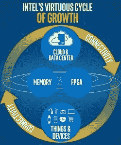

# [更新]英特尔:凌动没有死，我们不会离开移动

> 原文：<https://www.xda-developers.com/intel-myths-debunked-atom-is-not-dead-and-not-leaving-mobile/>

上周晚些时候，我们报道了英特尔 Atom 系列产品的可能死亡以及从移动市场退出的推测。从那时起，我们有机会与英特尔的公共关系团队交谈，他们帮助澄清了一些事情。获得这些额外信息后，英特尔的决定不仅合理，而且从长远来看可能更好。

## Atom 的未来

与最坏的假设相反，英特尔报告称，它并没有死。之前命名为“Cherry Trail”的凌动 x5 和 x7 SoCs 将继续发货，并保留凌动品牌。因此，由它驱动的设备，如微软 Surface 3，微软 HoloLens，甚至英特尔最近更新的基于 Atom 的计算棒都将继续。樱桃小径之后，事情似乎会有所改变。

英特尔最初声明他们*“将继续与原始设备制造商合作，开发基于 Apollo Lake 和 Core M 的新型二合一设备，用于可拆卸的二合一设备。”*当我跟进 Apollo Lake 时，我被告知*“将支持入门级/经济型设备，并将被命名为奔腾和赛扬。”* Atom 在 Core M 品牌不存在的时候推出；现在，两者在功能、能效和成本方面有了显著的重叠。虽然 Broxton 被取消了，但我没有看到任何迹象表明 Willow Trail 也被取消了，这为 Atom 留下了继续甚至超越 Cherry Trail 的可能性。

**更新:**英特尔已回复并声明*...唯一停产的产品是 Broxton 的手机和平板电脑、SoFIA 3GX、SoFIA LTE 和 SoFIA LTE2"* 。他们还澄清说，凌动品牌尚未就此做出任何决定，并指出许多奔腾和赛扬产品都基于凌动设计(如 Bay Trail)。

## 英特尔和移动数据

 另一个流行的神话是，英特尔可能会收起帐篷，将移动市场让给高通、三星和联发科等公司。为了解决这个问题，英特尔提到了 4 月 26 日英特尔首席执行官布莱恩·科兹安尼克[的博客文章。他在书中写道:](https://newsroom.intel.com/editorials/brian-krzanich-our-strategy-and-the-future-of-intel/)

*“随着世界迈向 5G，英特尔将因我们的技术实力而领先，提供端到端 5G 系统，从调制解调器到基站，再到现在和未来存在的各种连接形式。”*

当我读到这篇文章时，我很困惑，因为没有 5G 规范- 3GPP 正在采取措施[在 2018 年](https://www.qualcomm.com/news/onq/2016/03/18/progressing-toward-global-5g-standard-3gpp-approves-study-item-new-5g-air)前制定一个规范；一些活跃的参与者已经将候选技术贴上了 5G、[的标签，比如三星](https://shop-links.co/link/?exclusive=1&publisher_slug=xda&article_name=%5BUpdated%5D+Intel%3A+Atom+Is+Not+Dead+And+We%27re+Not+Leaving+Mobile&article_url=https%3A%2F%2Fwww.xda-developers.com%2Fintel-myths-debunked-atom-is-not-dead-and-not-leaving-mobile%2F&u1=UUxdaUeUpU16011&url=http%3A%2F%2Fwww.samsung.com%2Fglobal%2Fbusiness%2Fnetworks%2Finsights%2Fnews%2Fsamsung-begins-5g-technology-standardization-in-earnest-by-hosting-3gpp-ran1-meeting)。英特尔正在努力推动所有与物联网相关的事物，这一概念表明，几乎所有东西都可以并最终将在某些方面“联网”。

获取数据是一回事，但数据必须被送回某个地方进行分析和使用——在许多增长的情况下，这仍然需要移动信号。人们只需看看他们自己的图表，就能明白他们对此有多重视。

这个谜题缺少的部分是:索菲亚不是英特尔唯一的调制解调器。没错，就是集成了 Atom 的那个；但是除了这种整合，英特尔还有其他几个型号，所有这些型号看起来仍然生机勃勃。任何这些都可以很容易地与处理器配对，现在可能与英特尔的奔腾或酷睿 M 处理器配对。它甚至可以与另一家制造商[的 SOC 配对，比如传闻中与苹果](http://blogs.wsj.com/moneybeat/2016/03/11/will-new-iphones-let-intel-inside/)的交易。由于他们想要发展这项业务，他们需要在可以使用它的平台上支持它，包括 Android。

英特尔宣布的举措看起来像是一家公司向前看，放弃了行不通的东西。Atom 继续关注远离低端和完全集成。保留凌动 x5 和 x7 使他们能够致力于提供支持的产品，如 4K 显示器，这是英特尔最擅长的市场。英特尔在移动领域消亡的理论似乎也被大大夸大了。无论是对那些认为我们需要更多手机玩家的人来说，这都是一个值得欢迎的消息，与上周关于这个话题的文章形成鲜明对比。

## 英特尔和安卓(更新)

鉴于最近的发展，对于那些想知道英特尔对 Android 的立场的人来说，这个声明应该会让你放松。

“我们绝对会继续致力于 Android 和那个生态系统，几周后我们会在谷歌 I/O 上。”

您认为英特尔会在移动领域继续增长吗？或者，它可能会以其他方式增长，专注于将其组件作为更大系统的一部分销售，而不是完整的解决方案？请在下面的评论中告诉我们吧！