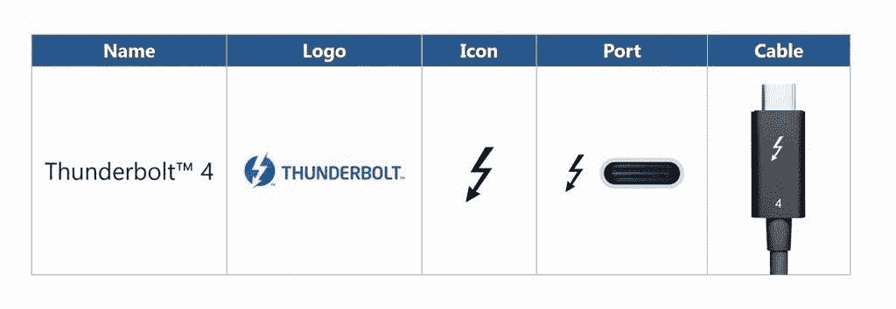

# 英特尔宣布推出符合 USB4 标准的 Thunderbolt 4 和新控制器

> 原文：<https://www.xda-developers.com/intel-thunderbolt-4-protocol-8000-series-thunderbolt-controllers-usb-c-usb4-compliance-compatible/>

Thunderbolt 是英特尔开发的跨平台数据和电源传输标准。该协议常见于笔记本电脑和个人电脑，可用于通过 USB-C 端口连接兼容 [DisplayPort](https://www.xda-developers.com/displayport-alt-mode-2-0-allow-16k-video-output-over-usb-4-type-c-ports/) 的设备，包括外部显示器以及 PCI Express (PCIe)外设，包括外部显卡、硬盘、Wi-Fi 或以太网连接器。当前一代协议——雷电 3——支持高达 40Gbps 的上行或下行带宽，是 USB4 规范的基础。雷电 3 于 2015 年末发布，早就应该更新了。英特尔在 [CES 2020](https://www.xda-developers.com/tag/ces2020/) 上发布其 [Tiger Lake 移动处理器](https://www.xda-developers.com/intel-tiger-lake-horseshoe-bend-foldable-pc-laptop/)时谈到了 Thunderbolt 4，但没有透露任何细节。现在这一天终于到来了，英特尔终于宣布了 Thunderbolt 4 连接协议以及新的 8000 系列控制器，以向后兼容雷电 3 和 USB 3.1(及更高)设备。

与上一代相比，新协议对最低视频要求加倍，要求支持至少两台 4K 显示器或一台 8K 显示器。该标准还要求通过 PCIe 支持的最低数据传输速率为 32Gbps，存储传输速度为 3,000Mbps。

 <picture></picture> 

Intel Thunderbolt 4 branding

虽然 Thunderbolt 4 通过一根电缆传输数据、电源和视频信号，传输速率与雷电 3 相同，但它确实比上一代产品有所改进。更具体地说，Thunderbolt 4 将带来多功能性和安全性方面的改进，因此，英特尔希望为整个 PC 行业的 USB 连接设立一个新标准。

## 霹雳 4 的好处

### 多才多艺

Thunderbolt 4 最大的改进之一是，它现在将支持多达四个 Thunderbolt 4 端口的 USB 扩展集线器和坞站，而雷电 3 只有一个端口。这实质上意味着任何具有单个 Thunderbolt 4 端口的 PC 或笔记本电脑都可以支持多达四种增强功能，如外部固态硬盘、外部 GPU、显示器等。由协议提供动力。为了在以前的版本中实现这一点，用户必须一个接一个地“[菊花链](https://en.wikipedia.org/wiki/Network_topology#Daisy_chain)”Thunderbolt 配件，即串联它们。

除了这些改进，英特尔现在要求兼容的 PC 支持至少一个能够充电的 Thunderbolt 4 端口。此外，键盘或鼠标等连接附件必须能够将电脑从睡眠状态中唤醒。

### 安全性

英特尔要求原始设备制造商或开发人员采用 Thunderbolt 4 英特尔的[虚拟化技术进行定向 I/O](https://newsroom.intel.com/wp-content/uploads/sites/11/2020/07/intel-thunderbolt4-security-brief.pdf) (VT-d)技术，以抵御任何物理直接内存访问(DMA)攻击。这基本上需要处理器内置定制的功能来阻止对系统内存的任何未经授权的访问。这种防御措施至关重要，因为系统内存由许多 PCIe 设备共享，包括通过热插拔插头(或端口)外部连接的设备，这使得内存容易受到物理拦截或破坏。

Thunderbolt 4 使用内核级 DMA 重新映射(DMA-r)支持的硬件级保护。后者意味着每个外设都可以访问系统存储器上的一个隔离块，这样就不会与其它设备共享。这可以防止其他设备访问或读/写其他设备的存储块。英特尔的 VT-d 和 DMA-r 技术在操作系统上受支持，包括 Windows 10 版本 1803 (RedStone 4)和更高版本、macOS 10.8.2，以及从内核版本 4.21 开始的 Linux。

### 膨胀性

去年，英特尔[开放雷电 3 作为免版税协议](https://newsroom.intel.com/news/intel-takes-steps-enable-thunderbolt-3-everywhere-releases-protocol/#gs.a9tx08)。后来，它被用作 USB4 的基础，USB 4 是即将推出的 USB 传输协议，旨在用 USB Type-C 端口取代标准 USB 端口，以实现简单性和一致性。正如所料，Thunderbolt 4 也完全符合 USB4，但提高了最低性能要求。

然而，英特尔表示，由于英特尔推出了新的 8000 系列控制器，Thunderbolt 4 也可以在没有英特尔 CPU 的情况下工作。其中包括面向原始设备制造商的英特尔新 **JHL8540** 和 **JHL8340** 主机 Thunderbolt 4 控制器和面向配件制造商的 **JHL8440** 设备控制器。在这些控制器的帮助下，原始设备制造商在他们的个人电脑和笔记本电脑上使用非英特尔芯片，包括 AMD 和可能用于笔记本电脑的 ARM 芯片。

这意味着苹果可能仍然能够在其 MacBook 机型上提供 Thunderbolt 4 支持，即使开始使用其[定制硅](https://pocketnow.com/apple-is-moving-to-custom-silicon-where-does-this-leave-intel)，正如上个月 WWDC 在线活动期间所证实的那样。

## 迅雷 4 上市

尽管 Thunderbolt 4 预计可以在不同芯片制造商的处理器设备上使用，但英特尔将保留吹嘘第一台支持该协议的 PC 的权利。第一批搭载 Thunderbolt 4 的笔记本电脑将采用英特尔的 Tiger Lake 处理器，并将于今年晚些时候上市。该目录将包括基于英特尔在 Computex 2019 上宣布的名为“ [Project Athena](https://newsroom.intel.com/wp-content/uploads/sites/11/2019/05/Project-Athena-Fact-Sheet.pdf) ”的创新模式的笔记本电脑，本质上是“超极本”品牌的继承者。Athena 项目为原始设备制造商提供了一套功能和性能指标，旨在实现丰富高效的移动体验。

Thunderbolt 4 开发套件现已推出，同时英特尔还开放了认证测试，这是所有设备性能一致的强制性测试。