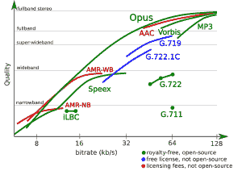

# iOS 11 和 Android 引领了对 Opus Audio Codec 的普遍支持，这是 MP3 迟到的继任者

> 原文：<https://www.xda-developers.com/ios-11-android-support-opus-audio-codec-mp3-successor/>

MP3 发布至今已有 24 年，尽管这些年来各种团体做出了许多努力来取代它(如 Vorbis、AAC、WMA 等)，但还没有人成功，但这种情况可能会改变。与[视频编解码器](https://www.xda-developers.com/av1-future-video-codecs-google-hevc/)不同，人们不再直接寻找免版税的音频编解码器来取代最流行的编解码器(MP3)，因为[今年早些时候](https://www.iis.fraunhofer.de/en/ff/amm/prod/audiocodec/audiocodecs/mp3.html) **MP3 本身随着其剩余专利的到期**正式成为免版税的。但这并不意味着我们已经到了音频编解码器开发的尾声。我们仍然可以从进一步的编解码器改进中受益，特别是在低延迟和低带宽的情况下，这就是 Opus 的用武之地。

 <picture></picture> 

Comparison of Opus 1.0 with other audio formats. Opus has seen substantial further improvements since then. CC-BY opus-codec.org

Opus 是一种免版税的视频编解码器，由 Xiph.Org 基金会在 Broadcom(一家帮助 Xiph.Org 开发 CELT 的半导体公司)和微软(SILK 由其子公司 Skype 开发)的帮助下，基于 CELT 和 SILK 音频编解码器创建。**它在整个比特率范围内提供了显著的延迟和效率改进**，尤其是在 MP3 目前苦苦挣扎的低比特率场景中。Opus 能够以低至 [32 kbps 的音乐比特率和 14 kbps 的语音比特率提供高质量的音频](https://www.xda-developers.com/opus-codec-high-quality-audio-32-kbps/)，这是对低比特率和低延迟场景(如通过蜂窝连接的实时音频)的一个重大进步。

然而，在所有关于 Opus 在低比特率下有多棒的谈论中，经常被忽略的是它在更高比特率下的出色表现(T2)。Opus 达到了这样一个点，即比特率的进一步增加不再导致 192 kbps 左右的可察觉的音频质量改善，这远远低于 MP3 实现相同效果所需的大约 256 kbps，并且 Opus 在整个比特率范围内继续优于 MP3。这当然不能取代提供无损压缩的存档格式，如 FLAC(它也是免版税和自由/开源软件，就像 Opus 和 MP3 一样)，但对于常规音乐收听的日常使用来说非常棒。

Opus 是真正的软件工程的一个奇妙的作品，显然是迄今为止最好的音频编解码器之一，同时是免费的。那么，为什么还没有人使用 Opus 呢？对于一个试图获得广泛采用的新编解码器来说，最大的问题之一就是**设备支持**。每个流媒体服务和音乐商店都可以支持编解码器，但如果人们使用的设备不支持它，*那么一切都没有意义*。Xiph.Org 基金会在开发他们之前的 MP3 竞争对手 Vorbis 时遇到了设备支持的问题。Vorbis(有时也称为 Ogg Vorbis。ogg 文件扩展)是免版税的，并且在大多数情况下比 MP3 有明显的进步，但是它从未达到广泛采用所需的设备支持水平。相反，Vorbis 只是被 Spotify、网飞和 Youtube 等流媒体服务用于特定的用例。

谢天谢地，Opus 终于在所有主流操作系统上获得了支持。随着 macOS 10.13 High Sierra 和 iOS 11 的推出， **Opus 将正式得到各大操作系统和各大网络浏览器的某种形式的支持**(假设苹果不会取消目前存在于其测试版中的支持)。不可否认的是，在某些平台上的支持仍然比其他平台好，但这仍然是 Opus 采用的一个重要里程碑。

随着对 Opus 的广泛设备级支持成为现实，**我们很可能会看到流媒体服务迅速转向 Opus** ，特别是当他们中的许多人将修改他们的堆栈，以带来 [AV1](https://www.xda-developers.com/av1-future-video-codecs-google-hevc/) 支持时，Opus 预计将在未来的 WebM 视频容器中与 Opus 一起使用。Opus 看到最大改进的用例(低比特率流和低延迟应用，如视频聊天)通常由没有用户输入的程序处理，因此用户可能没有意识到这种转变正在发生，但是这些应用奠定的基础将使 Opus 未来能够用于用户可见的用例，如播客和音乐下载。

随着 Opus 的广泛采用，现有的性能，以及它所看到的持续发展，我们可以确信，在未来几年，互联网和我们设备上的音频将继续拥有强大的免版税未来。基于免版税和开源组件的互联网对健康的互联网至关重要，因为这是确保互联网上所有人和所有事物互操作性的唯一途径。使用受专利保护的编解码器和其他软件可能会造成这样的情况:如果网站不创建其页面的多个版本，某些用户将无法访问互联网的这些部分，这给开发者带来了额外的工作，并给用户带来了问题。自由和开源软件(“自由”是指“自由地”随心所欲地使用软件)是我们互联网基础设施的重要组成部分，很高兴看到在音频编解码器方面，这种自由将会持续到未来。