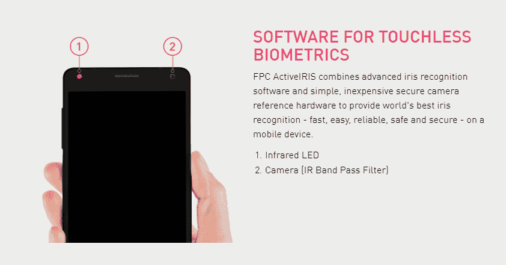

# Android 终于开始支持虹膜扫描仪了

> 原文：<https://www.xda-developers.com/iris-scanners-native-support-android-p/>

生物认证可能没有 pin 或密码安全，但它的便利性是许多消费者的一大卖点。一加旗舰产品上极其快速的指纹扫描仪几乎得到了普遍的好评，但最近公司已经转向面部识别技术作为替代方案。例如， [OnePlus 5T](https://www.xda-developers.com/oneplus-face-unlock-oneplus-5t/) 和 [Honor 7X](https://www.xda-developers.com/honor-7x-update-face-unlock-ar-lens/) 分别采用了面部解锁功能。三星手机也有面部识别功能来解锁设备，但该公司最引以为豪的生物认证技术是虹膜扫描仪。现在，随着官方对虹膜扫描仪的支持被添加到 Android 中，虹膜扫描仪可能会在未来出现在更多的 Android 手机中。

* * *

## 现有 Android 硬件上的虹膜扫描仪

第一款带虹膜扫描仪的主流安卓智能手机是命运多舛的 T2 三星 Galaxy Note 7 T3。这项技术后来被用于[三星 Galaxy S8/S8+](https://www.xda-developers.com/galaxy-s8s-iris-scanner-will-authenticate-mobile-transacations-in-the-near-future-starting-with-south-korea/) 和 [Galaxy Note 8](https://www.xda-developers.com/note-8-real-world-analysis-performance/) 。我们还知道它将与[三星 Galaxy S9/S9+](https://www.xda-developers.com/samsung-galaxy-s9-iris-scanner/) 一起发布，它将在硬件上提供[增量改进，但通过](https://www.xda-developers.com/samsung-galaxy-s9-iris-scanner/)[将其与面部识别](https://www.xda-developers.com/samsung-galaxy-s9-intelligent-scan-face-unlock-iris-scanner/)相结合，整体体验[应该会改善](https://www.xda-developers.com/samsung-galaxy-s9-facial-recognition/)。(还有一种可能性是虹膜扫描仪可能会出现在尚未发布的三星 Galaxy 手机上，但目前还没有确定。)

对于我们这些没有三星 Galaxy 旗舰机的人来说，当谈到带有虹膜扫描仪的智能手机时，没有太多的选择。事实上，实际上只有一个选择，这款手机甚至还没有上市销售:一款名为 [BitVault](https://swissbankinyourpocket.com/bitvault/) 的不起眼的智能手机，面向加密货币爱好者。

BitVault:自称“全球首款区块链手机”。来源:[你口袋里的瑞士银行](https://swissbankinyourpocket.com/product/bitvault/)。

这款智能手机，以及来自日本智能手机 OEM 厂商的一款未公布的智能手机，是我所知道的唯一提供虹膜扫描的非三星 Galaxy 设备。驱动这些手机虹膜扫描仪的芯片是指纹识别的 [FPC 主动虹膜](https://www.fingerprints.com/technology/software/fpc-activeiris/)。

 <picture></picture> 

FPC ActiveIRIS. Iris Recognition for Smartphones. Source: [FPC](https://www.fingerprints.com/solutions/smartphones-tablets/).

你可能从未听说过这家公司，但你很可能使用过集成了他们技术的智能手机。一些使用 FPC 指纹扫描仪的智能手机包括谷歌 Pixel、Honor 8 和华为 Mate 9 Pro。他们的指纹传感器出现在许多其他设备上，包括小米的几款设备，所以可以肯定地说，FPC 是销售智能手机生物认证技术的领先供应商之一。

FPC 指纹扫描仪位于设备的主页按钮、背面和侧面。来源: [FPC](https://www.fingerprints.com/solutions/smartphones-tablets/) 。

那么这家公司为什么重要呢？这是因为他们的几个工程师一直在研究在 Android 中加入对生物虹膜扫描仪的原生支持。这里有几个提交，所有这些都应该放在一起看，以便更好地了解发生了什么。

## Android 未来版本中的虹膜扫描仪

让我们从最重要的提交开始:生物识别虹膜 HAL 接口。

包含一个 HAL 接口将使 Android 框架如何与虹膜扫描仪通信标准化。这意味着来自多家厂商的产品，而不仅仅是 FPC 自己的产品，将能够在 Android 上运行。最重要的是，这也为基于 AOSP 的 rom 提供了与虹膜扫描硬件通用的功能。例如，[项目 Treble GSI](https://www.xda-developers.com/tag/project-treble/)依赖于此，以便基本的指纹扫描仪功能能够开箱即用，因此，没有这一点，新的 [Exynos 三星 Galaxy S9 和 Galaxy S9+](https://www.xda-developers.com/samsung-galaxy-s9-s9-plus-hands-on/) 将无法使用 AOSP ROM 上的虹膜扫描仪。

最终用户对虹膜扫描仪的 SELinux 政策完全不感兴趣，但如果你想看一看，它们就在那里。Android 中包含的基本[虹膜功能](https://android-review.googlesource.com/c/platform/frameworks/native/+/608279)将允许应用程序检测设备是否有虹膜扫描仪。最后，[虹膜框架](https://android-review.googlesource.com/c/platform/frameworks/base/+/608396)的引入将真正允许第三方应用程序在未来利用虹膜扫描仪进行身份验证。以下是相关字符串:

### 框架中的虹膜扫描仪

```

<string name="permlab_manageIris">manage iris hardware</string>

<string name="permdesc_manageIris">Allows the app to invoke methods to add and delete iris templates for use.</string>

<string name="permlab_useIris">use iris hardware</string>

<string name="permdesc_useIris">Allows the app to use iris hardware for authentication</string>

<string name="iris_acquired_insufficient">Couldn\'t process iris. Please try again.</string>

<string name="iris_acquired_too_bright">Iris is too bright. Please try in low light.</string>

<string name="iris_acquired_too_dark">Iris is too dark. Please uncover light source.</string>

<string name="iris_acquired_too_close">Move further.</string>

<string name="iris_acquired_too_far">Move closer.</string>

<string name="iris_acquired_eyes_closed">Open eyes.</string>

<string name="iris_acquired_eyes_partially_obscured">Open eyes wider.</string>

<string-array name="iris_acquired_vendor">
</string-array>

<string name="iris_error_hw_not_available">Iris hardware not available.</string>

<string name="iris_error_no_space">Iris can\'t be stored. Please remove an existing iris.</string>

<string name="iris_error_timeout">Iris time out reached. Try again.</string>

<string name="iris_error_canceled">Iris operation canceled.</string>

<string name="iris_error_lockout">Too many attempts. Try again later.</string>

<string name="iris_error_lockout_permanent">Too many attempts. Iris sensor disabled.</string>

<string name="iris_error_unable_to_process">Try again.</string>

<string name="iris_name_template">Iris <xliff:g example="1">%d</xliff:g></string>

<string-array name="iris_error_vendor">
</string-array>

<string name="iris_icon_content_description">Iris icon</string>

```

在框架的清单中，标题为“android.permission.USE_IRIS”的建议权限具有“正常”的保护级别，因此第三方应用程序确实能够请求权限，并且将由用户授予它。

最后，[另一个提交](https://android-review.googlesource.com/c/platform/frameworks/base/+/608456)在键盘守卫中增加了对虹膜识别的支持。这实际上将允许用户扫描他们的虹膜来解除锁屏。根据承诺，为了降低功耗，只有在屏幕打开时才会进行虹膜认证。此外，如果授权机构(例如工作场所)认为虹膜扫描仪是不安全的认证方法，则可以根据设备策略管理器禁用虹膜扫描仪。

在所有这些提交中，有趣的是，在许多地方，Android 框架中对指纹的引用被泛化为对生物特征的引用。这为 Android 未来潜在的其他生物认证方法做好了准备，尽管还不清楚会是什么。

我不会用其余的实现细节来烦你，所以我将继续讨论这些提交的重要性。这对 Android 来说意味着 Android 的未来版本，可能是 Android P，将包括对虹膜扫描硬件的原生支持。我说“可能”是因为提交还没有被合并——更改非常长，可能需要几周甚至几个月才能通过代码审查。

然而，它很可能会在 Android P 中使用，甚至有迹象表明虹膜扫描仪框架代码已经进行了特定于 P 的更改(例如，不再将用户信息存储在/data/system/users 中，而是将它们重新定位到一个新的/data/vendor 目录中，这可能是未公开的项目 Treble 需求的第二个要求)。

此外，这似乎是对虹膜扫描仪的完全支持，尽管这并不意味着其他供应商不会添加额外的功能(事实上，评论明确提到了这一点)。不过，基本的实现是有的，所以我们应该期待看到未来的智能手机配备生物虹膜扫描仪。不过，在这些提交中没有证据表明谷歌 Pixel 3 会有这样的功能，所以不要因为这些变化就认为任何特定的设备都会有虹膜扫描仪。

注意:我确实联系了 FPC 对这些变化进行评论，但在本文发表时还没有收到他们的回复。