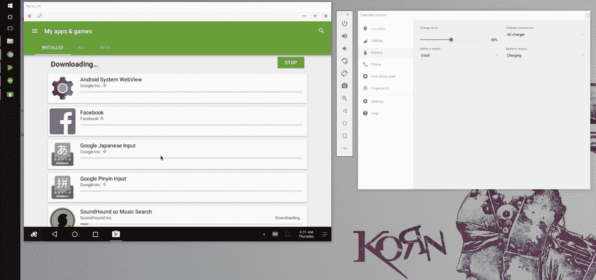

# Jide 推出 Remix OS 播放器-轻量级 Android 模拟器

> 原文：<https://www.xda-developers.com/jide-launch-remix-os-player-light-weight-android-emulator-for-windows/>

Jide 是广受欢迎的 Remix OS 的幕后公司，这是一个多窗口版本的 Android，设计用于 PC 上运行，已经推出了 Remix OS Player for Windows。作为市场上最快和最优化的 Android 模拟器，基于棉花糖的程序将直接在你的 Windows 设备上运行大多数 Android 应用程序。

Remix OS Player 面向那些希望以最简单的方式尝试 Remix OS 并体验在大屏幕 PC 上运行的 Android 游戏和应用程序的人。它扩展了 Remix OS 的体验，让更多人能够体验 Android PCs。对于更专注的游戏玩家，Remix OS 还包括一个按键映射工具，允许使用键盘和鼠标更有效地玩带有触摸控制方案的 Android 游戏。

“Remix OS Player”目前仅适用于 Windows PCs，但 Mac 支持将在未来推出。安装以。并且可以像任何其他程序一样简单地运行。Remix OS Player 基于谷歌自己的 Android Studio。但让它脱颖而出的一个重要原因是，与 Android Studio 和其他模拟器不同，Remix OS Player 旨在让 Android 开发者针对 Android PC/Chrome OS 环境优化他们的应用程序，因为它支持鼠标和多窗口。随着 Chromebooks 现在获得了运行 Android 应用程序的能力，这比以往任何时候都更加重要。

接触阿尔法已经有一段时间了，我最初的印象是复杂的。我最初很喜欢这种体验，也很欣赏这种可能性，因为我通常会通过[弧焊机](https://chrome.google.com/webstore/detail/arc-welder/emfinbmielocnlhgmfkkmkngdoccbadn)运行一些应用程序。虽然工具是广泛的，未来的潜力是显而易见的，但目前有一些事情阻碍了软件的发展。Remix OS Player 确实附带了膨胀软件，并且在应用程序抽屉中有广告，不能删除。Play 商店是预装的，虽然我可以自由浏览商店，但尽管我花了几个小时试图修复错误，但我仍然无法下载任何应用程序。侧面加载应用程序是可能的，我测试的所有应用程序都运行正常，但被非常缓慢的性能和主要的帧跳跃所拖累。我将这些帧跳跃归因于软件的 Alpha 本质，并希望未来的版本可以修复大多数这些问题。

安装 Remix OS Player 非常简单，只需下载在 Jide 网站上找到的文件(下面的链接)，然后打开文件并按照给出的说明操作。如果您之前没有在 Windows PC 上使用过虚拟化，那么您可能需要进入 bios 并启用它。它通常位于“CPU 配置”或“系统配置”下，某些硬件的用户可能会发现虚拟化在他们的机器上是默认启用的，并且 bios 中没有这些选项。一旦程序安装完毕，打开它，加载一会儿后，你会发现 Remix OS 作为一个窗口在你的桌面上运行。

[**Download Remix OS Player**](www.jide.com/remixos-player)**Additional reading**

不要忘了在 xda 参观全新的官方混音操作系统玩家论坛。甚至有 Jide 的工作人员在现场听取反馈，并在需要的地方提供帮助！

[Jide 发布新系列设备并聘请 Android-x86 项目创始人](https://www.xda-developers.com/jide-announced-new-range-of-android-pcs-and-a-tablet/)

[积德](http://www.xda-developers.com/jide-remix-ultra-tablet-multi-window-done-right/) [Remix Ultra 平板点评:多窗口完成正确](http://www.xda-developers.com/jide-remix-ultra-tablet-multi-window-done-right/)，

[Jide Remix Mini 评测——70 美元的安卓桌面体验](http://www.xda-developers.com/remix-mini-by-jide-review-70-of-android-desktop-experience/)，

[Jide 发布适用于 PC 和 Mac 的多窗口 Android，](http://www.xda-developers.com/jide-announce-multi-window-android-for-pc-and-mac/)

[Jide 推出 All in One PC，](http://www.xda-developers.com/jide-launch-remix-os-powered-all-in-one-pc/)

[Jide: Remix 现在兼容 GPL 和 Apache](http://www.xda-developers.com/jide-remix-is-now-gpl-and-apache-compliant/)