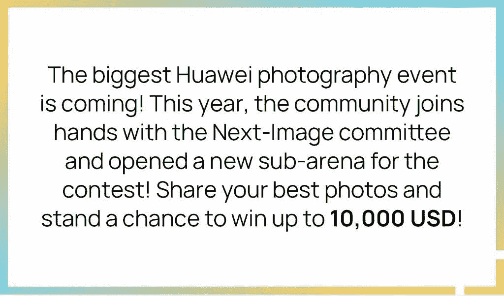

# 加入华为社区的 NEXT-IMAGE 2020！赢取 10K 美元

> 原文：<https://www.xda-developers.com/join-the-next-image-2020-in-huawei-community-win-10k-usd/>

### 

1.  华为社区(包括其本地站点)将成为参与者提交参赛作品的官方平台之一。社区上的投稿和 Next-Image 官网上的一样有效，请避免重复投稿。
2.  参赛作品只能用华为或 Honor 设备捕捉，并且只能用华为或 Honor 手机进行图形编辑(接受在第三方应用程序上编辑)。
3.  **从一个参与者处接受不超过 30 个参赛作品**。如果一名参赛者提交超过 30 件参赛作品，最早的 30 件作品将被视为参赛作品，而其余的作品将不会参加比赛。
4.  社区(全球网站)将选出 20 件参赛作品*3(每个类别 4 件)提交给竞赛委员会进行下一轮评估。一旦您被选中，社区管理员将通过社区的私人消息与您联系。
5.  最终评估将由 2020 年下一届影像奖委员会完成，结果将在 2020 年下一届影像奖官方网站*4 上公布。
6.  20 名全球社区分竞技场冠军将获得专属社区奖品，无论最终评估结果如何。其余的比赛奖品将由委员会发出。7.更多竞赛规则和常见问题，请参考竞赛条款和条件以及本文档末尾的常见问题

## 类别详细信息:

1.  远近:通过使用手机相机的新功能，例如长焦、超广角或微距拍摄镜头，发现新的地方和新的体验。晚安:在弱光下捕捉有趣的瞬间。你好，生活！:分享日常经历中的情感或灵感。面孔:实验身份和你自己、她/他/它或他们的肖像的力量。讲故事者:将 3 到 9 张照片排序来讲述一个故事，表达情感，记录变化，或者寻找一种趋势。
2.  下一届图像竞赛委员会将决定并奖励最终的竞赛获奖者。社区将决定并颁发社区冠军奖。
3.  下一轮 20 名候选人的选拔将由包括管理员和官方设计师在内的社区团队完成，评估将基于参赛作品的美感、创意、社会价值和与竞赛主题的相关性。华为社区 adnub 团队保留冠军评选的解释权。
4.  2020 年 NEXT-IMAGE Awards 官方网站:[gallery.consumer.huawei.com](http://gallery.consumer.huawei.com)

点击此处[访问画廊](https://consumer.huawei.com/en/community/gallery/?forumId=40318)分享您的最佳作品，并查看所有参与者的优秀作品！

提交作品时，请务必仔细阅读提交页面上的[条款和条件以及隐私声明](https://consumer.huawei.com/en/community/details/topicId_90998/)以避免混淆。在比赛期间，如果您有新的问题，您可以查看[常见问题](https://consumer.huawei.com/en/community/details/topicId_90999/)，或者再次阅读[条款&条件](https://consumer.huawei.com/en/community/details/topicId_90998/)进行比赛。

###### 我们感谢华为赞助这篇文章。我们的赞助商帮助我们支付与运行 XDA 相关的许多费用，包括服务器成本、全职开发人员、新闻撰稿人等等。虽然您可能会在门户内容旁边看到赞助内容(这些内容将始终被标记为赞助内容),但门户团队对这些帖子不承担任何责任。赞助内容、广告和 XDA 仓库完全由一个独立的团队管理。XDA 绝不会通过接受金钱来赞扬一家公司，或以任何方式改变我们的观点或看法，从而损害其新闻诚信。我们的意见不能被收买。