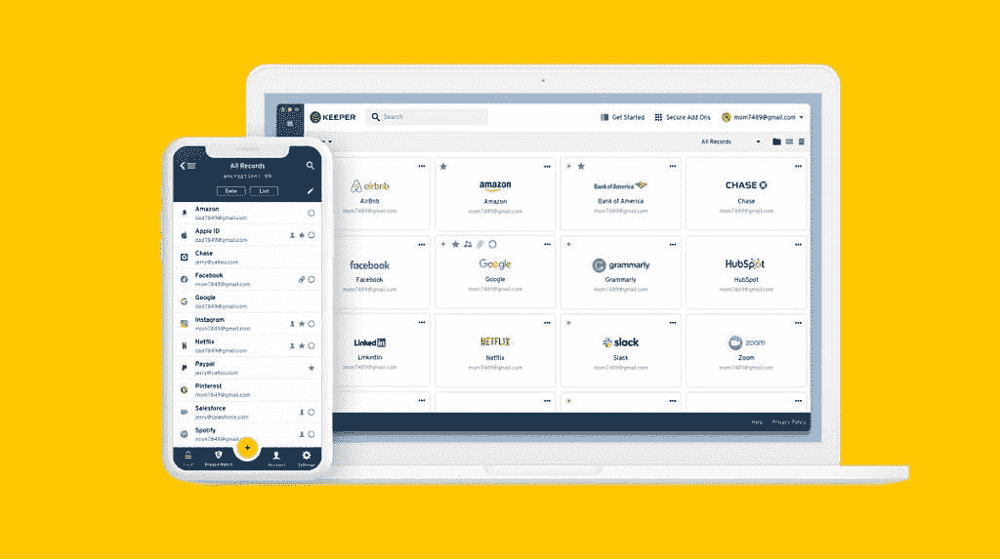
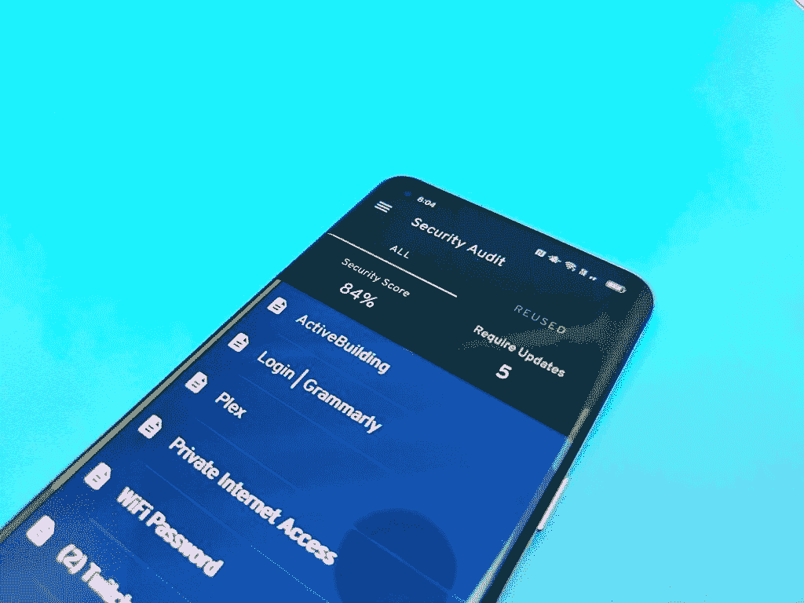
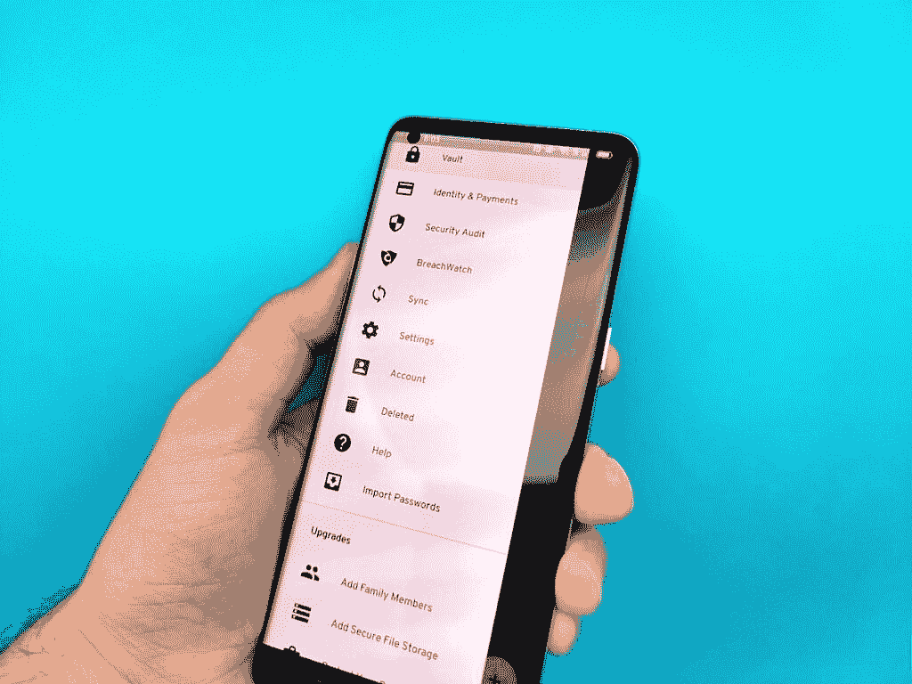

# 使用 Keeper 保护您的密码和文档的安全

> 原文：<https://www.xda-developers.com/keeper/>

如果您花时间浏览过不同的密码管理解决方案，您可能会对市场上所有不同的产品感到不知所措和困惑。他们都声称自己是最棒的，但真的是这样吗？

有一点是肯定的:你绝对应该使用一个密码工具，Keeper 有你需要的解决方案来最终控制你的安全。Keeper 可以轻松管理数十个甚至数百个密码，保护您的敏感文档、笔记、支付来源等。

有了 Keeper，你将不再需要记住所有的密码，所以你可以自由地使用长而复杂的密码来确保额外的帐户安全。你可以使用生物识别技术来保存你所有的密码。与软件可在一个大的选择平台，Keeper 使跟踪您的密码尽可能容易。

 <picture></picture> 

Keeper Security Software

## 密码安全性

注册新账户并跟踪你的登录信息可能是一场噩梦。守护者是你的梦想成真！

一旦你开始设置一个新帐户，Keeper 就会立即行动起来，帮助你生成一个安全的密码，只需点击几下鼠标，就可以为你的 Keeper 应用程序创建一个新的记录。您的新帐户信息将在您所有安装了 Keeper 的设备上同步，因此您将能够使用您的指纹访问您的整个密码数据库。

 <picture></picture> 

Keeper Security Audit

当需要登录一个在线账户时，Keeper 会准确地知道你需要哪些凭证来登录这个网站。如果你在这项服务上有多个账户，它甚至会为你提供多种选择。得益于保管员的身份和支付记录存储，从网站订购物品也更容易了。您可以在您的 Keeper 应用程序中存储信用卡、银行信息、身份证、政府文件或任何类型的敏感信息。

Keeper 提供 20 多种预制记录类型，让创建新记录变得简单。选择您需要输入的记录类型，系统会提供所有适用的数据字段。关键是花更少的时间管理你的密码记录，并使登录你的帐户毫不费力。

## 您的数字保险箱

凭借存储如此多不同类型记录的能力，Keeper 是您的一体化数字保险箱。现在，您可以完全数字化您收集的敏感和重要的文档，如纳税申报表、社会保障卡、护照、车辆名称等。作为附加功能，您可以将 Keeper 用作数字文件的云存储。这让您可以将两个服务压缩成一个，让您的生活稍微轻松一点。

 <picture></picture> 

Keeper Android App

访问你的保管库是很重要的，即使你没有互联网连接。这就是为什么您的文档存储在本地，可以随时访问。不要被困在一个恶劣的天气事件中，或者在没有保险文件的情况下被困在路边。

## 无限记录

也许您只需要记住几个密码，或者也许您希望管理一个包含所有文档的大型数据库。无论哪种方式，Keeper 支持无限的记录与您的服务订阅。输入尽可能多的记录。

我们感谢 Keeper 赞助了这篇文章。我们的赞助商帮助我们支付与运行 XDA 相关的许多费用，包括服务器成本、全职开发人员、新闻撰稿人等等。虽然您可能会在门户内容旁边看到赞助内容(这些内容将始终被标记为赞助内容),但门户团队对这些帖子不承担任何责任。赞助内容、广告和 XDA 仓库完全由一个独立的团队管理。XDA 绝不会通过接受金钱来赞扬一家公司，或以任何方式改变我们的观点或看法，从而损害其新闻诚信。我们的意见不能被收买。