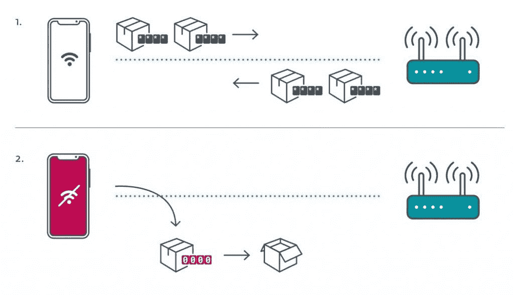

# Kr00K 漏洞影响装有 Broadcom 和 Cypress Wi-Fi 芯片的设备

> 原文：<https://www.xda-developers.com/kr00k-wifi-vulnerability-broadcom-cypress/>

提供反病毒产品的互联网安全公司 ESET 刚刚公开披露了 Broadcom 和 Cypress 制造的 Wi-Fi 芯片中的一个漏洞。ESET 称之为“Kr00K”的漏洞允许对 WPA2 加密的网络流量进行未经授权的解密。根据 ESET 的说法，装有 Broadcom 和 Cypress FullMac Wi-Fi 芯片的设备可能容易受到攻击，这些芯片可以在亚马逊 Echo/Kindle、苹果 iPhone/iPad/MacBook、谷歌 Nexus、三星 Galaxy、小米 Redmi 等产品中找到。此外，即使客户端设备已经打了补丁，如果无线接入点或路由器没有打补丁，攻击者也可以拦截网络流量。

以下是 ESET 确认易受 Kr00k 攻击的客户端设备列表:

*   亚马逊 Echo 第二代
*   亚马逊 Kindle 第八代
*   苹果 iPad mini 2
*   苹果 iPhone 6，6S，8，XR
*   苹果 MacBook Air Retina 13 寸 2018
*   谷歌 Nexus 5
*   谷歌 Nexus 6
*   谷歌 Nexus 6P
*   树莓 Pi 3
*   三星 Galaxy S4 GT-I9505
*   三星 Galaxy S8
*   小米 Redmi 3S

以下是 ESET 确认易受攻击的无线路由器列表:

*   华硕 RT-N12
*   华为 B612S-25d
*   华为 EchoLife HG8245H
*   华为 E5577Cs-321

ESET 还测试了高通、Realtek、雷凌和联发科的 Wi-Fi 芯片，但无法利用这一漏洞。由于市场上有太多的 Wi-Fi 芯片需要测试，ESET 正在与 Wi-Fi 联盟合作开发工具来检测易受攻击的设备，自 2020 年 1 月 16 日以来，他们还与 [ICASI](https://www.icasi.org/our-members/) 成员合作，以确保所有可能受影响的设备制造商都知道 Kr00K。该漏洞已于 2019 年 8 月 17 日分配 [CVE-2019-15126](https://nvd.nist.gov/vuln/detail/CVE-2019-15126) 。

根据 ESET 的说法，这个漏洞涉及 Wi-Fi 层的加密，与传输层安全(TLS)无关。使用 Kr00k 的攻击“降低了你的安全性，比你在开放的 Wi-Fi 网络上的安全性低了一步。”具体来说，该漏洞会导致易受攻击的设备使用全零临时密钥(TK)来加密单播数据帧，这使得攻击者很容易解密易受攻击设备传输的一些网络数据包。该错误发生在客户端设备和接入点之间解除关联之后，即当接入点重新建立与客户端设备的连接时。

这是 ESET 发布的一张图片，展示了未打补丁的客户端和打补丁的客户端与无线接入点通信的区别。

 <picture></picture> 

Kr00K Attack Scheme. Source: ESET.

ESET 只测试了 AES-CCMP 加密的 WPA2 个人和 WPA2 企业协议，但没有测试这个漏洞是否会影响 WPA3。由于 ESET 提到了影响谷歌 Nexus 设备的漏洞，我们就 ESET 的发现联系了谷歌，并得到了以下声明:

> #### “像素设备不受此漏洞的影响。Broadcom 直接向受影响的 Android 设备制造商通知了漏洞和补丁。”-谷歌发言人

此时，没有简单的方法来检查您的设备或无线接入点是否容易受到 Kr00K 的攻击。要找出它们是易受攻击还是已经被修复，你需要联系制造商。ESET 估计，超过 10 亿的 Wi-Fi 功能的设备和接入点可能容易受到这种利用，但主要制造商的设备补丁已经发布。根据 ESET 的披露时间表，自 2019 年第四季度以来，补丁一直在推出。定制 ROM 开发者将需要等待 OEM 厂商发布更新的 Wi-Fi 二进制文件；不幸的是，没有 OEM 的积极支持，旧设备将很难或不可能修复。更多关于 Kr00K 的信息，[请访问 ESET 的专用网页](https://www.eset.com/int/kr00k/)。