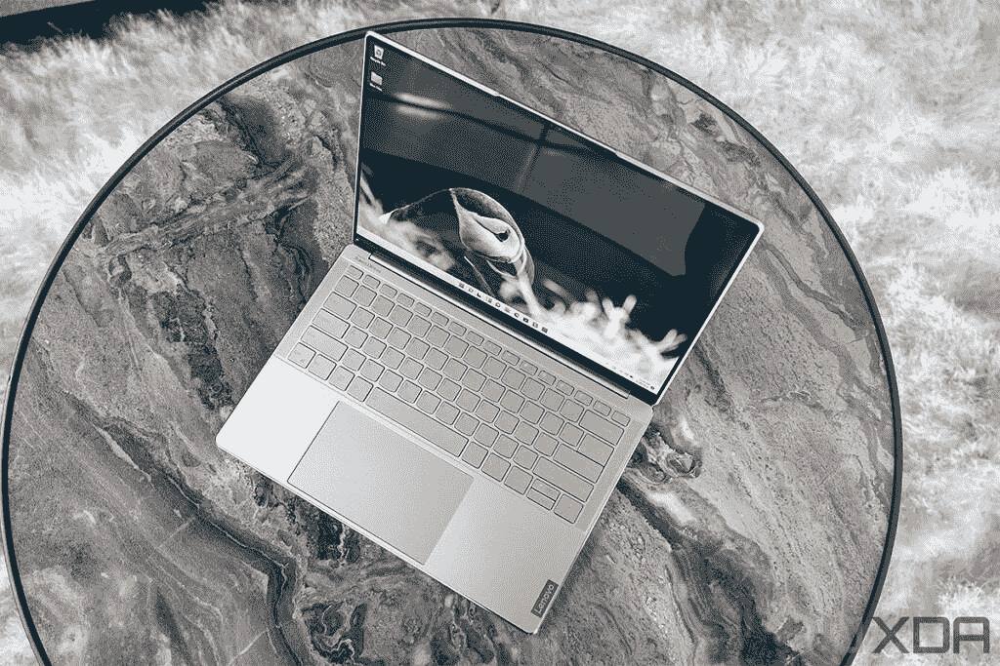
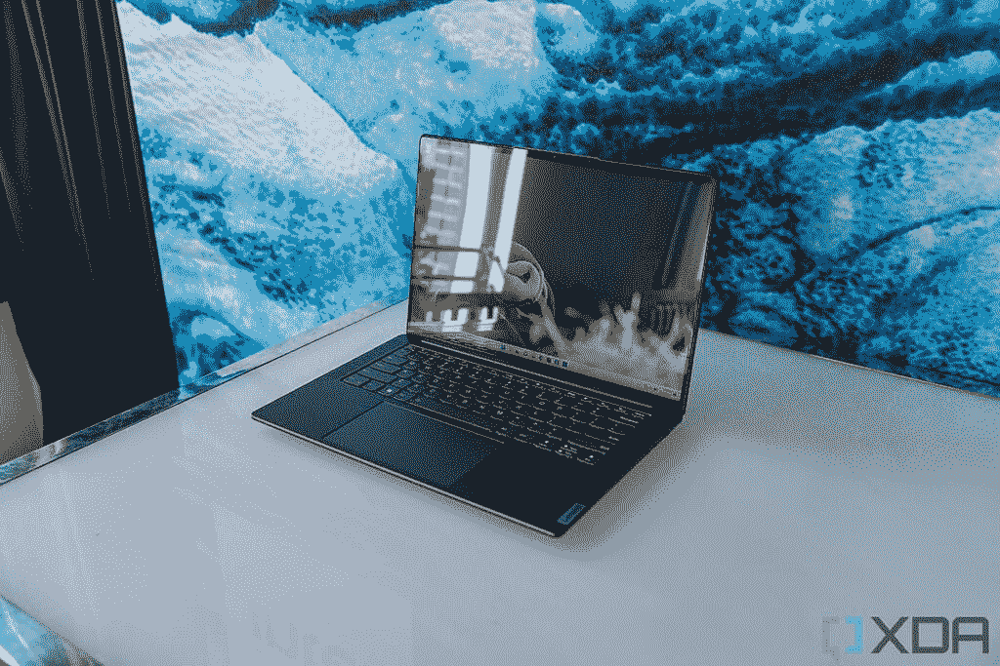
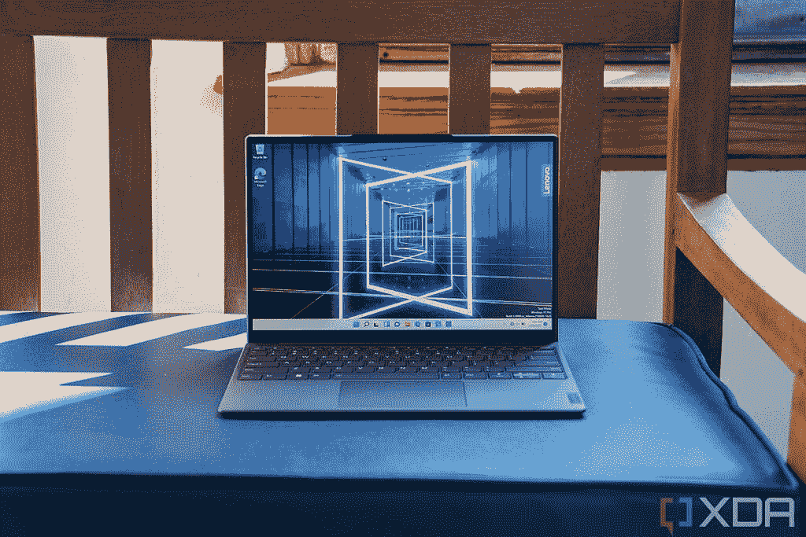
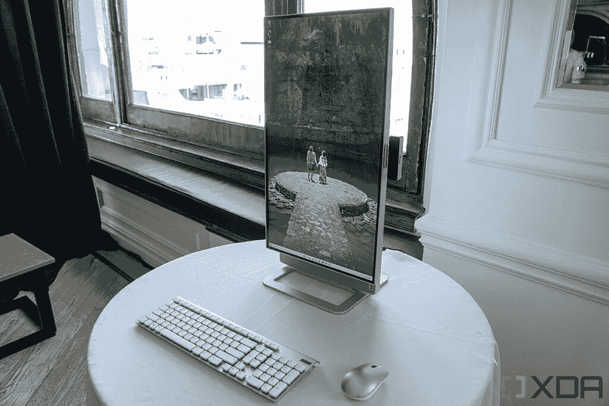

# 联想推出采用漂亮新设计的新款超薄笔记本电脑

> 原文：<https://www.xda-developers.com/lenovo-new-slim-laptops-beautiful-new-designs/>

今年早些时候在 CES 上，联想推出了 2022 Yoga 敞篷车。现在，是时候推出高级翻盖系列了，在美国将被称为 Slim，而在其他地方仍被称为 Yoga Slim。基本上，联想正在放弃 IdeaPad 品牌。具体来说，有四台笔记本电脑和一台一体机，包括联想 Slim 9i、Slim 7i/7 Pro X、Slim 7i Carbon、Slim 7/7i 和 Yoga AIO 7。

“混合生活是激发新一代联想超薄设备发展的新标准。我们的目标是让更多的人能够‘做你自己’——按照自己的方式消费、创造和协作，”联想副总裁兼智能设备集团消费者业务部门总经理欧阳军表示。“我们设计和制造的新电脑具有更智能的功能和更优质的用户体验，以帮助人们实现自己的抱负、放松并以自己的方式完成工作。”

## 联想超薄 9i

首先，整个阵容都在重新设计。他们使用联想新的舒适边缘设计，边缘呈圆形。在超薄 9i 上，边缘具有我们已经在联想 Yoga 9i 上看到的相同镜面。事实上，虽然高端翻盖式和折叠式笔记本电脑在过去有不同的设计，但现在它们更加相似了。

盖子由玻璃制成，看起来很光滑，正如你从上面的图片中看到的，你会在美国看到常规的联想品牌，或在美国以外的 Yoga 品牌。它的颜色被称为燕麦片，是一种淡金色。

 <picture></picture> 

Lenovo Slim 9i

对于显示屏，有机发光二极管是标准配置，您可以选择 90 赫兹时的 2，880x1，800 或 60 赫兹时的 3，840x2，400。它还拥有你期望的所有其他功能，例如英特尔的 28W P 系列处理器，1080p 网络摄像头，最低 16GB 内存和 512GB 固态硬盘，以及三个完整的 Thunderbolt 4 端口。它甚至还有一个 75 瓦时的大电池，重量仍为 3.02 磅。音频也越来越高，我们已经在带有旋转条形音箱的敞篷版上看到了这一点。现在，蛤壳式超薄 9i 将有两个 2W 扬声器和两个 3W 扬声器，用于由 Bowers 和 Wilkins 调谐的强大音频。

它还包括联想人工智能核心 2.0，可以调整风扇速度以获得更好的性能。联想 Slim 9i 将于 6 月上市，起价 1799 美元。

## 联想超薄 7i Pro X

接下来是联想 Slim 7i Pro X，该公司表示，它使用联想 X Power，这是一系列功能，包括更好的散热，以及针对不同的使用情况优化 CPU 和 GPU。

 <picture></picture> 

Lenovo Slim 7i Pro

它也有强大的内部功能，就像你期待的 Pro X 一样。你可以在联想 Slim 7i Pro X 中使用英特尔的第 12 代处理器，或在 7 Pro X 中使用 AMD 的锐龙 6000 HS Creator Edition 芯片。在图形方面，它配备了高达 NVIDIA GeForce RTX 3050。

值得注意的是，它配备了 14 英寸 3，072x1，920 显示屏，刷新率为 120Hz。其他值得注意的规格包括两个 2W·哈曼扬声器和杜比 Atmos，英特尔型号的 LPDDR5 内存为 6,000MHz，AMD 型号为 6400 MHz，以及 1080p 网络摄像头。

将于 6 月上市的 Slim 7i Pro X 的起价为 1699 美元，而 Slim 7 Pro X 的起价为 1499 美元。

## 联想超薄 7i 碳纤维、超薄 7 和超薄 7i

另一个很酷的产品是超薄的 7i Carbon，重量仅为 2.13 磅，同时仍然封装了英特尔的 28W P 系列处理器。它最薄处的厚度为 14.8 毫米，有月亮白、云灰和风暴灰等颜色。显示器方面，你会得到一个 13.3 英寸的屏幕，分辨率为 2，560x1，600，刷新率为 90Hz。

 <picture></picture> 

Lenovo Slim 7i Carbon

然后我们还有联想 Slim 7 和 7i 系列的其余产品。它们有 14 英寸和 16 英寸两种尺寸，封装了英特尔 P 系列、H 系列和 AMD HS Creator Edition 芯片。14 英寸型号的显卡最高可达 GeForce RTX 2050，16 英寸版本的显卡最高可达英特尔 Arc A370M，超薄 7 最高可达 RTX 3050 Ti。

显示选项看起来很可爱。在 14 英寸机型上，它可以达到 2880 x 1800 有机发光二极管和 90Hz 刷新率，或者 2,880x1,800 IPS 和 120Hz 刷新率。或者，在 16 英寸的型号上，它具有 2,560x1,600 的分辨率，以及 120Hz 或 165Hz 的刷新率，这取决于你是使用英特尔还是 AMD 的型号。

联想 Slim 7i Carbon 将于 6 月上市，起价 1299 美元。16 英寸的 Slim 7 也将于 6 月上市，起价为 1，499 美元，但不幸的是，14 英寸的 Slim 7 不会在美国上市。基于英特尔的 14 英寸 Slim 7i 将于 5 月上市，起价为 1，199 美元，而 16 英寸的英特尔变种将于 6 月上市，起价为 1，599 美元。

## 联想 Yoga AIO 7

最后，我们有联想 Yoga AIO 7，顾名思义，这是一款多功能一体的电脑。

 <picture></picture> 

Lenovo Yoga AIO 7

它配有一个 27 英寸的 4K 显示屏，正如你从图片中看到的，你可以将显示屏旋转 90 度。此外，你在那边看到的网络摄像头可以取下。

它配备了 AMD 锐龙 6000 处理器，镭龙 RX 6600M 显卡，双 5W JBL 扬声器。不幸的是，联想 Yoga AIO 7 不会在美国上市。