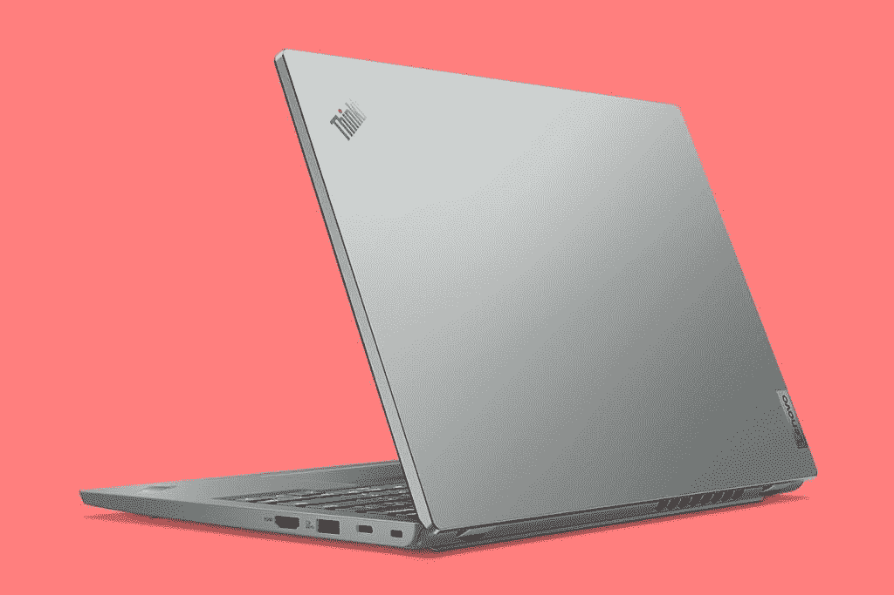

# 联想发布新的 ThinkPad X 系列和 L 系列笔记本电脑

> 原文：<https://www.xda-developers.com/lenovo-new-thinkpad-x-l-series-laptops/>

联想的 ThinkPad 季到了。它在 CES 上宣布了更新的 ThinkPad X1 系列，以及新的 T2 ThinkPad Z 系列。在世界移动通信大会上，该公司宣布了其第一款基于 ARM 的 ThinkPad X13s，以及其最畅销的 ThinkPad T 系列的更新。现在，是时候更新 Len0vo ThinkPad X 系列和 L 系列了。

具体来说，正在公布的新型号是新的 ThinkPad X13、X13 Yoga、L13、L13 Yoga、L14 和 L15。像往常一样，X 系列都是为了轻薄，而 L 系列则更加经济实惠。

 <picture></picture> 

Lenovo ThinkPad L13 in Storm Grey

首先，它们都配备了英特尔的第 12 代博锐处理器，并且大多数*处理器，具体来说，除了 ThinkPad X13 Yoga 之外的所有处理器，也都有 AMD 锐龙版本。有趣的是，ThinkPad X13 配有锐龙 PRO 6000，而 L 系列仅配有锐龙 PRO 5000。*

新功能的一个关键主题是协作。这些新的笔记本电脑配备了杜比语音，它使用空间音频，可以分离语音。底线是你会在会议中听起来更好。由于可选的 FHD 网络摄像头，您也会看起来更好。如果你的视频在无线网络上不流畅，也有好消息。所有这些笔记本电脑都有可选的 4G LTE，虽然这在 ThinkPads 中很常见，但这是 L 系列首次提供蜂窝功能。

联想吹嘘的一些功能是该机型特有的。新的 X13 和 X13 Yoga 配有杜比音频扬声器和杜比视觉显示器。此外，英特尔型号通过了 Evo 认证。X13 配备了高达 54.7 瓦时的电池，承诺比基本型号多 40%的电量。

ThinkPad L13 和 L13 Yoga 现在有两种颜色，分别是雷霆黑和风暴灰。它们还配备了 16:10 显示屏，包括采用联想 PrivacyGuard 技术的 500 尼特选项。这可以防止人们越过你的肩膀看你屏幕上的内容。

对于更大的 ThinkPad L14 和 L15，它们有雷黑色，联想承诺更大的屏幕与机身比例。它们配有 42 瓦时、57 瓦时和 63 瓦时电池选项。

现在，对于价格和可用性。ThinkPad X13 Gen 3 将于 6 月上市，英特尔和 AMD 型号的起价分别为 1，179 美元和 1，119 美元，而 ThinkPad X13 Yoga Gen 3 的起价为 1，179 美元。

ThinkPad L13 系列将于 5 月上市，英特尔和 AMD 型号的 L13 起价分别为 859 美元和 799 美元，L13 Yoga 起价为 1039 美元和 979 美元。L14 和 L15 将于 4 月上市，如果你想要 AMD 的话，这两款的起价都是 869 美元。对于英特尔型号，它们将于 5 月上市，起价为 929 美元。