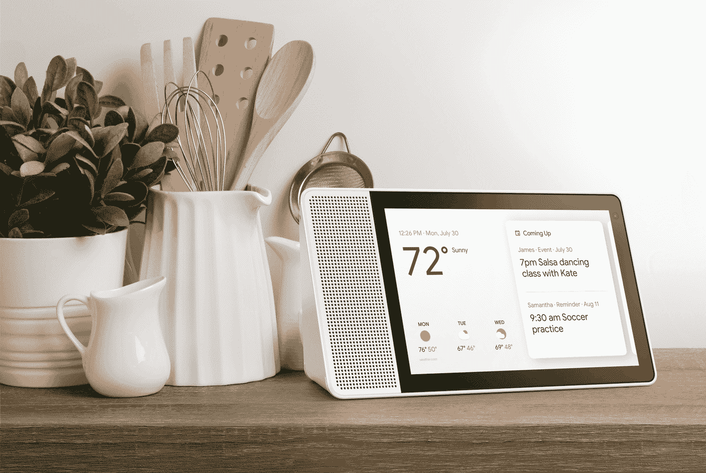

# 配备谷歌助手的联想智能显示屏现已上市，起价 199 美元

> 原文：<https://www.xda-developers.com/lenovo-smart-display-google-assistant-now-available/>

谷歌助手此前只能通过谷歌 Home 设备上的语音功能使用。你给它基于语音的问题，它大声背诵答案。Google Home 是 Google Assistant 的一个实现，它允许你在家里的任何地方问 it 问题——不需要绑定到你的智能手机。这是相对成功的，类似的设备建立在这个概念上。亚马逊 Echo Show 是 Echo Dot 的扩展，只是它也有一个屏幕来显示信息。现在，谷歌正在提供类似的联想智能显示屏，由谷歌助手驱动，起价 199 美元。

联想智能显示器是同类产品中的第一款，允许您在一个设备中访问地图、YouTube、日历、Duo 和照片。它几乎所有的功能都使用触摸手势和语音命令。它能做的事情很多。你可以从许多不同的支持服务上流式播放 YouTube 和音乐，包括 YouTube Music、Google Play Music、Spotify 和 Pandora。对所有这些服务也有免费层支持。你甚至可以通过购买获得三个月的免费 YouTube Premium。

它的能力不仅仅在于音频。你可以观看 YouTube 电视，HBO Now，Google Play 电影和电视，并从一开始就快速播放。然而，还没有网飞支持的消息。你通常能在 YouTube 上看到的所有内容也将可用。如果你不喜欢音乐和电视，你甚至可以利用谷歌播客或 T2 谷歌图书。如果你根本不是在寻找娱乐，你可以简单地用它来看新闻和做个人计划。你会得到和谷歌主页一样的提醒——它也有一个虚拟界面。它可以控制你的智能家居，循环浏览照片，等等。它实际上是一个放在书桌或桌子上的安卓平板电脑，预装了你想要的所有谷歌服务。

联想智能显示屏将于本周末在美国主要零售和在线商店上市。有 8 英寸版本 199.99 美元，10 英寸版本 249.99 美元。我们还没有关于国际可用性的消息。

* * *

[**来源:谷歌博客**](https://www.blog.google/products/assistant/first-smart-displays-google-assistant-are-now-available-stores/)