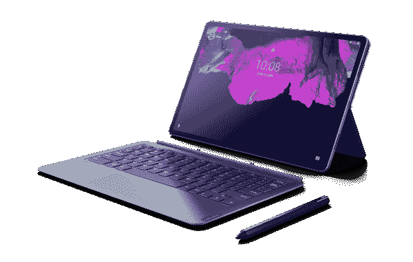

# 联想 Tab P11 Pro，Tab M10 HD Gen 2 系列安卓平板宣布上市

> 原文：<https://www.xda-developers.com/lenovo-tab-p11-pro-lenovo-tab-m10-hd-android-tablets/>

取决于你问谁，你可能会听到 Android 平板电脑已经死了。它们并没有完全消亡，但是 Windows 驱动的替代品和 iPads 总体来说是客观上更好的产品。安卓系统有好有坏，但不如以前在平板电脑上那么好了。但这并不能阻止原始设备制造商试图制造它们。三星是为数不多的通过其 [Galaxy Tab 阵容](https://www.xda-developers.com/samsung-galaxy-tab-s7/)深度投资平板电脑生态系统的制造商之一。现在，[联想推出了自己的两款新安卓平板电脑:联想平板 P11 Pro 和第二代联想平板 M10 HD。它们是完全不同的设备。](https://news.lenovo.com/pressroom/press-releases/lenovo-makes-learning-and-entertaining-at-home-easier-than-ever/)

 <picture></picture> 

Lenovo Tab P11 Pro

联想平板 P11 Pro 是这两款设备中最强大的设备，它被吹捧为高级选项。它由高通骁龙 730G 驱动，虽然不是最高端的中端处理器，但足以处理大多数游戏和应用程序，以及日常使用。有一个 11.5 英寸 2560x1600 分辨率，HDR10/Dolby Vision 认证的 OLED 面板，以实现惊人的媒体消费能力，四个带有 Dolby Atmos 调谐的 JBL 扬声器，一个可选的键盘附件，带有一个通过 4 点 pogo-pin 连接器连接的触控板，并支持联想 Precision Pen 2，以在旅途中完成工作。这款平板电脑相当薄，厚度为 5.8 毫米，重量为 485 克。它运行 Android 10，具有 4/6GB 的内存，128GB 的内部存储，8，600mAh 的电池，双 13 MP 主+ 5 MP 广角后置摄像头阵列，双 8MP + 8MP 前置摄像头阵列，ToF 传感器，以及可选的 LTE 支持国际 SKU。

另一方面，联想平板电脑 M10 HD 第二代系列由普通平板电脑 M10 HD、带谷歌助手的平板电脑 M10 HD 和带亚马逊 Alexa 的平板电脑 M10 HD 组成，是一款更加温和的平板电脑。不仅是规格方面，也是面向大众的。它们由联发科 Helio P22T 驱动，比 Tab P11 Pro 中的高通骁龙 730G 弱得多。它们拥有分辨率为 1280x800 的 10.1 英寸 IPS 液晶显示器、2/4GB 内存、可通过 microSD 卡插槽扩展的 32/64GB 内部存储、5,000mAh 电池、800 万像素后置摄像头、500 万像素前置摄像头，开箱即可运行 Android 10，并支持可选的 LTE 国际 SKU。

这三款平板电脑的硬件不同之处在于音频和麦克风；普通的 Tab M10 HD 具有双麦克风和双扬声器，带有谷歌助手的 Tab M10 HD 具有单麦克风和低功率 DSP 和双扬声器，带有亚马逊 Alexa 的 Tab M10 HD 具有双麦克风和扬声器，但支持带有双 3W 扬声器和 3 个远场麦克风的智能基座。

显然，这些设备不是为了满足发烧友的需求，而是为了满足孩子和家庭的需求。事实上，联想与谷歌合作推出了一个名为[儿童空间](https://www.blog.google/technology/families/kids-space)的新模式，其中包括为儿童策划的应用程序、书籍和视频。

联想平板电脑 P11 Pro 的起价为€699 英镑，包括增值税，这肯定比我们预计的这种规格的设备要贵一些。然而，另一方面，联想平板电脑 M10 HD 的起价要低得多，为€159 英镑(含增值税)。配备谷歌助手的 Tab M10 HD 起价为€179 英镑(含增值税)，而配备亚马逊 Alexa 的 Tab M10 HD 起价为€199 英镑(含增值税)。普通 Tab M10 HD 预计从 2020 年 9 月开始上市，带谷歌助手的 Tab M10 HD 预计从 2020 年 10 月开始上市，带亚马逊 Alexa 的 Tab P11 Pro 和 Tab M10 HD 预计从 2020 年 11 月开始上市，