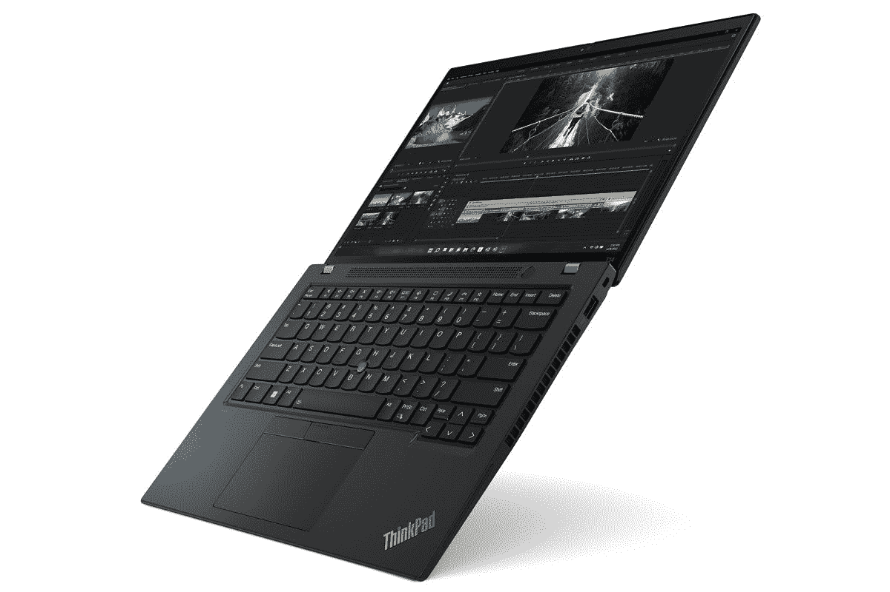

# 联想 ThinkPad T14 Gen 3 的网络摄像头好吗？

> 原文：<https://www.xda-developers.com/lenovo-thinkpad-t14-gen-3-webcam/>

联想 ThinkPad T14 Gen 3 笔记本电脑是 2022 年上市的最新主流商务笔记本电脑之一。这款特别的笔记本比前一代机型有很多改进，它将成为 T2 最好的 ThinkPad 笔记本之一。新的 ThinkPad T14 Gen 3 配备了英特尔或 AMD 处理器，16:10 宽高比面板等选择。但是网络摄像头呢？联想 ThinkPad T14 Gen 3 有足够好的网络摄像头来进行在线会议和视频通话吗？简单的回答是肯定的。

## 联想 ThinkPad T14 网络摄像头

联想 ThinkPad T14 Gen 3 笔记本可以配置高达 1080p 的全高清摄像头，并支持红外。这使得它比其他笔记本电脑更好，比如说，最大 720p 高清摄像头。这是新款 ThinkPad T14 相对于只有 720p 摄像头的上一代机型的改进之一。

值得指出的是，720p 依然是今年的基础配置。不过，如果你想在视频通话和会议中看起来更清晰，你可以升级到全高清(1080p)。如果你经常参加会议和视频电话，我们强烈建议你升级到 1080p 摄像头。我们无法评论网络摄像头的质量，因为我们还没有机会使用笔记本电脑，但由于分辨率更高，视频在技术上应该看起来更好，更清晰。

值得注意的是，1080p 网络摄像头还包括一个支持 Windows Hello 的红外摄像头。与去年不同，如果你选择 720p 网络摄像头，这不是一个选项，所以请记住这一点。如果你想要 Windows Hello，你必须要有 1080p 的摄像头。您可以在电源按钮中嵌入指纹扫描仪，但我们认为使用 Windows Hello 的红外摄像头登录您的笔记本电脑更方便。

高质量的内置网络摄像头只是联想 ThinkPad T14 Gen 3 笔记本电脑成为最佳笔记本电脑之一的众多原因之一。正如我们提到的，这款笔记本电脑配备了英特尔和 AMD 处理器选项、16:10 高面板、丰富的端口选择等等。联想 ThinkPad T14 Gen 3 的起价为 1299 美元，现在就可以购买，所以一定要去看看。

 <picture></picture> 

Lenovo ThinkPad T14 Gen 3

##### 联想 ThinkPad T14 Gen 3

联想 ThinkPad T14 Gen 3 正在成为目前市场上最好的主流商务笔记本电脑之一。