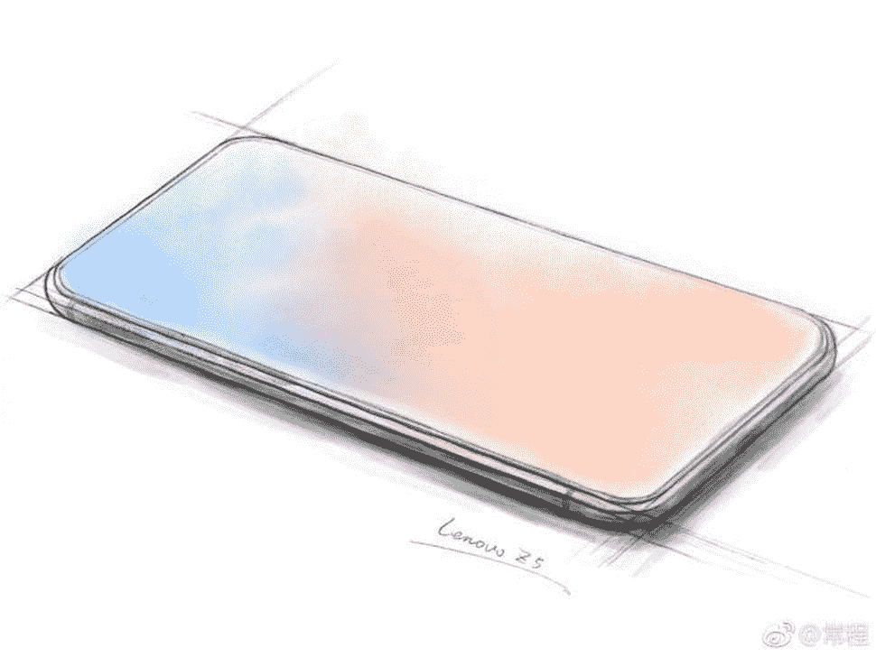
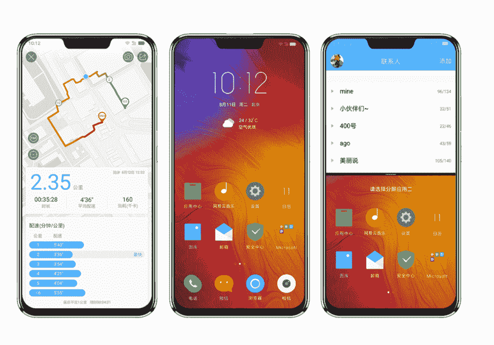

# 真正的“全面屏”联想 Z5 仍然有一个显示缺口

> 原文：<https://www.xda-developers.com/lenovo-z5-official-display-notch/>

# 真正的“全面屏”联想 Z5 仍然有一个显示缺口

在最初调侃联想 Z5 是第一款真正的“全面屏”手机后，现在它的官方显示令人失望。

因此，很明显，现在智能手机市场的新趋势之一是向超薄边框的转变。智能手机的设计允许边框变得如此之薄，以至于许多公司都选择在设备顶部设置所谓的“凹口”。这一设计在社区内引起了相当大的分歧。有些人对此没有意见，但其他人更喜欢像 Pixel 2 XL 这样不需要凹槽的超薄边框。最近，联想副总裁分享了一张新联想 Z5 的[草图，图中没有凹口](https://www.xda-developers.com/lenovo-z5-all-screen-phone-sketch/)。然而，现在这款手机已经被披露，这似乎只是一个谎言。

 <picture></picture> 

Teaser sketch

当我们报道上个月开始在互联网上流传的设计草图时，我特别提到现在设计这样的智能手机有多困难。这当然不是不可能的，因为他们可以为 Mi Mix 系列选择[压电扬声器。他们可以选择不包括前置摄像头，然后我们只剩下环境和接近传感器。实际上，只要我们愿意做出一些牺牲，就有可能得到一部没有凹槽的全屏智能手机。](https://www.xda-developers.com/xiaomi-mi-mix-2-price-cut-india-rs-32999/)

 <picture></picture> 

Final product

看起来联想已经选择放弃这条路线，这确实是有道理的。联想 Z5 是该公司的新智能手机，如果它忽略了其中的一些功能，将很难与市场上的其他产品竞争。尽管如此，这并不能原谅联想副总裁常程，他戏弄了一款没有刻痕的智能手机，他必须知道它会在那里。除了他分享的这张草图，还有另一张图片是 Z5 的渲染图，其中也没有凹口。

如果我们愿意，我们可以将其归因于“营销策略”，但现在我们知道，联想目前无法创造一款全屏幕智能手机。就实际规格而言，Z5 拥有 6.2 英寸 19:9 1080p 显示屏，未指定的 8 核高通处理器，6GB 内存，64/128GB 存储，双 1600 万像素摄像头和 3300 毫安时电池。它将于本月晚些时候在中国上市，起价 1299 元。

* * *

[**来源:联想**](https://activity.lenovo.com.cn/activity/moto/introduce/lenovoz5/html/overview/index.html)