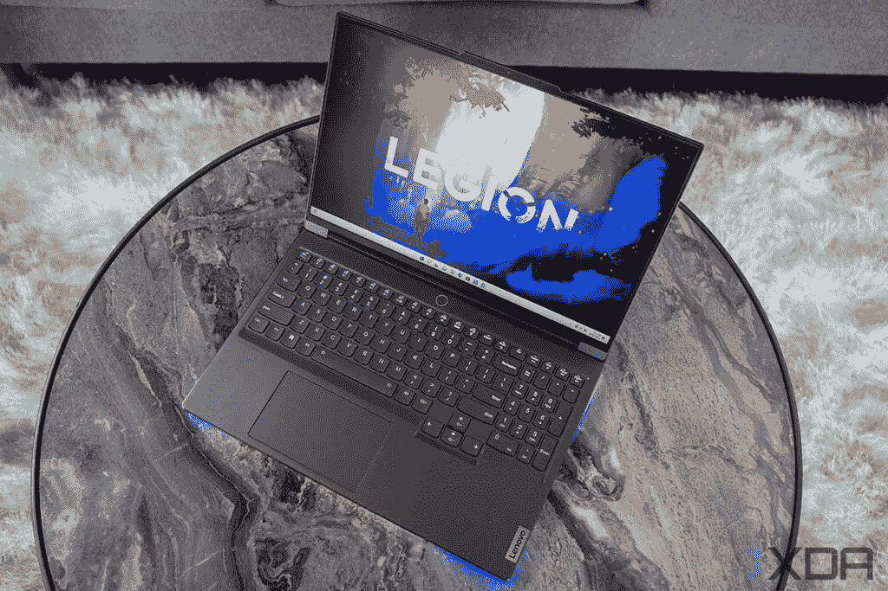
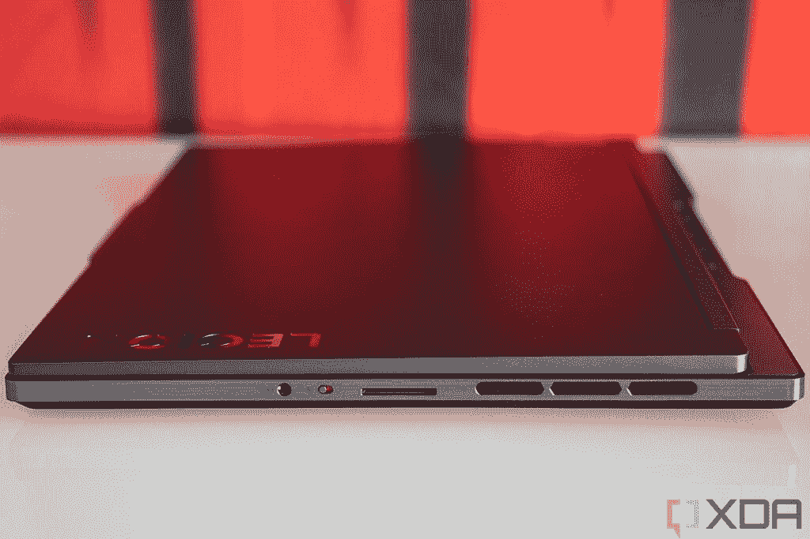

# 联想的新游戏笔记本电脑功能更强，电池也更大

> 原文：<https://www.xda-developers.com/lenovos-new-gaming-laptops-are-more-powerful-and-have-massive-batteries/>

今天，联想宣布推出一对新的 16 英寸游戏笔记本电脑，Legion 7/7i 和 Legion Slim 7/7i。它们都配备了 AMD 锐龙 6000 处理器，其中“I”型采用了英特尔第 12 代芯片。

## 联想称之为性能的顶峰

联想承诺 Legion 7 系列和 Legion Slim 7 系列的性能最佳，但前者将获得英特尔新的 HX 系列处理器。这些是该公司第一批具有 55W TDP 的移动处理器，因此 Legion 7i 最高可配有酷睿 i9-12900HX，而 Legion 7 最高可配有锐龙 9 6900HX。对于苗条的人来说，这是一个核心 i9-12900HK 或锐龙 9 6900HX。

 <picture></picture> 

Lenovo Legion 7i

但这并不是联想提升业绩的全部。它继续重新设计热量，通过键盘上方的格栅(实际上看起来像扬声器格栅)和键盘本身吸入空气。空气从角落的通风口排出。联想还表示，在 29%的大风扇上，液晶聚合物叶片增加了 31%，转速提高了 100 转。也有一个新的热管只为 GPU。

说到角落里的那些通风口，那些都是用军团 7/7i 上的 RGB 灯光照亮的，那个型号也沿着前面得到了一个 RGB 条。苗条的模特没有得到这些。

## 它们又薄又轻，配有大电池

说到纤薄，这些笔记本电脑应该是移动的。军团 7/7i 的厚度为 19 毫米，底盘为 5.5 磅，非常轻。对于纤薄的 7/7i 来说，它的厚度仅为 16 毫米，重量为 4.4 磅。

 <picture></picture> 

Lenovo Legion Slim 7i

然后还有一个很大的旧电池。军团 7/7i 配有 99.99 瓦时的电池，而超薄 7/7i 有 99.99 瓦时的电池作为基本型号中 71 瓦时电池的选项。这是笔记本电池最大的尺寸，原因是如果电池再大，你就不能带上飞机了。

## 屏幕具有可变的刷新率

我们最终在 Windows 市场上看到的一个东西是可变刷新率显示器。这意味着 PC 可以在需要时提高屏幕的刷新率，然后在可能的情况下降低刷新率以节省电能。

这是联想新推出的 Legion 7//7i 和 Legion Slim 7/7i 笔记本电脑的一个选项。虽然基本型号的分辨率为 1，920x1，200，刷新率为 165Hz，但其余 SKU 的分辨率为 2，560x1，600。许多配置是 165 赫兹，但你可以得到高达 240 赫兹的 VRR。

至于定价和可用性，Legion 7i 和 Legion Slim 7i 都将于 5 月上市，起价分别为 2449 美元和 1589 美元。Legion 7 和 Legion Slim 7 将于 6 月上市，起价分别为 2059 美元和 1519 美元。