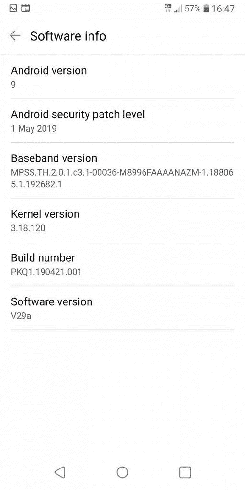

# LG G6 (H870)获得了早期泄露的 Android Pie 测试版

> 原文：<https://www.xda-developers.com/lg-g6-android-pie-beta-leak/>

**更新(美国东部时间 10/14/19 @ 12:05PM):**LG G6 的新测试版 Android Pie 已经泄露。

与竞争对手相比，韩国智能手机品牌 LG 在提供主要 Android 系统升级方面的速度令人失望。2017 年初推出的 LG G6 搭载了安卓 7.0 牛轧糖，虽然它收到了安卓 8.0 奥利奥的更新，但还没有收到安卓 9 馅饼。根据 LG 的 [Android Pie 更新路线图](https://www.xda-developers.com/lg-v30-v35-v40-android-pie-q2-2019-kernel-sources/)，G6 预计将在第三季度获得更新，这意味着在接下来的 3 个月内。现在，我们了解到 Telegram 用户@backryun 发现了 LG G6 即将推出的 Android 9 Pie build，该版本被用户@Pascal 验证为 H870 欧洲型号的测试版。然后，/r/ [上的 Redditor 发布了 LGG6](https://www.reddit.com/r/lgg6/comments/cbhvy4/testing_out_pie_on_h870_v29a/) 的版本，分享了截图和展示更新的视频。

**[LG G6 XDA 论坛](https://forum.xda-developers.com/lg-g6)**

内部版本号为 PKQ1.190421.001，附带[2019 年 5 月 1 日安全补丁级别](https://www.xda-developers.com/may-2019-google-android-security-updates/)。Reddit 上的帖子作者表示，构建非常稳定，没有明显的崩溃或错误。这个版本带有所有 Android 9 的花哨功能，比如双按钮手势导航。还有一个改进的屏幕记录器和双应用程序功能。

 <picture></picture> 

Credits: Redditor /u/Rifum

如果你想在你的欧洲 LG G6 上试用这个早期的 Android Pie 测试版，有几个方法。首先，确认你有 H870 型号，并且你使用了最新的基于 Android Oreo 的更新。如果你有一个解锁的引导程序，你可以下载 [OTA 文件](https://drive.google.com/file/d/13VxJ3kHE8hTrtFhCp1KSMGPItFkx6v-5/view)并通过 TWRP 简单地刷新它。如果没有，你可以使用 LGUP 来侧装 [UP 文件](https://drive.google.com/file/d/1mh5hVDqvztvslA8k22YYFEFF1v96MSh1/view)。你可以[跟随这个指南](https://forum.xda-developers.com/lg-g6/how-to/lg-g6-unbrick-method-t3935924)了解更多。

*欧洲 LG G6 上的安卓派。截图作者 Redditor /u/ [Rifum](https://www.reddit.com/user/Rifum) 。完整专辑可以在这里找到[。](https://imgur.com/a/ZUKAoVb)*

稳定版的确切发布日期目前还不得而知。尽管如此，看起来更新已经准备好了，因为构建看起来已经相当稳定了。到目前为止， [LG G7 ThinQ](https://www.xda-developers.com/lg-g7-android-pie-us-europe/) 、 [LG G7 One](https://www.xda-developers.com/lg-g7-one-android-pie-update/) 、 [LG V40 ThinQ](https://www.xda-developers.com/verizon-lg-v40-android-pie/) 已经收到了 LG 的 Pie 更新。

*red ditor/u/Rifum 拍摄的 LG G6 上的 Pie 的视频概述。*

**Via:[PiunikaWeb](https://piunikaweb.com/2019/07/11/lg-g6-android-pie-9-0-update-looks-near-as-beta-build-leaks/)**

* * *

## 更新:新测试版

LG G6 型号 H870S 的新版本 Android Pie 已经泄露。该版本的内部版本号为 PKQ1.190522.001，仍然有 2019 年 5 月的安全补丁。在安装这个版本之前，请确保您的手机型号是 LGH870S，软件版本是 V20o。你可以在下面的 XDA 线找到安装说明。

**[LG G6 H870S 安卓派测试版安装](https://forum.xda-developers.com/lg-g6/how-to/lg-g6-h870s-official-android-pie-beta-t3982587)**