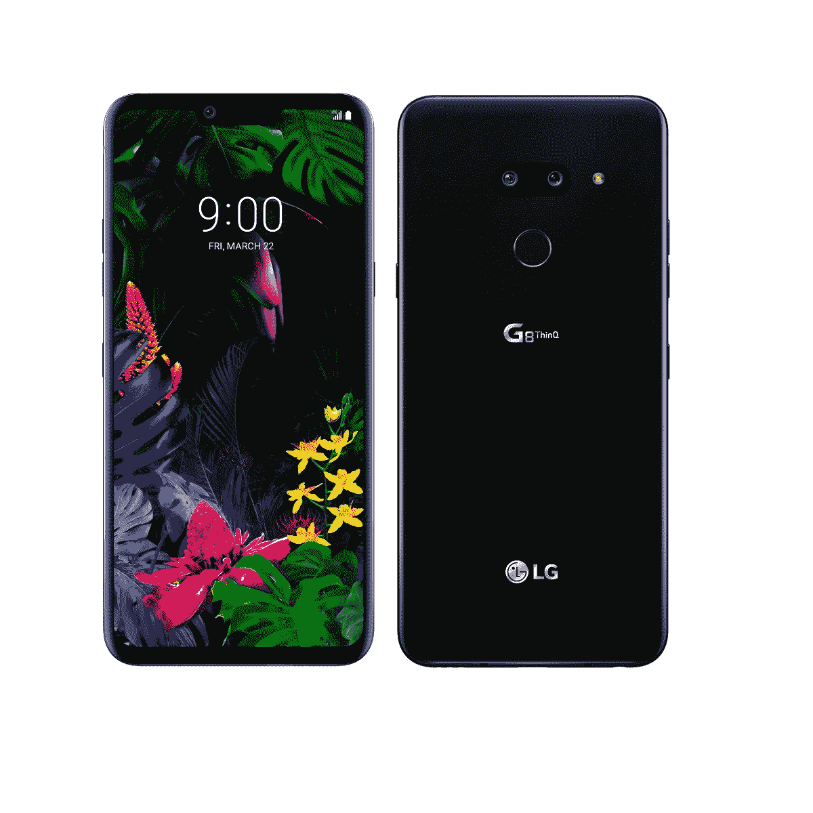
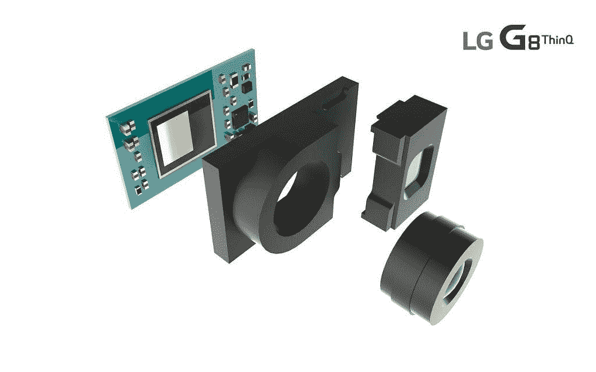
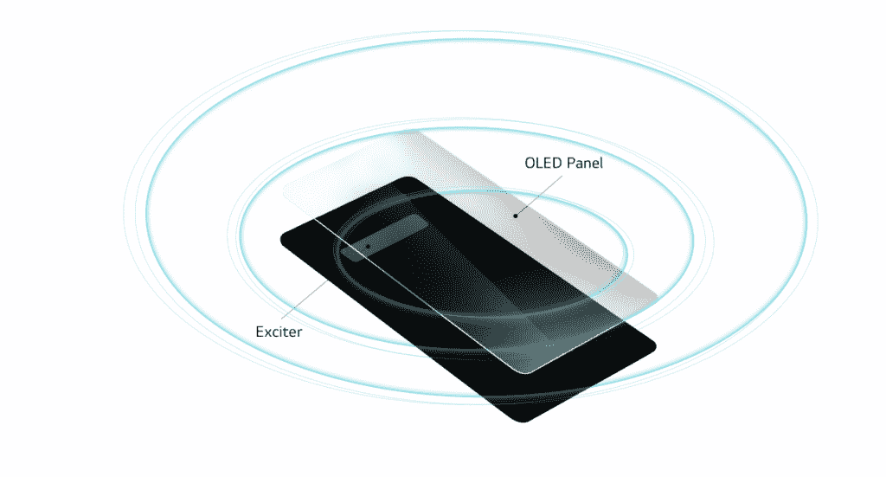

# LG G8 ThinQ 推出了 3D 面部解锁、手部 ID 和空中手势

> 原文：<https://www.xda-developers.com/lg-g8-thinq-specifications-features/>

尽管 LG 在市场上的地位远低于另一个韩国巨头三星，但该公司每年仍会推出新的智能手机，老实说，如果不是因为价格的原因，这些手机是非常值得尊敬的设备。当我们[第一次看到 LG G8 的渲染图](https://www.xda-developers.com/lg-g8-renders-dual-front-cameras/)时，我们惊讶于 LG 代表是如何坚决否认它们的准确性，尽管[有压倒性的证据](https://www.xda-developers.com/lg-g8-thinq-leaks-rumors/)与此相反。在看到 LG 今天在 MWC 宣布的消息后，我们开始对 LG 为什么否认谣言有了更好的理解:他们没有讲述整个故事。进入 LG G8 ThinQ，根据你对生物认证、手势和音频的看法，它要么是一个令人难以置信的创新设备，要么只是一个噱头。

## 生物认证

LG 在 G8 ThinQ 上提供了不止一种、两种，而是*三种*不同的生物识别身份验证方式。我们都知道并喜欢可靠的后置指纹扫描仪，而不是相对较慢的显示指纹扫描仪。然后是 3D 面部识别，苹果、华为和小米已经分别在 iPhone X、华为 Mate 20 Pro 和小米 Mi 8 探索版中证明了这一点。然而，LG G8 使用[飞行时间](https://www.xda-developers.com/lg-confirms-g8-thinq-front-facing-tof-sensor/)来测量物体反射红外光的时间，以计算深度。还有这个疯狂的:*静脉模式识别*。LG G8 ThinQ 可以通过分析你血液中血红蛋白的红外吸收特性来识别你手中的静脉。

LG 已经在顶部的大凹槽区域安装了他们所谓的“Z 相机”。我们称赞 LG 没有为这个传感器阵列想出一个荒谬的名字，因为“Z”只是代表“Z 轴”。反正 Z 相机是由一个 8MP 摄像头，一个用于接收的 IR 传感器，一个用于发射红外激光的垂直腔面发射激光器组成的。LG G8 ThinQ 的 Z 相机中的每个传感器都用于增强生物识别安全性，但 Z 相机不仅仅用于生物识别——它还用于手势。

*LG G8 ThinQ*上的英飞凌科技飞行时间传感器

## 空气运动手势

当 LG 为他们的 MWC 发布会发出媒体邀请时，他们包括了一个简短的预告，承诺我们将与 touch 说[再见对于 Air Motion，该公司正在使用 Z 相机来识别你的手的形状和运动，以进行无触摸手势控制。虽然您不会使用手势来完全导航您的设备，但您可以使用手势来快捷操作、拨打电话、取消闹钟/定时器、控制音乐/视频回放、更改音量或拍摄屏幕截图。](https://www.youtube.com/watch?v=-O1KLGxJE40)

## 水晶之声有机发光二极管

如果有一件事是大多数评论者都同意的，那就是 LG 确实非常重视智能手机音频。即使像我这样的非发烧友也可以承认该公司在音频质量方面的实力，尽管我仍然对 LG 的命名方案感到畏缩。LG G8 ThinQ 应该延续 LG 卓越音频质量的传统，配备 LG 标志性的 Hi-Fi 四通道 DAC，DTS:X 3D Boombox 以模拟 7.1 声道系统，Master Quality 认证用于高质量音频流，以及传闻已久的[发声有机发光二极管显示器。](https://www.xda-developers.com/samsung-galaxy-s10-lg-g8-sound-emitting-oled/)

LG 称这种发出声音的有机发光二极管显示器为[水晶有机发光二极管](https://www.xda-developers.com/lg-g8-thinq-crystal-sound-oled-screen-audio-amplifier/) (CSO)。据该公司称，有机发光二极管显示器被用作振动膜，振动以放大大音量的声音。LG 表示，由于 CSO 的存在，音频清晰度得到了提高，声音和音符更加清晰可辨。无孔听筒使得即使手机潮湿也能接听电话。LG 还表示，CSO 通过底部发射扬声器和显示器的顶部，使饱满的立体声性能成为可能。

## 

哦，LG 还在 G8 中保留了 3.5 毫米耳机插孔。如果三星取消了 Galaxy S10 的耳机插孔，这将更加重要，但许多智能手机品牌都取消了耳机插孔，所以我们很高兴看到它被纳入 G8。

## 相机功能

我们已经谈论了足够多的“噱头”功能，那么 LG G8 还有哪些地方改进了呢？首先，由于 Z 相机的图层识别，LG 承诺更好的自拍。相机应用程序中还有一个新的夜景，可以捕捉 10 张照片，以便更好地识别弱光。夜景听起来像是我们从华为和谷歌看到的另一种手持长时间曝光，但我们必须看看它是否能经得起最好的考验。高通骁龙 855 参考设备中演示的一项功能——实时视频散景——将包含在 LG G8 ThinQ 中。此功能可让您实时创建散景，并使用滑块来调整音量。

与 LG V40 ThinQ 不同，LG 坚持在 LG G8 ThinQ 上使用双后置摄像头。你有一个带 OIS 的标准 12MP f/1.5 相机和 LG 标志性的广角镜头和 16MP f/1.9 相机。LG G8[和 LG G7](https://www.xda-developers.com/lg-g7-thinq-update-4k-60fps/) 一样，可以以 60FPS 的速度录制 4K 分辨率的视频，这一功能在智能手机中实际上非常罕见。

## LG G8 ThinQ 规格

由于这是一款 2019 年旗舰，LG G8 ThinQ 搭载了最新的[高通骁龙 855 移动平台](https://www.xda-developers.com/qualcomm-snapdragon-855-kryo-485-cpu-adreno-640-gpu-spectra-isp-cv/)。G8 配有 6GB 的 LPDDR4 内存和 128GB 的存储空间，鉴于各种[三星 Galaxy S10](https://www.xda-developers.com/samsung-galaxy-s10-s10-and-s10e-launch-with-the-snapdragon-855-ultrasonic-in-display-fingerprint-scanners-reverse-wireless-charging-and-a-whole-lot-more/)SKU，这似乎不够，但对于大多数用户来说，内存和存储空间应该绰绰有余。如果你需要更多的存储空间，LG G8 有一个 microSD 卡插槽。你不能改变的一件事是 3500 毫安时的电池，但我们不能在没有审查设备的情况下谈论 G8 的电池寿命。幸运的是，该设备支持[高通快充 3.0](https://www.xda-developers.com/charging-comparison-oneplus-huawei/) ，虽然没有[华为](https://www.xda-developers.com/huawei-mate-20-pro-mate-20-x-update-optimize-face-unlock-camera-december-patches/)或[一加](https://www.xda-developers.com/oneplus-6t-mclaren-edition-warp-charge-30-speed-thermal-performance-test/)提供的快，但比三星的自适应快充快。LG G8 确实像许多同时代产品一样支持快速无线充电，但 LG 没有透露 G8 无线充电的确切速度。

LG G8 ThinQ 拥有由 LG Display 制造的 6.1 英寸 QHD+ OLED 面板。它支持 HDR10，正面有一层大猩猩玻璃 5 保护。LG 在提高有机发光二极管面板质量方面取得了重大进展，因此我们期待看到 LG G8 ThinQ 的 OLED 面板表现如何。

LG G8 ThinQ 在基于 Android 9 Pie 的 LG UX 上运行。唯一配有 Android Pie 的 LG 智能手机是 LG G7 ThinQ，它只在韩国得到了更新。不幸的是，这意味着我们不能告诉你太多关于最新的 LG UX 的软件体验，直到我们花更多的时间与 G8。我们确实知道这款设备有一个谷歌助手按钮，所以预计会看到很多集成的语音命令。

| 

种类

 | 

规格

 |
| --- | --- |
| 显示 | 6.1 英寸 QHD+ (3120x1440)有机发光二极管，564 像素，HDR10，正面为大猩猩玻璃 5，背面为大猩猩玻璃 6 |
| 社会学 | 高通骁龙 855 |
| 尺寸和重量 | 151.9 x 71.8 x 8.4 毫米，167 克 |
| 前置摄像头(Z 摄像头) | 800 万像素 f/1.7，1.22μm，80°视场，自动聚焦红外传感器(接收器)红外垂直腔面发射激光器(发射器) |
| 后置摄像头 | 标配:12MP f/1.5，1.4μm，79°视野，双 PDAF，OISWide: 16MP f/1.9，1.0μm，107°视野，FF，60 fps 4K 视频录制 |
| 记忆 | 6GB LPDDR4 RAM |
| 储存；储备 | 128GB 存储空间，最高可扩展至 2TB microSD |
| 电池 | 3500 毫安时 |
| 充电 | 高通快充 3.0，快速无线充电 |
| 声音的 | 高保真四路数模转换器，DTS:X 3D 音箱+水晶声有机发光二极管立体声，MQA |
| 端口和按钮 | USB Type-C，3.5 毫米耳机插孔，谷歌助理按钮 |
| 生物测定学 | 手识别、3D 人脸解锁、后置指纹扫描仪 |
| 软件 | 基于安卓 9 派的 LG UX |

* * *

LG G8 ThinQ 将有黑银、黑、红三种颜色可选。威瑞森已经宣布，他们将在美国销售这款智能手机，但确切的定价和上市日期尚未公布。

[LG G8 ThinQ 论坛 ](https://forum.xda-developers.com/lg-g8)

我承认，我对 LG 进入 MWC 持怀疑态度。虽然华为、OPPO 和小米等公司继续令人惊叹，但 LG 还没有任何真正独特的东西让我们惊叹。甚至三星今年也恢复了状态，对 Galaxy S 阵容进行了重大调整，但 LG 几年来一直被智能手机爱好者视为“足够好”的品牌，所以我们的期望很低。不过，这真的很遗憾，因为我并不真的相信智能手机品牌在其设备上包含的噱头。不过，我认识到，正是这些特性让设备脱颖而出，这对市场营销非常重要。LG 能否利用 G8 ThinQ 的优势，重振他们的智能手机品牌，这是我期待看到的事情。