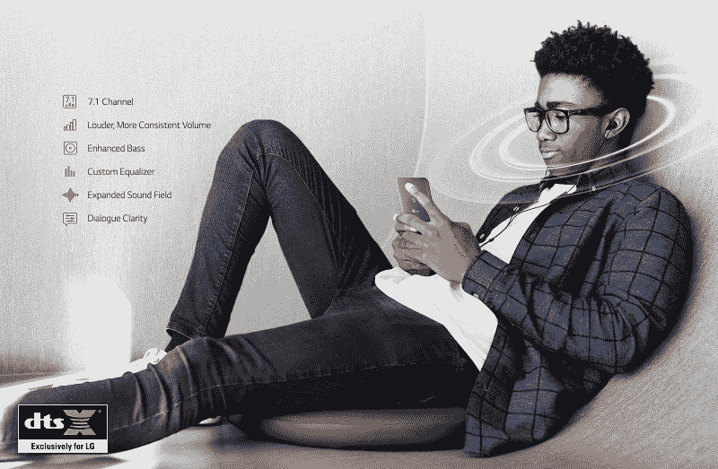

# LG Q6 Android Oreo 更新增加了 3D 立体声和新的摄像头 LED 功能

> 原文：<https://www.xda-developers.com/lg-q6-android-oreo-update-dtsx-3d-stereo/>

# LG Q6 Android Oreo 更新添加了 DTS:X 3D 立体声和新的摄像头 LED 功能

LG Q6 正在更新 Android Oreo (8.1)，增加了 DTS:X 3D 立体声支持以及许多很酷的新相机 LED 功能。

LG Q6 是去年发布的低端安卓智能手机，搭载高通骁龙 435。作为一款低端手机，人们的期望是它不会收到很多(如果有的话)软件更新。它去年推出了 Android 7.1 牛轧糖，自那以来一直没有重大更新。不过，这种情况将会改变，因为根据韩国出版物 *kbench* 的报道，它正在更新为 Android Oreo (Android 8.1)。此次更新增加了一些额外功能，包括 DTS:X 3D 立体声和一些新的摄像头 LED 功能。

首先也是最重要的，这次更新包括了我们所期待的 Android Oreo 的所有常见功能。这包括[电池增益](https://www.xda-developers.com/android-oreo-oem-background-app-limitations/)，性能增益，[自动填充 API](https://www.xda-developers.com/android-os-autofill-framework-will-finally-resolve-a-long-standing-lag-issue-with-password-managers/) ，新功能如[画中画，](https://www.xda-developers.com/picture-in-picture-mode-desktop-google-chrome/)等等。除此之外，你还可以在 LG Q6 上获得 [DTS:X](https://dts.com/dtsx) 3D 立体声音效支持。DTS:X 也可以在 LG G7 ThinQ 上使用，它允许您播放特定类型的音频文件，这些文件具有标记有位置数据的单独声音。这是一种基于对象的音频标准，根据正在播放的设备，DTS:X 会将其向下混合以用于音频接收器。你不需要特别支持的耳机，它完全向后兼容以前的 DTS 格式。

 <picture></picture> 

DTS:X on the LG G7 ThinQ

至于摄像头 LED，一些有趣的功能也即将推出。你可以让它随着当前播放的歌曲的节奏跳动，或者让它在你接电话时闪烁。第一个功能当然是一个噱头，但第二个功能有许多用途，尤其是对那些可能失聪或听力不好的人。很高兴看到 LG 的用户获得了公司几个月前开设的软件更新中心的回报。随着 LG G6、LG G5 和 LG V20 [等旧设备获得更新](https://www.xda-developers.com/lg-g6-android-oreo-update-v20-g5/)，我们可以看到该公司终于愿意认真对待软件更新。LG Q6 的用户可以期待看到更新很快在韩国推出，预计很快就会在全球发布。

* * *

[**来源:kbench**](http://m.kbench.com/?q=node/189201)

[**Via: LG Q6 XDA 论坛**](https://forum.xda-developers.com/lg-q6/how-to/oreo-update-bring-dtsx-3d-flash-lite-to-t3813263)