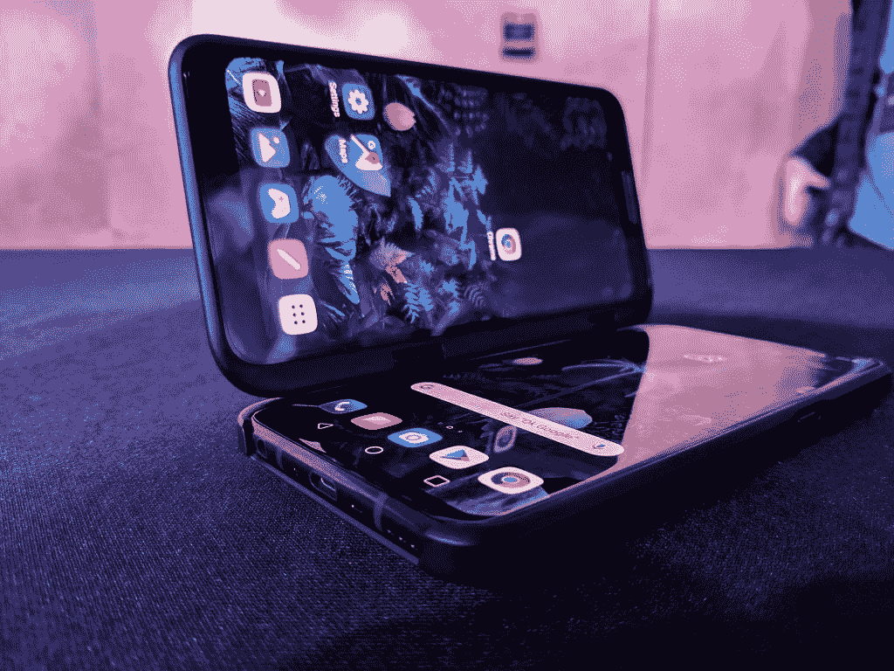

# [更新 2: LG V50S ThinQ] LG 推出了 V50 及其双屏附件的后续产品

> 原文：<https://www.xda-developers.com/lg-teases-v50-follow-up-dual-screen-attachment/>

**更新 2(美国东部时间 8/30/19 @上午 10:14):**即将发布的 V50 后续的 logo 已经泄露，透露了“LG V50S ThinQ”的名称。

**更新 1(美国东部时间 8/27/19 @上午 9:35):**LG 制作了一款基于 Chrome 的浏览器，以利用即将推出的双屏兼容智能手机。

不到 6 个月前[我们看到 LG 正式发布了](https://www.xda-developers.com/lg-v50-thinq-5g-specifications-features/)LG V50 ThinQ 智能手机。这是该公司的第一款 5G 智能手机，一份泄露的渲染图显示，LG 和 Sprint 合作推出了这款设备。总的来说，它被视为 LG V40 ThinQ 的改良版，采用高通的骁龙 855 芯片组和 4,000mAh 容量的电池。本周，该公司发布了一份继任者的预告，表明 LG V50 的后续产品将在下个月的 2019 年 IFA 展会上发布。

[**LG V50 XDA 论坛**](https://forum.xda-developers.com/v50-thinq)

在 LG 宣布 LG V50 之前，关于一款带有第二块屏幕附件的设备的传言开始出现。事实证明，这款传闻中的设备实际上是 LG V50，[当这款手机发布时，我们能够得到它的配件](https://www.xda-developers.com/lg-v50-dual-screen-hands-on/)。与 LG 很久以前承诺的模块化设计不同，看起来他们对客户对这种副屏幕的接受程度很满意。

 <picture></picture> 

LG V50 with Dual Screen

从视频中可以看到，LG 已经向其 YouTube 频道上传了一段预告视频。该视频提到了 2019 年 IFA 奥运会(将于 9 月 6 日至 11 日举行)，并以播放一款手机游戏开始。然后，视频转回来，并暗示这显然是智能手机的一个类似的第二屏幕配件。然后我们被告知保存日期，因为 LG 移动的新闻发布会将在 9 月 6 日上午 10 点举行。

对于那些将参加活动的人，LG 要求人们来柏林工业博览会 18 号馆寻求一些“更多的惊喜”如何看待 LG 对“可折叠”手机的做法？双屏是个好主意吗？

* * *

## 更新 1:新浏览器

LG 已经推出了一款新的智能手机，将与其双屏配件兼容。现在，该公司宣布了一款针对双屏优化的浏览器。LG 与韩国最大的搜索引擎提供商 [*Naver*](https://play.google.com/store/apps/dev?id=6225315284672069550&hl=en) 合作开发了这款名为 Whale 的浏览器。Whale 基于 Chrome，它的特点是“全任务处理”，即将多个任务放在一个屏幕上。通过分屏模式，双屏用户可以将网站放在每个显示器上，并在它们之间轻松移动。LG 将在他们的 IFA 活动上展示 Whale 的优化版本。

**来源:[LG](http://www.lgnewsroom.com/2019/08/lg-and-naver-team-up-to-maximize-smartphone-dual-screen-with-omnitasking-browser/)**

* * *

## 更新 2: LG V50S ThinQ

我们已经知道 LG V50 的后续产品有一段时间了，但该设备的实际名称一直有点神秘。一些人猜测这将是“LG V60”，但“LG V50S ThinQ”也出现了几次。一些报道称 [LG G8X](https://www.xda-developers.com/lg-g8x-leak-headphone-jack-waterdrop-amoled/) 在某些地区将被称为 LG V50S ThinQ。现在， [@evleaks](https://twitter.com/evleaks?lang=en) 分享了 LG V50S ThinQ 的 logo。似乎肯定会有一款以这个名字命名的设备，尽管与 LG G8X 的连接仍然悬而未决。

**来源:[推特](https://twitter.com/evleaks/status/1167393759245623297)(私人)**