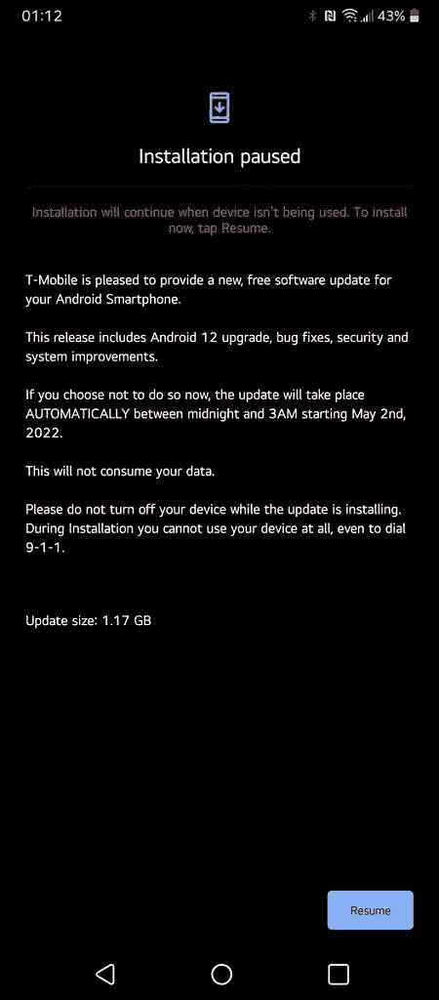
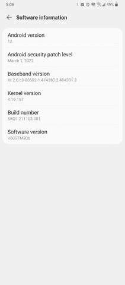

# LG 已经开始向 T-Mobile LG V60 推出稳定的 Android 12

> 原文：<https://www.xda-developers.com/lg-v60-t-mobile-android-12-update/>

尽管 LG 不再生产 Android 智能手机，但该公司在更新现有机型方面做得相当不错。在过去的几周里，它为 LG Velvet 的多个变种[推出了稳定的 Android 12 版本。现在，它正在为 LG V60 推出类似的更新。](https://www.xda-developers.com/verizon-lg-velvet-android-12-update/)

据报道，LG V60 的 Android 12 更新目前正在推出 T-Mobile 版本(LM-V600TM)。根据在 Reddit 上分享的一张截图，这次更新大约有 1.17GB，它带来了谷歌在 Android 12 中引入的所有新功能。此外，它还包含一些错误修复、安全更新和系统改进。

 <picture></picture> 

Credit: u/BinaryBitz_

在*LG v 60-Velvet-Wing*Telegram 频道上分享的一张截图进一步指出，此次更新有软件版本 V600TM30b，并且还打包了 2022 年 3 月的 Android 安全补丁。

 <picture></picture> 

Credit: LG V60 - Velvet - Wing Telegram channel

有趣的是，T-Mobile 在其 Android 12 追踪器中没有提到 LG V60，所以无论如何，很高兴看到 LG 推出了该变种的更新。不幸的是，这种设备的威瑞森变种却不是这样。来自威瑞森的 LG V60 仍然停留在 Android 11 上，我们没有关于它何时会收到类似更新的信息。一旦威瑞森开始推出，我们会尽快通知您。

值得一提的是，LG V60 预计将接受三次 Android 操作系统升级。由于该设备推出的 Android 10 开箱即用，你可以期待 LG 将其更新为 [Android 13](https://www.xda-developers.com/android-13/) 。然而，鉴于 LG 发布 Android 12 更新的速度，你不应该指望 Android 13 版本会在明年 3 月之前发布。

*你的 T-Mobile LG V60 收到 Android 12 更新了吗？请在下面的评论区告诉我们。*

* * *

**来源:** [Reddit](https://www.reddit.com/r/LGV60/comments/u97sg9/android_12/) ，[电报](https://t.me/v60thinq)