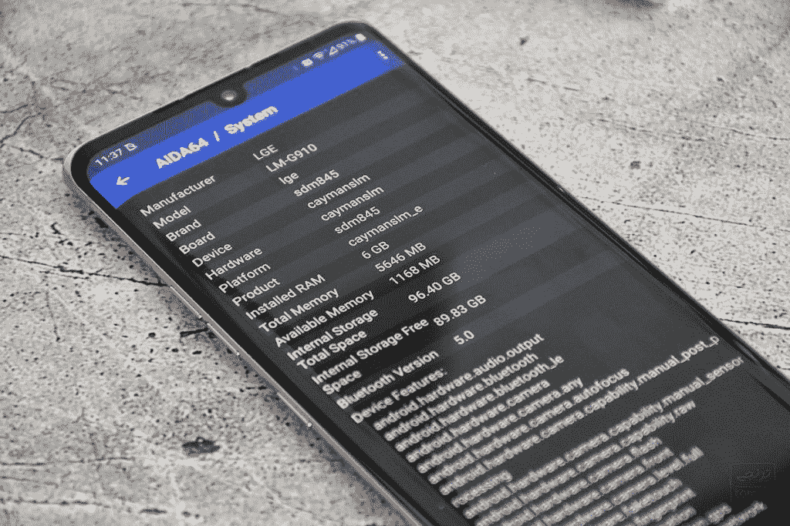

# 4G LG Velvet 将与骁龙 845 一起在部分地区推出

> 原文：<https://www.xda-developers.com/lg-velvet-4g-launching-some-regions-2-year-old-qualcomm-snapdragon-845/>

LG Velvet [在经过一段时间的谣言和泄露以及 LG 自己的调侃后，最近宣布了](https://www.xda-developers.com/lg-velvet-unveiled-qualcomm-snapdragon-765-stylus-support/)。虽然我们期待 LG 发布 LG G9，但这并没有发生。相反，LG 2020 年唯一的旗舰产品是 LG V60，而 LG Velvet 今年将取代 LG G 系列的位置。由于骁龙 765G 处理器，它支持 5G 功能，由于它不是高端旗舰产品，它应该更便宜，但也只是勉强:估计约 700 美元，仍属于市场上昂贵的一端。LG 可能会用一种奇怪但简单的方法让它更便宜:用骁龙 765G 换骁龙 845。

是的，这是 2 岁的骁龙 845。LG 首次在 [LG G7](https://www.xda-developers.com/lg-g7-thinq-india-launch-snapdragon-845/) 上使用了这款前旗舰 SoC，该公司计划在 LG Velvet 上重复使用相同的 SoC。LG 对使用旧的 SOC 并不陌生:事实上，2017 年的 LG G6 使用了骁龙 821。不过，现在，在你对 LG 发表仇恨言论之前，请记住，这个决定并不完全是*没有道理的。骁龙 845 实际上是相对于骁龙 765 和 765G 最接近的 4G:它的 CPU 性能大致相同，而骁龙 845 实际上在 GPU 性能上仍有优势。它也没有 5G，作为一个旧的 SoC，LG 使用它比现在的骁龙 765/G 便宜得多*

**[高通骁龙 865 基准:与麒麟 990、骁龙 855、骁龙 845](https://www.xda-developers.com/qualcomm-snapdragon-865-benchmarks-cpu-gpu-performance-vs-kirin-990-snapdragon-855-snapdragon-845/)** 比较 CPU 和 GPU 性能

不过，骁龙 845 仍然有一些缺点，特别是在效率方面(845 是 10 纳米，765 是 7 纳米)，并且随着骁龙 845 相当旧并且越来越旧，可能会更新。但是 LG 并没有真正证明他们关心更新。

 <picture></picture> 

Image credits: سینا عطایی/[Toranji](https://toranji.ir/2020/06/09/lg-velvet-4g-with-snapdragon-845/)

这个版本的 LG Velvet 首先出现在中东，特别是在伊朗，那里 5G 还不是一个东西。但这款手机也可能会进入其他无 5G 市场，如巴西，因为据报道，巴西无线监管机构 Anatel 最近认证了该设备(代号为 LM-G910)。这个版本也将比其 SD765G 驱动的版本便宜至少 20 %: 700 美元的价格点将降至 600 美元以下，这更容易消化(尽管仍然有点贵，因为你可以用低得多的价格获得骁龙 845 的 2018 年旗舰产品)。

* * *

**来源: [toranji.ir(波斯)](https://toranji.ir/2020/06/09/lg-velvet-4g-with-snapdragon-845/)**

**Via:[GSMArena](https://www.gsmarena.com/lg_velvet_4g_with_snapdragon_845_appears_will_be_20_cheaper_than_the_5g_version-news-43673.php)**